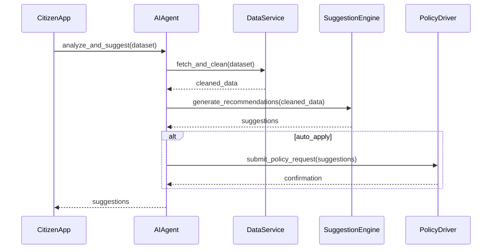

# Chapter 1: AI Agents Module (HMS-A2A)

Welcome to the first chapter! Here we introduce the **AI Agents Module (HMS-A2A)**—a smart “advisor” layer that watches over your public-sector workflows, analyzes data, suggests optimizations, and can even drive automated policy updates.

## 1.1 Why HMS-A2A? A Real-World Motivation

Imagine the U.S. Census Bureau collects millions of responses every day. How do you spot anomalies, recommend process tweaks, or trigger policy changes automatically? HMS-A2A steps in like a digital advisor in city hall:
- It reads raw census data.
- It flags data gaps or unusual trends.
- It proposes next steps (e.g., send reminders, adjust forms).
- It can nudge your policy engine to make tiny updates, all under human oversight.

This saves time, reduces manual review, and leads to faster, smarter decisions.

## 1.2 Key Concepts

1. **AIAgent**  
   A specialized “bot” focused on one domain (e.g., finance, healthcare, legal).  
2. **DataAnalyzer**  
   Ingests and preprocesses raw data from various sources (APIs, databases).  
3. **SuggestionEngine**  
   Crafts concrete improvement suggestions based on analysis.  
4. **PolicyDriver**  
   Optionally transforms approved suggestions into policy-change requests.

Think of each concept as a department in city hall: data intake, analysis team, recommendation committee, and policy office.

## 1.3 Using HMS-A2A to Solve a Census Data Use Case

### 1.3.1 Setup and Initialization

Below is a minimal example: we create a “CensusAgent” that looks for under-represented regions and suggests outreach campaigns.

```python
from hms_a2a import AIAgent

# Create an agent focused on census coverage
census_agent = AIAgent(
  name="CensusCoverageAdvisor",
  domain="demographics"
)

# Load a small sample dataset (e.g., population counts)
sample_data = [
  {"region":"County A","count":5000},
  {"region":"County B","count":250},
  {"region":"County C","count":4800},
]

# Ask the agent for suggestions
suggestions = census_agent.analyze_and_suggest(sample_data)
print(suggestions)
```

This outputs something like:
- “County B is under-surveyed. Launch a mobile outreach unit.”

### 1.3.2 What Happens Next?

1. The agent’s `analyze_and_suggest` inspects counts.
2. It spots outliers (very low counts).
3. It generates a human-readable recommendation.
4. You review and approve it, or pass it to the PolicyDriver.

## 1.4 Under the Hood: How HMS-A2A Works

### 1.4.1 Step-by-Step Walkthrough



1. **App** calls the AI agent with raw data.  
2. **Agent** asks **DataService** to clean and normalize entries.  
3. After getting clean data, it invokes the **SuggestionEngine**.  
4. If configured, the agent routes approved suggestions to **PolicyDriver**.  
5. Finally, your app receives actionable items.

### 1.4.2 Simplified Internal Code Snippets

#### File: hms-a2a_main.txt (simplified)

```python
class AIAgent:
    def __init__(self, name, domain):
        self.name = name
        self.domain = domain
        # TODO: load domain-specific models

    def analyze_and_suggest(self, data):
        clean = self._clean_data(data)
        recs  = self._suggest(clean)
        if self._auto_apply:
            self._drive_policy(recs)
        return recs

    def _clean_data(self, data):
        # Basic placeholder for cleaning logic
        return [d for d in data if d.get("count") is not None]

    def _suggest(self, clean_data):
        # Simple threshold logic
        suggestions = []
        for item in clean_data:
            if item["count"] < 1000:
                suggestions.append(
                  f"Increase outreach in {item['region']}"
                )
        return suggestions

    def _drive_policy(self, recommendations):
        # Stub: send recommendations to policy API
        pass
```

- `_clean_data`: drops invalid entries.  
- `_suggest`: flags low-count regions.  
- `_drive_policy`: placeholder for talking to the policy management layer (see [Policy Management API (HMS-API / HMS-MKT)](04_policy_management_api__hms_api___hms_mkt__.md)).

## Conclusion

You now know what the **AI Agents Module (HMS-A2A)** does, how to call it, and a peek at its internals. Next, we’ll explore the foundation that hosts this module—the [Core Infrastructure (HMS-SYS)](02_core_infrastructure__hms_sys__.md). Stay tuned!

---

Generated by [HardisonCo [NARA-DOC]](https://github.com/The-Pocket/Tutorial-Codebase-Knowledge)