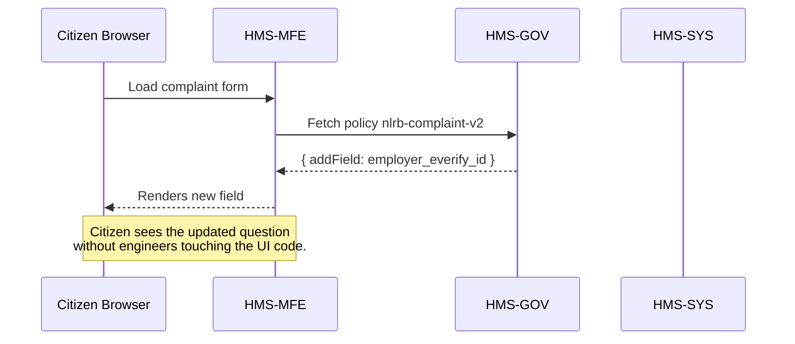

# Chapter 1: Governance Layer (HMS-SYS → HMS-GOV → HMS-MFE)

> “Change the law in the basement, watch the lobby adjust itself.”  
> – an HMS-A2A architect

---

## 1. Why do we need a “Governance Layer”?

Imagine the National Labor Relations Board (NLRB) must add one new question to its *Unfair Labor Practice* complaint form. In a traditional system, engineers would edit databases, back-end services, and front-end code—often in different teams—before citizens finally see the updated web page.

With HMS-A2A’s Governance Layer we:

1. Write or change the **rule** once (HMS-SYS).  
2. Let an internal **policy** engine translate it (HMS-GOV).  
3. Automatically refresh the **citizen-facing UI** (HMS-MFE).  

No broken links, no duplicated work, no late-night hot-fixes.

---

## 2. Courthouse Analogy

| Courthouse floor | HMS component | What happens here? |
| ---------------- | ------------ | ------------------ |
| Basement Utilities | **HMS-SYS** | Raw, machine-readable rules (“the law”). |
| Clerk Offices | **HMS-GOV** | Convert rules into agency-specific policies. |
| Public Lobby | **HMS-MFE** | Show friendly forms, dashboards, & alerts. |

Keep this picture in mind; it guides everything else in this book.


---

## 3. Meet the Three Layers

### 3.1 HMS-SYS – “Write the law”

- Stores rules as versioned YAML or JSON.  
- Designed for lawyers, analysts, or AI agents that speak legal or regulatory language.

```yaml
# file: nlrb_ulp_v2.yaml
rule_id: NLRB-ULP-Q42
text: |
  Collect the employer's E-Verify number when the complaint involves
  undocumented worker allegations.
field:
  name: employer_everify_id
  label: Employer E-Verify ID
  required: true
```

*Explanation:* A single file holds the new requirement. Nothing else changes—yet.

---

### 3.2 HMS-GOV – “File the paperwork”

- Watches HMS-SYS for new or updated rules.  
- Translates them into agency-friendly **policy specs**—think checklists for developers.

```json
{
  "policyId": "nlrb-complaint-v2",
  "addField": {
    "key": "employer_everify_id",
    "type": "string",
    "required": true,
    "showIf": "complaintType == 'undocumented_worker'"
  }
}
```

*Explanation:* The policy spec turns the plain rule into precise, UI-ready instructions.

---

### 3.3 HMS-MFE – “Serve the citizen”

- A micro-frontend that subscribes to HMS-GOV policies.  
- Renders or hides form fields with **zero redeploys**.

```js
// Inside a React component
usePolicy("nlrb-complaint-v2", policy => {
  registerField(policy.addField);
});
```

*Explanation:* The UI asks HMS-GOV, “Any new fields today?” and instantly updates.

---

## 4. End-to-End Example



---

## 5. Hands-On: Update a Rule Yourself

Step 1 – edit the YAML in HMS-SYS:

```yaml
# append to file
validation:
  pattern: '^\d{6}$'
  error: "E-Verify IDs are 6 digits."
```

Step 2 – commit & push. HMS-GOV auto-generates a new policy revision (`v2.1`).

Step 3 – reload the browser. The field now validates six digits.

No deployments. No outages.

---

## 6. Under the Hood (light version)

1. **File watcher** in HMS-SYS emits a *RuleChanged* event.  
2. HMS-GOV’s *Policy Builder* converts YAML → JSON spec.  
3. Spec is stored in a lightweight registry (Redis or S3).  
4. HMS-MFE components subscribe via WebSocket or HTTP ETag.  
5. UI auto-rerenders.

If you want to dive deeper into policy compilation, check the next chapter: [Policy Lifecycle Engine (HMS-CDF)](02_policy_lifecycle_engine__hms_cdf__.md).

---

## 7. Mini Implementation Peek

`/hms-gov/compile_rule.py` (simplified)

```python
import yaml, json, sys
rule = yaml.safe_load(open(sys.argv[1]))
policy = {
    "policyId": f"{rule['rule_id'].lower()}",
    "addField": {
        "key": rule['field']['name'],
        "type": "string",
        "required": rule['field']['required']
    }
}
print(json.dumps(policy, indent=2))
```

Run:

```bash
python compile_rule.py nlrb_ulp_v2.yaml > policy.json
```

*Explanation:* A 10-line script is enough to feel the magic.

---

## 8. Tips & Best Practices

• Keep HMS-SYS rules *atomic*—one logical change per file.  
• Use semantic versioning (`v2.1.0`) in policy IDs for easy rollback.  
• Let your design team style components in MFE, but avoid hard-coding labels; pull them from the policy!  
• When connecting multiple agencies, combine with the [Inter-Agency Protocol (HMS-A2A)](05_inter_agency_protocol__hms_a2a__.md).

---

## 9. Summary

You have learned how the Governance Layer turns legal text into living software:

1. HMS-SYS ‑ Write or amend the rule.  
2. HMS-GOV ‑ Translate to operational policy.  
3. HMS-MFE ‑ Instantly present changes to the public.

In short: **change once, propagate everywhere**.

Ready to see how policies evolve over time, get tested, and safely deployed? Continue to [Policy Lifecycle Engine (HMS-CDF)](02_policy_lifecycle_engine__hms_cdf__.md).

---

Generated by [HardisonCo [NARA-DOC]](https://github.com/The-Pocket/Tutorial-Codebase-Knowledge)