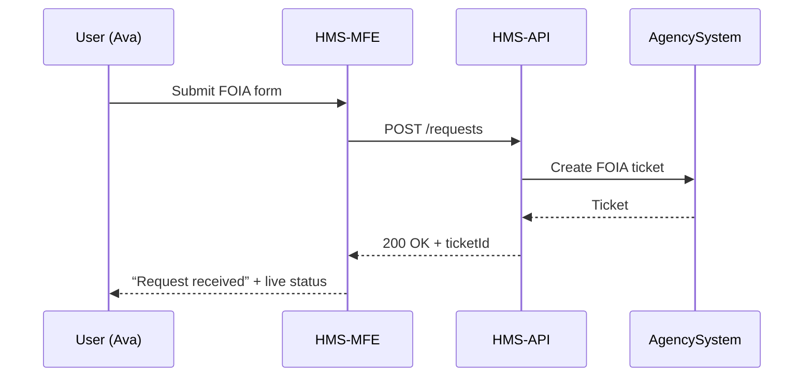

# Chapter 1: Multi-Frontend Experience (HMS-MFE)


> “Why build ten portals when one lobby will do?”  

HMS-MFE is the single, reusable **front door** for every agency that plugs into the HMS platform.  
Think of it as the self-service kiosk at your local DMV—but on the web and accessible from any device.

---

## 1. The Problem It Solves

Imagine a citizen—let’s call her **Ava**—who wants to:

1. Renew her TSA PreCheck,
2. Submit a Freedom of Information Act (FOIA) request to the U.S. House of Representatives, and  
3. Track her West Point application status.

Today, Ava would bounce between three completely different websites, learn three different log-ins, and wrestle with three different progress pages.

**HMS-MFE** solves this by giving every agency a **shared, Section 508-compliant interface** where:

* Ava signs in once,
* sees a familiar layout each time,
* and can check every request’s status in a single “My Requests” page.

---

## 2. Key Concepts in Plain English

| Concept | In Everyday Speak | Why It Matters |
|---------|-------------------|----------------|
| **Multi-Frontend** | One codebase that can “skin” itself for TSA, West Point, or any agency. | Agencies get branding; users get consistency. |
| **Shared Component Library** | Pre-built buttons, forms, and progress trackers. | Developers skip boilerplate and avoid accessibility mistakes. |
| **Self-Service Lobby** | The landing page citizens/employees see after logging in. | Central place to start or track anything. |
| **Section 508 Compliance** | Government accessibility rules (screen readers, contrast, etc.). | Inclusivity **and** legal requirement. |
| **Kiosk Mode** | Touch-friendly, full-screen view for in-office tablets. | Field offices don’t need separate software. |

---

## 3. A “Hello, World” Walk-Through  
### Use Case: Submit a FOIA request

Below is a **tiny** React snippet that lives inside HMS-MFE.  
We’ll simulate Ava starting a FOIA request with only three reusable components.

```jsx
// File: src/FoiaRequest.jsx
import { Login, RequestForm, StatusTracker } from '@hms-mfe/components';

export default function FoiaRequest() {
  return (
    <>
      <Login agency="house-of-representatives" />

      <RequestForm
        type="FOIA"
        onSubmit={(payload) => {
          // call backend
          fetch('/api/requests', {
            method: 'POST',
            body: JSON.stringify(payload)
          })
            .then(r => r.json())
            .then(console.log); // show confirmation
        }}
      />

      <StatusTracker requestType="FOIA" />
    </>
  );
}
```

Explanation  
1. `<Login>` already handles multi-factor auth and branding for “house-of-representatives.”  
2. `<RequestForm>` auto-generates the right fields for a FOIA request.  
3. `<StatusTracker>` polls HMS-API and shows Ava her progress (e.g., “Under Review → Documents Located → Complete”).

All three widgets come from **`@hms-mfe/components`**, so every agency gets the same accessible, keyboard-navigable UI without re-coding.

---

## 4. What Happens Behind the Scenes?

Below is a simplified flow when Ava presses **Submit**:



1. HMS-MFE forwards the payload; it does **not** hold sensitive data locally.  
2. HMS-API standardizes the request before forwarding to the agency’s internal system.  
3. Updates flow back to Ava through polling or WebSockets.

---

## 5. Peeking at the Implementation

### 5.1 Folder Layout (high-level)

```
hms-mfe/
├─ public/           # static assets & kiosk launcher
├─ src/
│  ├─ components/    # shared UI elements
│  ├─ pages/         # per-agency routes (e.g., /tsa, /house)
│  └─ themes/        # brand colors, logos
└─ vite.config.js    # build pipeline (tree-shakes, a11y tests)
```

### 5.2 Minimal Component Example  

```jsx
// File: src/components/StatusTracker.jsx
import { useEffect, useState } from 'react';

export default function StatusTracker({ requestType }) {
  const [status, setStatus] = useState('Loading…');

  useEffect(() => {
    fetch(`/api/requests/latest?type=${requestType}`)
      .then(r => r.json())
      .then(data => setStatus(data.phase));
  }, [requestType]);

  return <p aria-live="polite">Current status: {status}</p>;
}
```

Why it’s beginner-friendly:

* Under 20 lines.  
* Reads data once; no Redux or extra plumbing.  
* Uses `aria-live` so screen readers announce status changes (Section 508!).

---

## 6. Tips for First-Time Integrators

1. Clone the template repo:  
   `npx degit hms-gov/mfe-template my-agency-portal`
2. Open `src/themes/agencyBrand.js` to swap colors & logos—no CSS knowledge required.
3. Enable kiosk mode in `public/index.html`:

```html
<script>
  if (window.location.search.includes('kiosk')) {
    document.documentElement.requestFullscreen();
  }
</script>
```

4. Point the `.env` file at your staging HMS-API endpoint.  
5. Run locally: `npm run dev`

---

## 7. Where This Fits in the Bigger Picture

HMS-MFE is only the front porch.  
Once Ava clicks a button, her intent is handed off to more advanced layers like:

* [Intent-Driven Navigation & AI-Guided Journeys](02_intent_driven_navigation___ai_guided_journeys_.md) – helps Ava decide *what* she needs.  
* [AI Representative Agent (HMS-A2A)](03_ai_representative_agent__hms_a2a__.md) – an AI “clerk” that can fill forms for her.  
* [Backend API / Service Layer](07_backend_api___service_layer__hms_api__hms_svc__.md) – where the heavy lifting happens.

---

## 8. Summary

You learned:

* **Why** a Multi-Frontend beats one-off agency portals.  
* **How** shared components create a consistent, accessible experience.  
* A hands-on React snippet for submitting and tracking a FOIA request.  
* The basic request flow from browser to agency system.

Ready to see how Ava’s clicks turn into **intent-aware journeys**?  
Continue to ➡ [Intent-Driven Navigation & AI-Guided Journeys](02_intent_driven_navigation___ai_guided_journeys_.md)

---

Generated by [HardisonCo [NARA-DOC]](https://github.com/The-Pocket/Tutorial-Codebase-Knowledge)