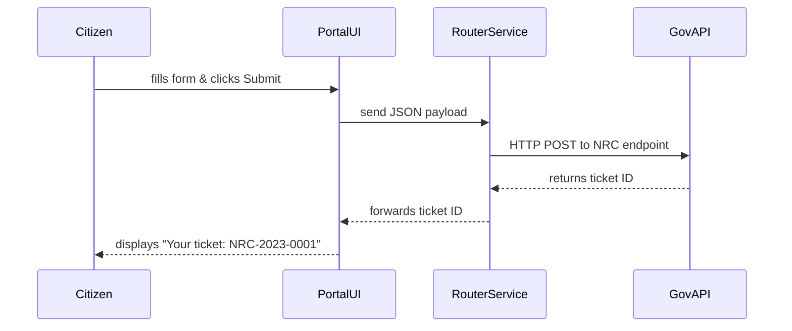

# Chapter 1: User Portal / Citizen Interface

Welcome! In this chapter, you’ll learn how the User Portal (a.k.a. Citizen Interface) acts like the front door of government services online. Think of it as walking up to a friendly help desk in City Hall—except it’s all on the web. Citizens can submit requests, complaints, or feedback, and then track the status without hunting through confusing forms or phone menus.

---

## Why a User Portal?

Problem: Citizens often struggle to find the right form or phone number for federal services.  
Solution: A single, guided portal that
- Captures basic info (name, contact, issue details)  
- Routes submissions to the correct agency or department  
- Shows live status updates (e.g., “Your request #12345 is under review”)  

Real example: Jane wants to report unusual noise near a nuclear plant to the U.S. Nuclear Regulatory Commission. With the portal, she fills a simple online form and immediately gets a ticket number—no more guessing which email or hotline to use.

---

## Key Concepts

1. **Entry Form**  
   A friendly web form that asks only for what’s needed.
2. **Data Capture & Validation**  
   Checks that fields (email, issue type) are valid before sending.
3. **Routing Engine**  
   Automatically sends each request to the right backend or agency API.
4. **Status Dashboard**  
   Lets citizens check progress (Received → In Review → Completed).

---

## Using the User Portal: A Simple Example

Imagine you’re building a small script to submit a complaint about nuclear plant noise.

```javascript
// step1: import the portal client
import { UserPortal } from 'hms-portal-client'

// step2: prepare your data
const submission = {
  name: "Jane Citizen",
  email: "jane@example.gov",
  issueType: "Noise Complaint",
  description: "Loud hum at night near Oak Ridge plant"
}

// step3: submit and get a ticket
UserPortal.submitRequest(submission)
  .then(res => console.log("Ticket created:", res.ticketId))
  .catch(err => console.error("Oops:", err.message))
```

Explanation:  
1. We import a client helper.  
2. Build a minimal object with user details and issue description.  
3. Call `submitRequest`; on success we get back a `ticketId` like `"NRC-2023-0001"`.  

---

## Under the Hood: Step-by-Step Flow

Before diving into code, here’s what happens when Jane clicks “Submit”:



1. **PortalUI** collects form data and calls the Router.  
2. **RouterService** decides which GovAPI (e.g., NRC, PBGC) should handle it.  
3. **GovAPI** creates the official ticket and returns an ID.  
4. **PortalUI** shows that ID to the citizen.

---

## Inside the Code

### 1. Portal Frontend (`hms-portal/src/ui.js`)

```javascript
// hms-portal/src/ui.js
function onSubmit(formData) {
  fetch('/api/portal/submit', {
    method: 'POST',
    headers: {'Content-Type': 'application/json'},
    body: JSON.stringify(formData)
  })
  .then(res => res.json())
  .then(data => showConfirmation(data.ticketId))
  .catch(err => alert("Submit failed"))
}
```

This snippet listens for the form’s submit event, posts data to our backend, and then displays the returned ticket ID.

### 2. Router Service (`hms-api/src/routes/portalRouter.js`)

```javascript
// hms-api/src/routes/portalRouter.js
const express = require('express')
const router = express.Router()

router.post('/submit', async (req, res) => {
  const { issueType, ...info } = req.body
  // decide which gov API to call
  const apiUrl = routeMap[issueType]
  const response = await callGovApi(apiUrl, info)
  res.json({ ticketId: response.id })
})

module.exports = router
```

Here, we use a simple `routeMap` that links `"Noise Complaint"` → `"https://nrc.gov/api/complaints"`. The helper `callGovApi` wraps the HTTP call and returns the created ticket.

---

## How It Fits in HMS-A2A

The User Portal is your citizen-facing entry point. Later chapters show how the Gov Portal ([Chapter 2: Admin/Gov Portal](02_admin_gov_portal_.md)) and AI agents ([Chapter 4: Specialized AI Agents](04_specialized_ai_agents__hms_a2a__.md)) build on these submissions for review and decision-making.

---

## Conclusion

You’ve seen how the User Portal:
- Guides citizens through a simple form  
- Validates and routes requests automatically  
- Returns a clear ticket ID for tracking  

Next up, learn how government staff log in to manage and act on these tickets in the [Admin/Gov Portal](02_admin_gov_portal_.md).

---

Generated by [HardisonCo [NARA-DOC]](https://github.com/The-Pocket/Tutorial-Codebase-Knowledge)