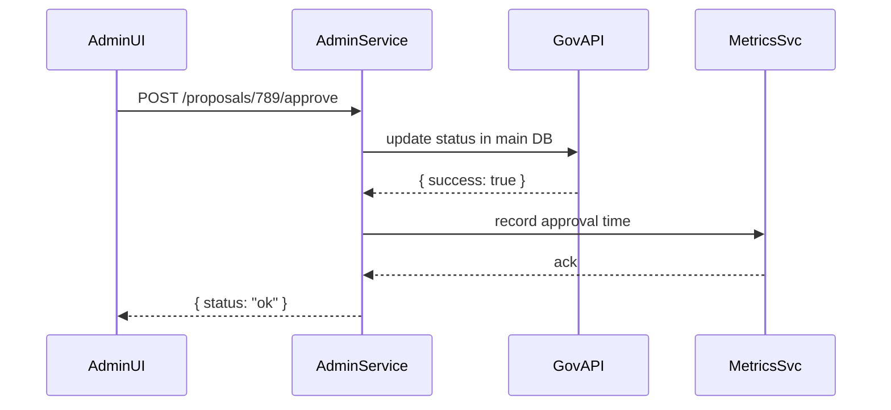

# Chapter 2: Admin/Gov Portal

Now that you’ve seen how citizens submit requests in the [User Portal / Citizen Interface](01_user_portal___citizen_interface_.md), it’s time to see what happens on the other side of City Hall. The **Admin/Gov Portal** is the control center for policy-makers, regulators, and administrators. Think of it as the city manager’s dashboard where they:

- Review incoming AI proposals or citizen tickets  
- Adjust service parameters (e.g., noise thresholds)  
- Approve or reject policy changes  
- Monitor system-wide metrics and compliance  

---

## Why an Admin/Gov Portal?

**Problem:** Without a clear admin dashboard, policy-makers juggle spreadsheets, emails, and scattered logs.  
**Solution:** Provide a single portal where they can see pending items, tweak rules, and track performance—all in one place.

**Example Use Case**  
A regulator at the Nuclear Regulatory Commission (NRC) wants to review an AI-generated suggestion that raises the nighttime noise limit near a facility. They need to:

1. See the AI’s proposal  
2. Compare it against current policy  
3. Approve or reject it  
4. Watch key metrics (noise complaints per month)

---

## Key Concepts

1. **Proposal Queue**  
   A list of AI-generated or citizen-submitted items waiting for admin review.  
2. **Parameter Controls**  
   Sliders, dropdowns, or fields to tune policy thresholds (e.g., noise dB limit).  
3. **Approval Workflow**  
   Buttons or actions to approve, reject, or send back for revision.  
4. **Metrics Dashboard**  
   Charts and stats showing system health, compliance rates, and service levels.

---

## Using the Admin Portal: A Simple Example

### 1. Fetch Pending Proposals

```javascript
// Import a client helper
import { AdminPortal } from 'hms-gov-client';

async function loadProposals() {
  // Step 1: Ask the portal for all pending proposals
  const proposals = await AdminPortal.fetchProposals();
  console.log("Pending:", proposals);
}

loadProposals();
```

Explanation:  
1. We import `AdminPortal` from a client library.  
2. `fetchProposals()` returns an array of objects like `{ id, title, details }`.  

### 2. Approve a Proposal

```javascript
// Mark a proposal as approved
await AdminPortal.approveProposal("proposal-789");
// The portal updates the record and notifies the AI system
console.log("Proposal approved!");
```

Explanation:  
- We call `approveProposal(id)`.  
- Under the hood, the portal updates the database and triggers any follow-up processes (e.g., notifying downstream services).

### 3. View System Metrics

```javascript
// Get key metrics (e.g., avg approval time, compliance rate)
const metrics = await AdminPortal.getMetrics();
console.log("Current Metrics:", metrics);
```

Explanation:  
- `getMetrics()` might return `{ avgReviewTime: "2h", complianceRate: 98 }`.  
- Admins use this to spot bottlenecks or policy drift.

---

## Under the Hood: Request Flow

Here’s what happens when an admin clicks “Approve”:



1. **AdminUI** sends an HTTP request to our backend (`AdminService`).  
2. **AdminService** updates the record via `GovAPI` (the core data layer).  
3. It then logs the action with **MetricsSvc**.  
4. Finally, the UI receives confirmation.

---

## Internal Implementation

### 1. Route to Fetch Proposals

File: `hms-api/src/routes/adminRouter.js`

```javascript
// Express router setup
const router = require('express').Router();

// GET /api/admin/proposals
router.get('/proposals', async (req, res) => {
  // pretend: fetch pending items from DB
  const pending = await db.getPendingProposals();
  res.json(pending);
});

module.exports = router;
```

Explanation:  
- We define a GET endpoint that returns all proposals with status “pending.”

### 2. Route to Approve a Proposal

```javascript
// POST /api/admin/proposals/:id/approve
router.post('/proposals/:id/approve', async (req, res) => {
  const id = req.params.id;
  // update status in database
  await db.updateProposalStatus(id, 'approved');
  // record for metrics
  await metrics.logAction('approve', id);
  res.json({ status: 'ok' });
});
```

Explanation:  
- We extract `:id` from the URL, update the proposal status, then log the action for metrics.

---

## Conclusion

In this chapter, you learned how the **Admin/Gov Portal** gives policy-makers and administrators a single dashboard to:

- Review and manage AI-generated proposals  
- Tweak policy parameters  
- Approve or reject changes  
- Monitor compliance and performance metrics  

Next up, we’ll look at how users and admins navigate intent-driven workflows in the [Intent-Driven Navigation](03_intent_driven_navigation_.md) chapter.

---

Generated by [HardisonCo [NARA-DOC]](https://github.com/The-Pocket/Tutorial-Codebase-Knowledge)