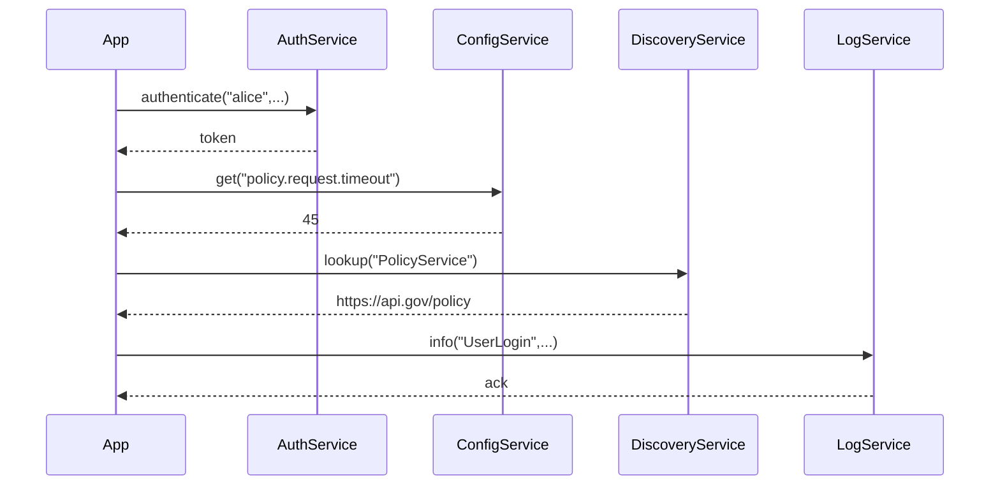

# Chapter 2: Core Infrastructure (HMS-SYS)

Welcome back! In [Chapter 1: AI Agents Module (HMS-A2A)](01_ai_agents_module__hms_a2a__.md), we met our smart “advisor” layer. Now we’ll dig one layer down—into the **Core Infrastructure (HMS-SYS)**—the utilities that make every part of our system run smoothly.

---

## 2.1 Why Core Infrastructure? A Real-World Motivation

Imagine a government office building:
- It has **electricity**, **water**, **heating/cooling**, and **elevators**.
- Every department relies on these shared utilities to do its job.
- If the HVAC fails, nobody can work comfortably; if the lights go out, nothing runs.

In our digital “building,” HMS-SYS provides:
- **Authentication** (who are you?)
- **Logging** (what just happened?)
- **Configuration** (how should we behave?)
- **Service Discovery** (where is that other service?)

Every application—AI agents, policy engines, citizen portals—“plugs into” these utilities so they all speak the same language, follow the same security rules, and stay compliant.

---

## 2.2 Core Concepts

Let’s break HMS-SYS down into four main services:

1. **Authentication Service**  
   Verifies identities and issues tokens.  
2. **Logging Service**  
   Records events (errors, access, audits) in a central store.  
3. **Configuration Service**  
   Holds feature flags and settings, so you don’t hard-code values.  
4. **Service Discovery**  
   Keeps a registry of URLs/endpoints for all microservices.

Think of them like the main breaker panel (auth), the CCTV and logbook (logging), the thermostat (config), and the building directory (discovery).

---

## 2.3 Using HMS-SYS: A Minimal Example

Scenario: A citizen-facing portal needs to log in a user, read a timeout setting, find the PolicyService address, and write an audit log.

```python
# file: app_example.py
from hms_sys import HMSCore

core = HMSCore()

# 1. Authenticate a user
token = core.auth.authenticate("alice", "Wonderland123")

# 2. Fetch a config value
timeout = core.config.get("policy.request.timeout")

# 3. Discover the PolicyService endpoint
policy_url = core.discovery.lookup("PolicyService")

# 4. Write an audit entry
core.logger.info("UserLogin", user="alice", token=token)

print(f"Token={token}, Timeout={timeout}, PolicyURL={policy_url}")
```

Explanation:
- We create a single `HMSCore` object that bundles all shared services.
- We call each service in turn—auth, config, discovery, logging.
- The portal code never worries about *how* tokens are stored or where configs live; HMS-SYS hides that complexity.

---

## 2.4 What Happens Under the Hood?

Here’s a step-by-step flow when `app_example.py` runs:



1. **App** asks **AuthService** to verify credentials.  
2. **AuthService** returns a token.  
3. **App** retrieves a config value from **ConfigService**.  
4. **App** finds the URL of the **PolicyService** via **DiscoveryService**.  
5. **App** logs the event through **LogService**.

---

## 2.5 Inside HMS-SYS: Simplified Code Snippets

Below are tiny, beginner-friendly sketches of each service. Real implementations would talk to databases, secrets vaults, or Kubernetes DNS—but this shows the basic idea.

### 2.5.1 Authentication Service

```python
# file: auth_service.py
class AuthService:
    def authenticate(self, username, password):
        # In reality: check credentials in a secure store
        if username == "alice" and password == "Wonderland123":
            return "token-xyz-123"
        raise Exception("Invalid credentials")
```

### 2.5.2 Configuration Service

```python
# file: config_service.py
class ConfigService:
    def __init__(self):
        # Hard-coded defaults; real world: load from a DB or file
        self._store = {
            "policy.request.timeout": 45,
            "max.concurrent.requests": 10
        }
    def get(self, key):
        return self._store.get(key)
```

### 2.5.3 Service Discovery

```python
# file: discovery_service.py
class DiscoveryService:
    def __init__(self):
        # Stub registry; real world: dynamic registry like Consul
        self._registry = {
            "PolicyService": "https://api.gov/policy",
            "UserService": "https://api.gov/users"
        }
    def lookup(self, service_name):
        return self._registry.get(service_name)
```

### 2.5.4 Logging Service

```python
# file: log_service.py
class LogService:
    def info(self, event, **metadata):
        # Real world: send to ELK/CloudWatch
        print(f"[INFO] {event} - {metadata}")
```

### 2.5.5 The HMSCore Wrapper

```python
# file: hms_sys.py
from auth_service import AuthService
from config_service import ConfigService
from discovery_service import DiscoveryService
from log_service import LogService

class HMSCore:
    def __init__(self):
        self.auth      = AuthService()
        self.config    = ConfigService()
        self.discovery = DiscoveryService()
        self.logger    = LogService()
```

---

## 2.6 Conclusion

You’ve learned how **HMS-SYS** provides the building-block services—authentication, logging, configuration, and discovery—so that every module in your public-sector system runs smoothly and securely. Next up, we’ll see how those foundations power the [Microservices Framework (HMS-SVC)](03_microservices_framework__hms_svc__.md). Stay tuned!

---

Generated by [HardisonCo [NARA-DOC]](https://github.com/The-Pocket/Tutorial-Codebase-Knowledge)