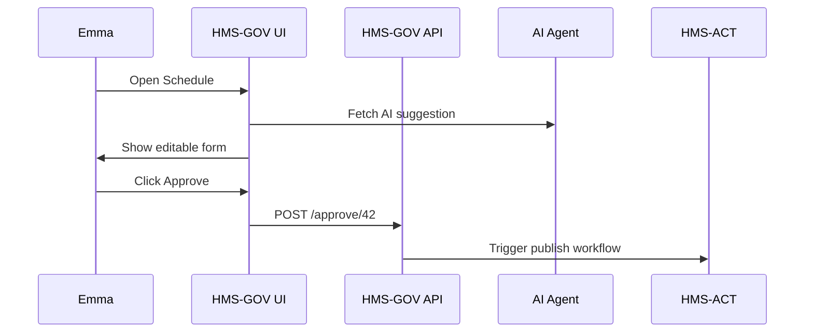

# Chapter 2: Government Admin Portal (HMS-GOV)

*From [Chapter 1: Three-Layer Governance Model](01_three_layer_governance_model_.md) you learned that every HMS feature lives on one of three “floors.” 
HMS-GOV is the **front door** to those floors for policy-makers.*

---

## 1. Why Does HMS-GOV Exist? 🚢

Imagine **Emma**, an operations manager at the **St. Lawrence Seaway** (part of the Department of Transportation).  
Tonight she must:

1. Review an AI-generated lock-operation schedule.  
2. Adjust opening times for a large cargo convoy.  
3. Publish the final schedule so shippers and citizens can plan.  
4. Leave an audit trail that legal teams (and auditors) can trust.

Without a single control room Emma would be juggling spreadsheets, emails, and scripts—slow, error-prone, and non-compliant.

**HMS-GOV solves this by giving her one secure portal with:**

• Dashboards  
• Approval queues  
• AI recommendations (from [AI Agent Framework](10_ai_agent_framework__hms_agt___hms_agx__.md))  
• “Publish” buttons that automatically log every decision  

---

## 2. Key Concepts in Plain English

| Concept | What It Feels Like | Why a Beginner Cares |
|---------|-------------------|----------------------|
| Widget Dashboard | Lego blocks showing stats (“Locks open”, “Weather alerts”) | You can add or remove blocks without touching backend code. |
| Approval Queue | Inbox for decisions (“Approve Schedule #2024-05-A”) | Keeps work organized; every click is recorded. |
| AI Recommendation Panel | Smart assistant saying “Try opening Lock 3 at 14:00” | Shows how AI integrates, yet still gives humans final say. |
| Audit Trail | Tamper-proof diary | Required by law for federal systems. |
| Release Notes Generator | One-click summary for citizens | Makes transparency effortless. |

---

## 3. A 30-Second Interface Tour

```
┌────────────────────────────────────────────┐
│  HMS-GOV Dashboard                         │
├────────────────────────────────────────────┤
│ [Widget] Lock Status       | [Widget] AI Risk│
│ [Queue] Approvals (3)      | [Log] Audit     │
└────────────────────────────────────────────┘
```

### Tiny React Widget (Interface Floor)

```tsx
// LockStatusWidget.tsx (≤20 lines)
import { useEffect, useState } from "react";

export default function LockStatusWidget() {
  const [status, setStatus] = useState("Loading...");
  useEffect(() => {
    fetch("/api/locks/status")               // calls Management Floor
      .then(r => r.json())
      .then(d => setStatus(`${d.open} open / ${d.closed} closed`));
  }, []);
  return <div className="widget">Locks: {status}</div>;
}
```

**What just happened?**  
1. The component asks the **Management Floor API** for lock data.  
2. No policy logic here—React just shows the result.  

---

## 4. The Core Use Case: Approve & Publish a Schedule

### Step-by-Step

1. Manager clicks “Review AI Schedule”.  
2. Edits parameters (e.g., “delay lock 2 by 10 min”).  
3. Clicks **Approve**.  
4. HMS-GOV stores the signed JSON + diff in the audit trail.  
5. Citizens instantly see updated times on the public site.

### Minimal Backend Route (Management Floor)

```python
# routes/schedules.py (≤20 lines)
from governance import check_publish_rights
from db import save_audit, publish_schedule

def approve(schedule_id, user, edits):
    check_publish_rights(user)        # Governance rule
    publish_schedule(schedule_id, edits)
    save_audit(user, schedule_id, edits)
    return {"status": "published"}
```

Explanation:  
• `check_publish_rights` pulls rules from the **Governance Floor**.  
• `save_audit` ensures compliance requirements are met.  

---

## 5. How the Pieces Talk



Keep in mind:  
• **AGT** is detailed in [AI Agent Framework](10_ai_agent_framework__hms_agt___hms_agx__.md).  
• **ACT** (workflow) is covered in [Event & Workflow Orchestration](08_event___workflow_orchestration__hms_act___hms_oms__.md).

---

## 6. Under the Hood in 3 Files

1. `governance/policies.yaml` (Governance Floor):  
   ```yaml
   allow_publish_roles:
     - Seaway-Manager
     - DOT-Admin
   ```
2. `services/authz.py` (Management Floor):  
   ```python
   import yaml, os
   POLICIES = yaml.safe_load(open("governance/policies.yaml"))

   def check_publish_rights(user):
       if user.role not in POLICIES["allow_publish_roles"]:
           raise PermissionError("Not authorized")
   ```
3. `ui/src/hooks/useAudit.ts` (Interface Floor):  
   ```ts
   export async function logView(itemId: string) {
     await fetch(`/api/audit/view/${itemId}`, { method: "POST" });
   }
   ```

Each file lives on its assigned floor, reflecting the model from Chapter 1.

---

## 7. Try It Yourself (Local Mock)

```bash
# 1. Start mock server
npx hms-gov-demo start
# 2. Open http://localhost:3000
# 3. Login with role "Seaway-Manager"
# 4. Approve Schedule #1 and watch the console log: "published"
```

This sandbox fakes the backend but shows the full click-to-publish flow.

---

## 8. Where HMS-GOV Fits in the Ecosystem

```
┌──────── Governance Floor ────────┐
│  [HMS-CDF] Laws & Policies       │
└──────────────────────────────────┘
┌──────── Management Floor ────────┐
│  HMS-GOV API  •  HMS-ACT         │
└──────────────────────────────────┘
┌──────── Interface Floor ─────────┐
│  HMS-GOV Web Portal (you saw it) │
└──────────────────────────────────┘
```

Future chapters will zoom into:  
• **[Legislative Workflow Engine (HMS-CDF)](03_legislative_workflow_engine__hms_cdf__.md)** – how policies above are drafted & versioned.  
• **[Backend API Gateway](06_backend_api_gateway_.md)** – how calls to `/api/locks/status` get throttled and secured.

---

## 9. Recap & What’s Next

You now know how HMS-GOV:

• Presents dashboards, queues, and AI tips to officials.  
• Lets humans override AI while preserving an iron-clad audit trail.  
• Sits neatly on the Interface & Management floors from Chapter 1.

Ready to see how the actual policy documents move from “draft bill” to “enforced rule”?  
Head to [Legislative Workflow Engine (HMS-CDF)](03_legislative_workflow_engine__hms_cdf__.md).

---

Generated by [HardisonCo [NARA-DOC]](https://github.com/The-Pocket/Tutorial-Codebase-Knowledge)