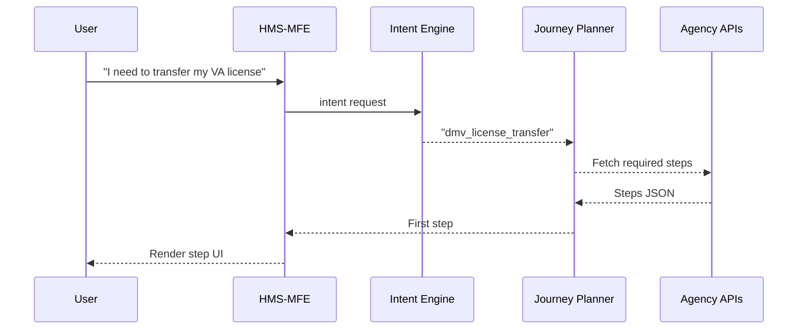

# Chapter 2: Intent-Driven Navigation & AI-Guided Journeys  

*From “click-hunt through 20 menus” to “tell me what you need and I’ll walk you there.”*  

[← Back to Chapter 1: Multi-Frontend Experience (HMS-MFE)](01_multi_frontend_experience__hms_mfe__.md)

---

## 1. Why Do We Need “Intent”?  

Imagine **Ben**, a military spouse who just moved to Maryland.  
He needs to:

1. Transfer his **driver’s license** from Virginia.  
2. **Appeal a parking ticket** he got on base.  
3. Update his **VA health-benefit address**.

Today, Ben must discover three different websites, guess the right forms, and re-enter the same personal data each time—pure frustration.

HMS asks one simple question instead:

> “Ben, what outcome do you want?”

Ben answers: “Switch my license, dispute my ticket, and update my VA address.”

Behind the scenes, the **Intent Engine** detects three *intents* and stitches together step-by-step **Journeys** that may travel across DMV, DoD, and VA systems.  
Ben only clicks “Next.”

---

## 2. Key Concepts in Plain English  

| Term | Everyday Analogy | Why It Matters |
|------|------------------|----------------|
| **Intent** | What you tell a 311 operator (“I need to report a pothole”). | Reduces endless menu digging. |
| **Journey** | A GPS route—turn-by-turn instructions that reach the destination. | Ensures users finish, not quit. |
| **Step Template** | Reusable Lego block (e.g., *Upload Proof of Identity*). | Consistency + accessibility. |
| **Intent Engine** | The smart operator who figures out which agency is responsible. | Saves users from bureaucracy. |
| **Journey Planner** | The GPS algorithm that picks the fastest road. | Optimizes across *multiple* agencies. |

---

## 3. A 60-Second Walk-Through  

Below is a **minimal** React component that hands the user’s free-text answer to the Intent Engine and renders the first Journey step.

```jsx
// File: src/IntentStarter.jsx
import { askIntent, getFirstStep } from '@hms/intent-sdk';
import { StepRenderer }       from '@hms-mfe/components';
import { useState }           from 'react';

export default function IntentStarter() {
  const [step, setStep] = useState(null);

  async function handleSubmit() {
    const answer = prompt("What outcome do you need?");
    const intentId = await askIntent(answer);     // e.g., "dmv_license_transfer"
    const first   = await getFirstStep(intentId); // e.g., "upload_identity"
    setStep(first);
  }

  return step
    ? <StepRenderer step={step} />
    : <button onClick={handleSubmit}>Start</button>;
}
```

What happens?

1. We prompt Ben.  
2. `askIntent()` sends his sentence to the Intent Engine, which returns an `intentId`.  
3. `getFirstStep()` fetches the opening step of the Journey.  
4. `<StepRenderer>` shows the UI for that step (file upload, form, etc.).

All under **20 lines**—beginner-friendly!

---

## 4. Peeking Inside: How Does the Engine Decide?  



---

## 5. Under the Hood: 3 Tiny Code Snippets  

### 5.1 Detecting Intent (NLP Lite)  

```python
# File: intent_engine/rules.py
RULES = {
    "license":      "dmv_license_transfer",
    "parking":      "parking_ticket_appeal",
    "va address":   "va_address_change"
}

def detect_intent(sentence: str) -> str:
    lower = sentence.lower()
    for key, intent in RULES.items():
        if key in lower:
            return intent
    return "fallback"
```

Explanation  
• Super-simple keyword search keeps the demo approachable.  
• Real deployments swap this for an AI model or Amazon Comprehend.

---

### 5.2 Journey Blueprint  

```json
// File: journeys/dmv_license_transfer.json
[
  { "id": "upload_identity",   "template": "upload-docs", "args": { "doc": "Driver’s License or Passport" } },
  { "id": "pay_fee",           "template": "payment",     "args": { "amount": 35 } },
  { "id": "schedule_exam",     "template": "calendar",    "args": { "kind": "Vision Test" } },
  { "id": "confirmation",      "template": "receipt" }
]
```

Explanation  
Each step points to a reusable template; only *arguments* differ (fee amount, calendar type, etc.).

---

### 5.3 Serving Steps Over an API  

```ts
// File: api/journey.ts
import journeys from '../journeys';

export function getFirstStep(intentId: string) {
  const [first] = journeys[intentId];
  return Promise.resolve(first);  // pretend DB
}
```

Explanation  
• Returns the first JSON block; later steps are fetched as the user progresses.  
• Under 10 lines—easy to grasp.

---

## 6. Where Does This Sit in the HMS Stack?  

1. User starts in the shared UI from [Chapter 1](01_multi_frontend_experience__hms_mfe__.md).  
2. Intent Engine classifies their request.  
3. Journey Planner sequences cross-agency steps.  
4. The **AI Representative Agent** in [Chapter 3](03_ai_representative_agent__hms_a2a__.md) can even *fill* those steps for the user automatically.  
5. Completed data flows through the [Backend API Layer](07_backend_api___service_layer__hms_api__hms_svc__.md) to each agency.

---

## 7. Tips for First-Time Integrators  

1. Install SDK: `npm i @hms/intent-sdk`  
2. Add new intents by editing `intent_engine/rules.py`.  
3. Author journey steps in plain JSON—no code build needed.  
4. Use `<StepRenderer>` so accessibility is handled for you (Section 508 compliant).  
5. Test end-to-end with: `npm run intent:dev`.

---

## 8. Summary & Next Steps  

You learned:

* Why asking for the *outcome* beats showing a maze of forms.  
* The building blocks—Intent, Journey, Step Templates, Engine, Planner.  
* A minimal code sample that turns free text into the first actionable step.  
* How HMS coordinates multiple agencies without confusing the citizen.

Ready to meet the AI “clerk” that can *execute* these steps on the user’s behalf?  
Jump to ➡ [Chapter 3: AI Representative Agent (HMS-A2A)](03_ai_representative_agent__hms_a2a__.md)

---

Generated by [HardisonCo [NARA-DOC]](https://github.com/The-Pocket/Tutorial-Codebase-Knowledge)