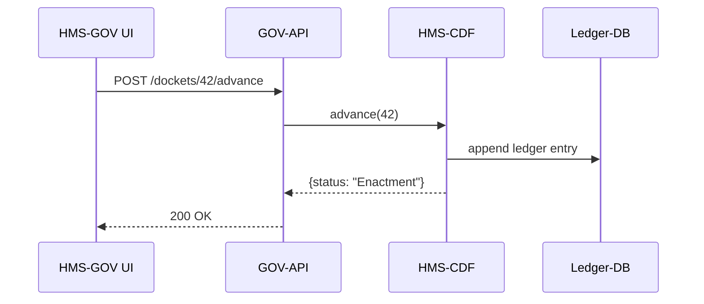

# Chapter 3: Legislative Workflow Engine (HMS-CDF)

*(From [Chapter 2: Government Admin Portal (HMS-GOV)](02_government_admin_portal__hms_gov__.md) you saw Emma “approve & publish” a shipping schedule.  
But **where did the schedule’s legal authority come from?**  
That story starts here.)*

---

## 1. Why a Workflow Engine for Laws? 🗳️

Imagine the **Department of Housing and Urban Development (HUD)** wants a new rule:  
“Every federally-funded apartment must install smart smoke detectors.”

The journey looks like this:

```
Draft 📝  →  Committee Review 🧐  →  Floor Vote 🗳️  →  Enactment ✅
```

Historically, each phase lived in different email threads or PDFs—easy to lose, hard to audit.

**HMS-CDF** (Codified Document Flow) is the digital clerk that:

1. Tracks every amendment like Git tracks code.  
2. Stops a rule from moving forward until all required steps pass.  
3. Emits machine-readable events so portals, bots, or external systems stay in sync.

Result: Agencies can **simulate**, **test**, or even **auto-promulgate** regulations without violating procedure.

---

## 2. Key Ideas in Plain English

| Term | Think of it as… | ⚖️  Why it matters |
|------|-----------------|-------------------|
| Docket | A folder for one policy | Holds all versions & comments |
| Phase | “Swim lane” in the process | Draft → Committee → Vote → Enact |
| Amendment | A pull-request on the docket | Must be voted in before merge |
| Guard-Rail Checker | A referee | Verifies quorum, signatures, etc. |
| Audit Ledger | Black box flight recorder | Immutable proof for courts |

---

## 3. Quick-Start: Create & Walk a Policy Through the Phases

Below is a **Rust-based CLI** shipped with HMS-CDF.  
(Beginner note: you don’t need to know Rust to follow along.)

### 3.1. Create a Docket

```bash
$ hms-cdf new "Smart Smoke Detector Rule"
✔️  Docket #42 created in ./dockets/42
```

Explanation: Generates a folder `dockets/42/` with a `policy.yml` skeleton.

### 3.2. Add an Amendment

```bash
$ hms-cdf amend 42 --file fix_dates.patch
Amendment A1 queued for Committee Review
```

The engine **refuses** to jump ahead until Committee signs off.

### 3.3. Simulate a Vote

```bash
$ hms-cdf advance 42
🔎  Guard-Rail: quorum = 8/10  ...OK
🗳️  Vote result: 7 Y / 1 N  ...PASSED
📦  Phase moved to Enactment
```

All three console outputs come from the Guard-Rail Checker.

---

## 4. Where Does HMS-CDF Live in the Three Floors?

```
┌──────── Governance Floor ────────┐
│ Legislative Workflow Engine      │  ← this chapter
└──────────────────────────────────┘
┌──────── Management Floor ────────┐
│ HMS-GOV API, HMS-ACT orchestrator│
└──────────────────────────────────┘
┌──────── Interface Floor ─────────┐
│ HMS-GOV Web Portal (“Approve”)   │
└──────────────────────────────────┘
```

CDF owns **policy truth**; everyone else just reads or executes it.

---

## 5. How Emma’s “Approve” Button Talks to HMS-CDF



Key points:

1. UI never hits CDF directly—Management Floor mediates.  
2. Ledger append is atomic; if it fails, phase doesn’t change.

---

## 6. Peek Under the Hood (Rust ≤ 20 lines each)

### 6.1. Finite-State Machine

```rust
// src/fsm.rs
use crate::Phase::*;
#[derive(Clone)]
pub enum Phase { Draft, Committee, Vote, Enactment }

pub fn next(current: Phase) -> Phase {
    match current {
        Draft     => Committee,
        Committee => Vote,
        Vote      => Enactment,
        Enactment => Enactment, // terminal
    }
}
```

Beginner takeaway: A simple `match` decides the only legal “next stop.”

### 6.2. Guard-Rail Checker

```rust
// src/guard.rs
pub fn check_quorum(votes: usize, members: usize) -> Result<()> {
    if votes * 2 >= members * 3 { Ok(()) }     // 2/3 quorum
    else { Err("Quorum not met".into()) }
}
```

Notice the logic is transparent & auditable—one reason HMS-CDF uses Rust.

### 6.3. Ledger Append

```rust
// src/ledger.rs
pub fn record(event: &str, docket: u32) -> Result<()> {
    let line = format!("{docket},{timestamp},{event}\n");
    std::fs::OpenOptions::new()
        .append(true).open("ledger.csv")?
        .write_all(line.as_bytes())?;
    Ok(())
}
```

Each change is one CSV line—simple for demos, upgradeable to blockchain later.

---

## 7. Talk to HMS-CDF from Any Language

Calling CDF doesn’t require Rust; it exposes a tiny HTTP API.

```python
# advance_policy.py
import requests
resp = requests.post("http://cdf.local/dockets/42/advance")
print(resp.json())   # → {'phase': 'Enactment'}
```

Under 10 lines and language-agnostic—perfect for micro-services in [Backend API Gateway](06_backend_api_gateway_.md).

---

## 8. Common Pitfalls & Tips

| Pitfall | Quick Fix |
|---------|-----------|
| “Advance” fails with `Quorum not met` | Run `hms-cdf vote --yes 3 --no 0` to gather enough votes before advancing. |
| Amended text disappears | Amendments live in `dockets/42/amendments/`; merge them before advancing. |
| Circular references between policies | Use `hms-cdf link` only after both dockets reach Enactment to avoid loops. |

---

## 9. Recap & What’s Next

You learned how HMS-CDF:

• Tracks a policy from **idea to law** with baked-in procedure checks.  
• Provides a **finite-state machine** that is tiny yet auditable.  
• Feeds higher layers like HMS-GOV and orchestration tools without giving up control.

Ready to see how the front-end teams plug multiple mini-apps (dashboard, vote panel, audit viewer) into one cohesive portal?  
Jump to [Chapter 4: Micro-Frontend Library (HMS-MFE)](04_micro_frontend_library__hms_mfe__.md).

---

Generated by [HardisonCo [NARA-DOC]](https://github.com/The-Pocket/Tutorial-Codebase-Knowledge)