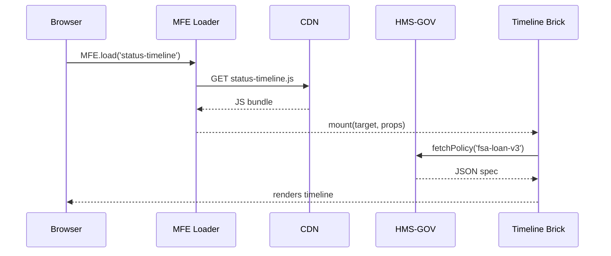
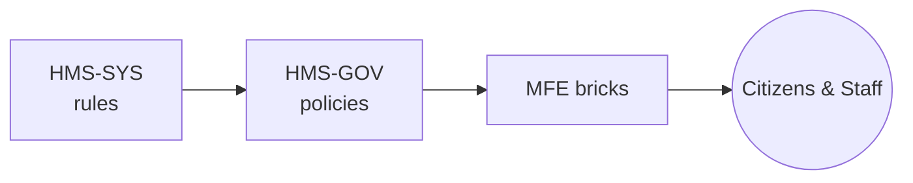

# Chapter 3: Micro-Frontend Library (HMS-MFE)

*(A sequel to [Policy Lifecycle Engine (HMS-CDF)](02_policy_lifecycle_engine__hms_cdf__.md).)*  

---

> “Build government UIs the way kids build castles—one Lego at a time.”  
> – a happy city-hall intern

---

## 1. Why a Micro-Frontend Library?

Picture two agencies that both care about vessels on U.S. waters:

* **U.S. Coast Guard** needs a *“Search & Rescue”* dashboard.  
* **NOAA Fisheries** needs a *“Catch Reporting”* portal.

They share 80 % of the look-and-feel (logos, status banners, help chat) but each has unique workflows. In a monolith, one bad CSS rule from the Coast Guard could break NOAA’s portal.  
**HMS-MFE** solves this by shipping **self-contained UI blocks** that load (and crash) independently—so a bug in the Coast Guard widget never sinks NOAA’s site.

---

## 2. The Use Case We’ll Build

We will create the first page of a **Farm Service Agency (FSA)** loan-application portal:

1. A header with the citizen’s name and application ID.  
2. A status timeline that updates when HMS-GOV policies change.  
3. An approval card that appears only after credit checks pass.

You’ll see how three Lego bricks snap together in minutes.

---

## 3. Key Concepts (the 3-piece Lego set)

| Name | Think of it as… | What beginners need to know |
| ---- | --------------- | --------------------------- |
| **Component** | A single Lego brick. | Comes as a tiny JS + CSS bundle. |
| **Loader** | The Lego mat. | Dynamically fetches bricks at runtime. |
| **Policy Binding** | Colored stickers. | Tells a brick how to behave by reading HMS-GOV specs. |

We’ll visit each concept through code next.

---

## 4. Quick Start (10 minutes)

### 4.1 Add the Loader script

```html
<!-- index.html -->
<script src="https://cdn.hms.gov/mfe/loader.js"></script>
<div id="app"></div>
```

*Explanation* – `loader.js` is only ~8 KB. It opens the door for all other bricks.

---

### 4.2 Snap in the Identity Banner

```js
// app.js
MFE.load('identity-banner', {
  target: '#app',
  props: { userId: 'FS12345', agency: 'FSA' }
});
```

*What happens?*  
• The loader fetches `identity-banner@1.4.0.js` from the CDN.  
• It renders “Welcome, FS12345” with the FSA logo—no build step required.

---

### 4.3 Add the Status Timeline (Policy-Aware)

```js
MFE.load('status-timeline', {
  target: '#app',
  subscribe: { policyId: 'fsa-loan-v3' } // pulled from HMS-GOV
});
```

*What happens?*  
When [HMS-GOV](01_governance_layer__hms_sys___hms_gov___hms_mfe__.md) publishes a new step—say, **“Soil Test Completed”**—the timeline updates instantly, re-rendering only itself.

---

### 4.4 Conditional Approval Card

```js
MFE.load('approval-card', {
  target: '#app',
  showIf: ctx => ctx.policy.step === 'CREDIT_PASS'
});
```

`ctx.policy` is automatically injected by the loader, so your JavaScript stays tiny.

---

### 4.5 Run it

```bash
npx serve .
```

Open `http://localhost:5000` and toggle policy steps with the mock button in the dev-toolbar. Watch bricks appear/disappear without a page reload.

---

## 5. Behind the Curtain – 60-Second Tour



1. The loader downloads only the requested brick.  
2. Each brick talks to HMS-GOV directly, not through the host page.  
3. If **X** crashes, the loader isolates the error and shows a fallback banner—all other bricks stay alive.

---

## 6. Tiny Glimpse at the Loader Code

```js
// loader.js (excerpt – 12 lines)
const cache = {};
export async function load(name, cfg) {
  if (!cache[name]) {
    const mod = await import(`https://cdn.hms.gov/mfe/${name}.js`);
    cache[name] = mod.default;
  }
  const Brick = cache[name];
  try {
    Brick.mount(cfg);
  } catch (e) {
    console.error(`[MFE] ${name} failed`, e);
    showFallback(cfg.target);
  }
}
```

*Takeaway* – The loader is so small you can read it on a coffee break. It caches bricks and guards against crashes.

---

## 7. How Does a Brick Bind to Policy?

```js
// status-timeline.js (simplified)
export default {
  async mount({ target, subscribe }) {
    const root = document.querySelector(target);
    const policy = await fetch(`/gov/policy/${subscribe.policyId}`).then(r=>r.json());
    render(root, policy);
    // open WebSocket for live updates
    ws(subscribe.policyId, newPolicy => render(root, newPolicy));
  }
};
```

*Beginner note* – No global variables, no shared framework version; each brick brings its own React, Vue, or vanilla JS.

---

## 8. Best Practices

• **One concern per brick** – header, chart, or form section, never all.  
• **Version pinning** – `identity-banner@^1.4` prevents surprise upgrades.  
• **Design tokens** – bricks read colors and fonts from `window.govTokens` so every agency stays on-brand.  
• **Graceful fallback** – every brick must export `mount` and `unmount`; loader swaps them during hot upgrades.

---

## 9. Where Does HMS-MFE Sit in the Big Picture?



HMS-MFE is the **shop window**: policies decide *what* to show; bricks decide *how* to show it.

---

## 10. Summary & Next Steps

You assembled a government portal from three independent Lego bricks, all driven by live policy data.  
If you can build one page, you can build fifty—each resilient to bugs in the others.

Ready to route citizens through those pages with AI-assisted paths? Continue to [Intent-Driven Navigation & AI-Guided Journeys](04_intent_driven_navigation___ai_guided_journeys_.md).

---

---

Generated by [HardisonCo [NARA-DOC]](https://github.com/The-Pocket/Tutorial-Codebase-Knowledge)