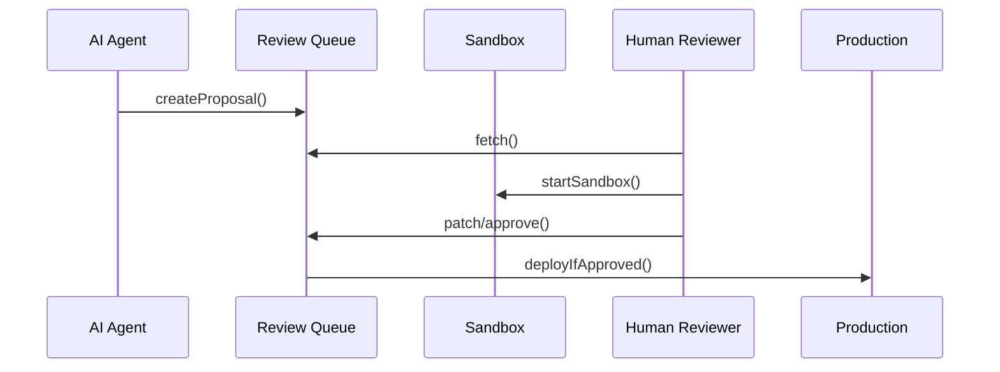

# Chapter 4: Human-in-the-Loop (HITL) Oversight  

[← Back to Chapter 3: AI Representative Agent (HMS-A2A)](03_ai_representative_agent__hms_a2a__.md)

---

## 1. Why Do We Need Humans *and* Robots?

Imagine the **Cybersecurity & Infrastructure Security Agency (CISA)** on a Friday night.  
An AI Agent (from Chapter 3) detects that a new firewall rule is **blocking 12 % of legitimate traffic**.  
It drafts a fix: *“Roll back rule `FW-982` and re-route through Region B.”*

Sounds great—but:

* What if Region B is already at capacity?  
* What if the rollback opens a brand-new vulnerability?  

Congress wouldn’t let a bill leave committee without markup, and agencies shouldn’t let AI push code without review.  
**HITL Oversight** is the “committee markup session” where *humans* can tweak, test, or veto every AI recommendation.

---

## 2. Key Concepts in Plain English  

| Concept | Capitol Hill Analogy | Why It Matters |
|---------|---------------------|----------------|
| **Review Queue** | Stack of bills awaiting markup | Keeps proposals organized |
| **Simulation Sandbox** | CBO cost analysis room | Test impact before it’s real |
| **Approval Workflow** | Committee vote | Go / No-Go with signatures |
| **Roles & Permissions** | Chair vs. Junior member | Only the right people sign off |
| **Audit Trail** | Congressional Record | Transparency + legal defense |

---

## 3. A 5-Minute Walk-Through  

### Use Case: Rolling Back `FW-982` at CISA  

1. **AI Agent** publishes a proposal `prop-fw-rollback`.  
2. The proposal appears in the **HITL Review Queue**.  
3. A senior CISA engineer runs the fix in a **Sandbox**.  
4. She tweaks the YAML (changes Region B → Region C).  
5. She clicks **Approve**; HMS deploys automatically.  
6. All actions are logged in the **Audit Trail**.

You will build steps 2–5 below.

---

### 3.1 Subscribe to the Review Queue  

```bash
# file: fetch_queue.sh
curl -H "Authorization: Bearer $TOKEN" \
     https://api.hms.gov/hitl/queue?agency=CISA
```

Typical response:

```json
[
  {
    "proposalId": "prop-fw-rollback",
    "summary": "Roll back FW-982; reroute to Region B",
    "confidence": 0.88,
    "status": "awaiting_review"
  }
]
```

Explanation  
• One `GET` call shows every pending proposal.  
• `confidence` comes from the AI Agent (Chapter 3).  
• `status` tells us this item needs human eyes.

---

### 3.2 Spin Up a Simulation Sandbox  

```bash
# file: start_sandbox.sh
curl -X POST \
     -d '{ "proposalId":"prop-fw-rollback" }' \
     https://api.hms.gov/hitl/sandbox
```

Response (trimmed):

```json
{ "sandboxId": "sbx-42", "url": "https://sbx-42.hms.gov" }
```

What happens  
• HITL clones production configs into an isolated kube-namespace.  
• The engineer clicks the `url`, sees live dashboards safe from real users.

---

### 3.3 Patch the Proposal (Optional)  

```yaml
# file: patch.yaml  (under 10 lines!)
action: reroute
fromRegion: "A"
toRegion:   "Region C"   # changed from B after test
rollBackMinutes: 30
```

Upload the patch:

```bash
curl -X PATCH \
     -F file=@patch.yaml \
     https://api.hms.gov/hitl/proposals/prop-fw-rollback
```

Explanation  
Only the diff is sent; HITL merges it with the original suggestion.

---

### 3.4 Approve or Reject  

```bash
curl -X POST \
     -d '{ "decision":"approve", "comment":"Region C looks healthier." }' \
     https://api.hms.gov/hitl/proposals/prop-fw-rollback/decision
```

Result:

```json
{ "deployment":"in_progress", "expectedLive":"2023-10-05T23:17Z" }
```

HMS now ships the change and updates the audit log.

---

## 4. What Happens Behind the Curtain?



Only **five** actors—easy to remember.

---

## 5. A Peek at the Implementation

### 5.1 Review Queue Table (PostgreSQL)

```sql
-- file: db/01_queue.sql
CREATE TABLE hitl_queue (
  id           TEXT PRIMARY KEY,
  agency       TEXT,
  payload      JSONB,
  status       TEXT,        -- awaiting_review, approved, rejected
  created_at   TIMESTAMPTZ,
  decided_at   TIMESTAMPTZ
);
```

Beginners’ notes  
• One row per proposal.  
• `status` drives the workflow.  
• JSONB makes it schema-flexible for any agency.

---

### 5.2 Tiny Go API for “Approve”

```go
// file: api/approve.go
func Approve(w http.ResponseWriter, r *http.Request) {
  id := mux.Vars(r)["id"]
  // 1. update DB
  db.Exec(`UPDATE hitl_queue SET status='approved', decided_at=now()
           WHERE id=$1`, id)
  // 2. emit Kafka event for deployment
  bus.Publish("hitl.approved", id)
  json.NewEncoder(w).Encode(map[string]string{
       "deployment":"in_progress"})
}
```

Under 20 lines and readable even if you’re new to Go.

---

### 5.3 Guardrails Config (per Agency)

```yaml
# file: config/hitl/cisa.yaml
allowedEditors:
  - "alice@cisa.gov"
  - "bob@cisa.gov"
mandatoryApprovers: 1
sandbox:
  cpu: "2"
  memory: "4Gi"
```

Explanation  
• Only listed staff can patch proposals.  
• At least one person must click **Approve**.  
• Sandbox resources are capped to avoid surprises.

---

## 6. Tips for First-Time Integrators

1. Add your agency reviewers:  
   `hms hitl add-editor alice@agency.gov`  
2. Pick a **Sandbox Region** close to prod to reduce latency.  
3. Use `?dryRun=true` on the approve endpoint in staging.  
4. Remind staff: “Reject” doesn’t delete the proposal—it sends feedback to the AI Agent to learn.

---

## 7. Where HITL Fits in the HMS World

* Starts with a suggestion from [AI Representative Agent (HMS-A2A)](03_ai_representative_agent__hms_a2a__.md).  
* Humans review, tweak, and publish via **HITL Oversight** (this chapter).  
* Once approved, changes are codified into the [Policy / Process Module](05_policy___process_module_.md) for long-term governance.  
* All calls flow through the backbone services introduced later in [Backend API / Service Layer](07_backend_api___service_layer__hms_api__hms_svc__.md).

---

## 8. Summary & Next Steps

You learned:

* The motivation for human checkpoints in an AI-driven platform.  
* Core HITL building blocks—Review Queue, Sandbox, Approval Workflow, Roles, Audit Trail.  
* A step-by-step example rolling back a risky firewall rule at CISA.  
* A glimpse of the simple database table and Go handler powering it.

Time to see how approved changes are captured as **official policy artifacts**.  
Continue to ➡ [Chapter 5: Policy / Process Module](05_policy___process_module_.md)

---

Generated by [HardisonCo [NARA-DOC]](https://github.com/The-Pocket/Tutorial-Codebase-Knowledge)