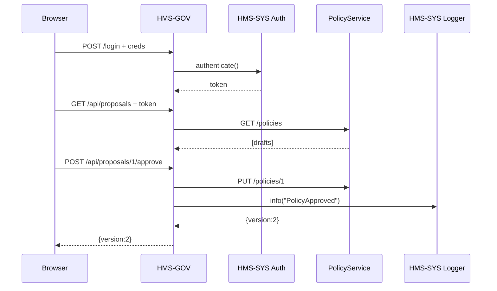

# Chapter 5: Administration Portal (HMS-GOV)

In the previous chapter we learned how to create and version business rules with the [Policy Management API (HMS-API / HMS-MKT)](04_policy_management_api__hms_api___hms_mkt__.md). Now it’s time to give officials and policy-makers a friendly, secure “council chamber” UI to review, adjust, and sign off on those rules. Welcome to the **Administration Portal (HMS-GOV)**.

## 5.1 Why HMS-GOV? A Real-World Motivation

Imagine the Environmental Protection Agency (EPA) has an AI agent that proposes new emission-limit policies. A senior official needs to:

1. Log in securely.
2. See a list of AI-drafted policies.
3. Tweak numerical parameters (e.g., allowable CO₂ ppm).
4. Approve or reject each draft.
5. Publish the change so all systems pick it up.

Without HMS-GOV, you’d jump between raw databases, code, or spreadsheets. HMS-GOV bundles all of this into one safe, audit-friendly web app.

## 5.2 Key Concepts

Let’s break the portal into its main pieces:

1. **Authentication**  
   Officials log in with their government credentials.  
2. **Dashboard**  
   A table showing all pending AI proposals (name, date, status).  
3. **Proposal Editor**  
   A form to view policy details and adjust parameters.  
4. **Approval Workflow**  
   Buttons to “Approve” or “Request Changes.”  
5. **Audit Log**  
   Every action (who, when, what) is recorded for compliance.

Think of HMS-GOV as the virtual chamber where each council member can speak, vote, and have their vote recorded.

## 5.3 Using HMS-GOV: A Minimal Example

Below is a tiny backend service that:

- Lets an official log in.
- Fetches policy drafts from HMS-API.
- Sends approvals back to HMS-API.
- Writes an audit entry.

```javascript
// file: portal_server.js
const express = require('express');
const fetch   = require('node-fetch');
const { HMSCore } = require('hms-sys');
const app = express();
const core = new HMSCore();
app.use(express.json());

// 1. Login endpoint
app.post('/login', async (req, res) => {
  const token = await core.auth.authenticate(req.body.user, req.body.pass);
  res.json({ token });
});

// 2. List drafts
app.get('/api/proposals', async (req, res) => {
  const url = core.discovery.lookup("PolicyService") + "/policies";
  const r = await fetch(url); res.json(await r.json());
});

// 3. Approve a draft
app.post('/api/proposals/:id/approve', async (req, res) => {
  const url = core.discovery.lookup("PolicyService") + `/policies/${req.params.id}`;
  const r = await fetch(url, {
    method: 'PUT',
    headers: { 'Content-Type':'application/json' },
    body: JSON.stringify({ body: req.body.body })
  });
  core.logger.info("PolicyApproved",{id:req.params.id});
  res.json(await r.json());
});

app.listen(3000,()=>console.log("HMS-GOV up"));
```

Explanation:

- We use `HMSCore()` from [HMS-SYS](02_core_infrastructure__hms_sys__.md) for auth, discovery, and logging.
- `/login` issues a token.
- `/api/proposals` fetches all policies (drafts) from the Policy Management API.
- `/approve` calls `PUT /policies/{id}` to create a new approved version and logs it.

## 5.4 What Happens Under the Hood?

When an official clicks “Approve” in their browser, here’s the simplified flow:



1. **Login** goes to HMS-SYS Auth.  
2. **Dashboard** fetches drafts from the PolicyService.  
3. **Approve** triggers a new policy version and writes an audit log.

## 5.5 Inside HMS-GOV: Frontend Snippet

A simple HTML snippet lets an official approve in one click:

```html
<!-- file: index.html -->
<button onclick="approve('1')">Approve CO₂ Limit</button>
<script>
async function approve(id) {
  const body = { body: { max_co2_ppm: 350 } };
  const r = await fetch(`/api/proposals/${id}/approve`, {
    method:'POST',
    headers:{'Content-Type':'application/json'},
    body: JSON.stringify(body)
  });
  const result = await r.json();
  alert(`Published version ${result.version}`);
}
</script>
```

Explanation:

- The button calls our backend `/approve` route.
- We send a new `max_co2_ppm` setting.
- On success, we alert the new policy version.

## 5.6 Conclusion

You’ve seen how **HMS-GOV** provides a secure, user-friendly interface for policy-makers to review AI proposals, tweak parameters, and publish new versions—all with a full audit trail. In the next chapter, we build the public-facing side of our system, the [Citizen Frontend (HMS-MFE)](06_citizen_frontend__hms_mfe__.md).

---

Generated by [HardisonCo [NARA-DOC]](https://github.com/The-Pocket/Tutorial-Codebase-Knowledge)