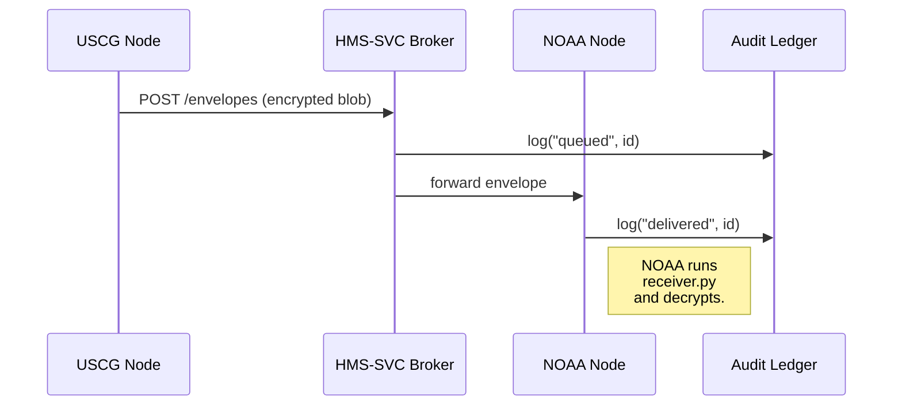

# Chapter 5: Inter-Agency Protocol (HMS-A2A)

*“Diplomacy is letting the right packet knock on the right door—nothing more, nothing less.”*  
– a federal network admin

[← Back to Chapter 4: Intent-Driven Navigation & AI-Guided Journeys](04_intent_driven_navigation___ai_guided_journeys_.md)

---

## 1. Why Do We Need HMS-A2A?

Imagine a container ship drifting toward a hurricane.  
• **U.S. Coast Guard** (USCG) updates the vessel’s manifest in real-time.  
• **NOAA** must fuse that manifest with live weather data to predict spill risk.  
• **FEMA** may request the same data minutes later for evacuation planning.

If each agency FTPs spreadsheets around, someone will open the wrong version—or miss the file entirely.  
**HMS-A2A** is the *sealed diplomatic pouch* that guarantees:

1. The right data reaches the right agency.  
2. The envelope is tamper-proof and versioned.  
3. Every hop is audit-logged for inspectors general.

---

## 2. Core Concepts (Beginner Cheat-Sheet)

| Term (Analogy)       | What It Really Is | One-Sentence Explanation |
|----------------------|-------------------|--------------------------|
| Envelope             | AES-encrypted ZIP | A sealed packet nobody can read in transit. |
| Header (Address)     | JSON metadata     | Tells the mesh *who* should open the envelope. |
| Payload (Letter)     | Protobuf / JSON   | The actual agency data (e.g., vessel manifest). |
| Node (Post Office)   | HTTPS endpoint    | An agency service that can send/receive envelopes. |
| Routing Table        | Hash map          | Maps agency codes to node URLs (auto-generated by HMS-SVC). |
| Audit Ledger         | Append-only log   | Records each hop—like registered mail. |
| Version Seal         | SHA-256 hash      | Locks a schema & prevents “it worked on my PC” bugs. |

Remember these seven nouns; 80 % of HMS-A2A boils down to them.

---

## 3. Quick Start: Shipping a Manifest from USCG to NOAA

> Prerequisites  
> • Python ≥3.10  
> • `pip install hms-a2a` (demo SDK, ~30 KB)  
> • A running [Backend Service Mesh (HMS-SVC)](06_backend_service_mesh__hms_svc__.md) sandbox

### 3.1 Compose and Seal the Envelope (Sender Side)

```python
# sender.py
from hms_a2a import Envelope, send

manifest = { "imo": "9319466", "hazmat": True, "crew": 18 }

env = Envelope(
    to="NOAA.FISH",                # agency code
    frm="USCG.PORTMIAMI",          # sender code
    schema="uscg.manifest.v2",     # Version Seal
    payload=manifest               # auto-serialized
)

env.seal(password="§§§TOP_SECRET§§§")   # AES-256
send(env)                               # POST to mesh
```

Explanation  
1. We build a tiny Python `dict` for the manifest.  
2. `Envelope` automatically adds a timestamp and unique ID.  
3. `seal()` encrypts everything **except** the header (the mesh needs an address).  
4. `send()` hands the envelope to HMS-SVC, which looks up the routing table.

### 3.2 Receive and Unseal (Receiver Side)

```python
# receiver.py
from hms_a2a import receive

env = receive()                        # blocks until a packet arrives
data = env.open(password="§§§TOP_SECRET§§§")

print("Got manifest:", data)
```

Explanation  
`receive()` pulls the next envelope from NOAA’s inbox.  
`open()` decrypts it; if the hash or schema mismatches, an exception is raised and the packet is quarantined.

*That’s the whole loop—under 20 lines total.*

---

## 4. What Happens Under the Hood?



1. **S** posts the sealed envelope to **M** (the mesh broker).  
2. **M** logs the event, then relays to **N**.  
3. Both hops are written to **A**. Auditors see *who*, *when*, *size*, never the secret contents.  

No more, no less—four actors, easy to debug.

---

## 5. Peeking at the Envelope Class (12 lines)

```python
# hms_a2a/envelope.py
class Envelope:
    def __init__(self, to, frm, schema, payload):
        self.id = uuid4().hex
        self.to, self.frm = to, frm
        self.schema = schema
        self.payload = payload
        self.ts = datetime.utcnow().isoformat()

    def seal(self, password):
        self._blob = aes_encrypt(json.dumps({
            "schema": self.schema,
            "payload": self.payload,
            "ts": self.ts
        }), password)
```

Take-away  
Even in the real repo the class fits on one screen; complexity lives in the mesh, not the envelope.

---

## 6. Common Tasks in 1-Minute Recipes

### 6.1 Request a Delivery Receipt

```python
receipt = env.track()         # returns list of hops
# ➜ [{'node':'USCG.PORTMIAMI','status':'queued'},
#    {'node':'NOAA.FISH','status':'delivered'}]
```

*Receipts satisfy FOIA and IG audits without human emails.*

### 6.2 Broadcast to Multiple Agencies

```python
env.to = ["NOAA.FISH", "FEMA.RESP", "EPA.SPILL"]
send(env)      # one call; HMS-SVC fan-outs behind the scenes
```

### 6.3 Evolve a Schema Safely

```python
# Bump from v2 ➜ v3
manifest["containerTemp"] = 4.5
env.schema = "uscg.manifest.v3"
```

Old NOAA nodes still on `v2` auto-reply **“unsupported schema”**; HMS-SVC routes them a converter or parks the message.

---

## 7. Best Practices (Sticky-Note Edition)

• Pin **schema versions**; never send “latest”.  
• Rotate encryption keys quarterly; HMS-A2A CLI automates key rolls.  
• Use **agency codes** not URLs in `to`/`frm`; the mesh handles infrastructure changes.  
• Log correlation ID (`env.id`) in all downstream microservices for easy tracing.  
• Store decrypted payloads in [Data Lake & Registry (HMS-DTA)](09_data_lake___registry__hms_dta__.md) rather than ad-hoc databases.

---

## 8. Where HMS-A2A Sits in the Ecosystem

```mermaid
graph LR
GOV[Policies<br/>(HMS-GOV)] -->|define data schemas| A2A(HMS-A2A<br/>secure envelopes)
A2A --> SVC(HMS-SVC<br/>mesh routers)
SVC --> Apps[Agency Apps<br/>(micro-frontends, services)]
```

Think of HMS-A2A as the *rules & wrappers*; HMS-SVC is the *postal trucks* that move them.

---

## 9. Recap & What’s Next

You just learned how to:

1. Wrap any data in an encrypted, version-sealed envelope.  
2. Send, receive, and track it across agency lines with two tiny functions.  
3. Rely on the mesh and audit ledger for routing, retries, and compliance.

With the diplomatic pouch mastered, it’s time to meet the postal fleet that does the actual driving:  
[Next Chapter – Backend Service Mesh (HMS-SVC)](06_backend_service_mesh__hms_svc__.md)

---

---

Generated by [HardisonCo [NARA-DOC]](https://github.com/The-Pocket/Tutorial-Codebase-Knowledge)