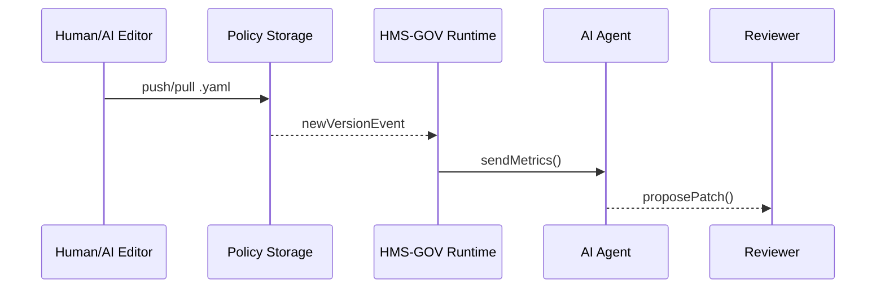

# Chapter 5: Policy / Process Module  
*[← Back to Chapter 4: Human-in-the-Loop (HITL) Oversight](04_human_in_the_loop__hitl__oversight_.md)*  

---

## 1. Why Turn “Policy” Into Data?

Hurricane **Odessa** just battered the Gulf Coast.  
Congress already appropriated funds, but families still wait weeks for cash because every county office:

* runs a slightly different Excel checklist,  
* emails a PDF to Treasury,  
* and only one supervisor knows how to approve the form.

HMS says: “Put that whole checklist in **one editable file** the platform can read.” 
Change the file → the workflow changes instantly; no one touches code or pipelines.

That editable file is a **Policy / Process Module**.

---

## 2. Key Concepts (Plain English)

| Term | What It Means | One-Sentence Reason |
|------|---------------|---------------------|
| **Policy Module** | A single YAML/JSON file describing a repeatable workflow. | Replaces scattered docs & scripts. |
| **Step Template** | Re-usable Lego (e.g., *document-check*). | Consistency; no re-coding forms. |
| **Guardrail** | Limits (caps, timeouts, error thresholds). | Keeps AI & humans from unsafe actions. |
| **Metric** | Number the platform watches (avg time, approval rate). | Lets HMS-A2A adjust or alert. |
| **Version Tag** | `fema-fund-release-v2`. | Roll back in one click if v3 breaks. |

---

## 3. “Hello, World”—Writing Your First Policy

Below is an entire *disaster-relief fund release* process in **17 lines** of YAML:

```yaml
# file: fema_fund_release.yaml
id: fema-fund-release-v1
description: |
  Pay eligible households up to $10k within 48h of Hurricane Odessa.
steps:
  - id: verifyIdentity
    template: document-check
    timeout: 24h
  - id: assessDamage
    template: inspection
    minAmount: 500
  - id: sendPayment
    template: treasury-disburse
    cap: 10000
guardrails:
  freezeIfErrorRate: 5    # %
metrics:
  - avgProcessingTime: 48h
```

Beginners’ Take-aways  
1. **Steps** call pre-built templates; only arguments differ.  
2. **guardrails.freezeIfErrorRate** stops payouts if > 5 % of requests error.  
3. Anyone with edit rights can tweak the file and commit—a pull request or HMS UI.

---

### 3.1 Running the Policy (Node script, 12 lines)

```js
// run_policy.js
import { loadPolicy, runStep } from '@hms/policy-sdk';

const policy = await loadPolicy('fema_fund_release.yaml');
for (const step of policy.steps) {
  await runStep(step);          // platform picks correct UI & API
}
console.log('🏁 Policy completed!');
```

What happens?  
* `loadPolicy` parses YAML into JSON.  
* `runStep` delegates each template to the right micro-service (file upload, inspection scheduler, Treasury API, etc.).  
* Guardrails & metrics are enforced automatically by the SDK.

---

## 4. Updating Policy—No Code Deploy Needed

### 4.1 An AI Agent Suggests a Change

```json
{
  "proposalId": "prop-odessa-cap",
  "patch": { "sendPayment": { "cap": 12000 } },
  "reason": "Inflation index adjustment"
}
```

### 4.2 Human Reviewer Tweaks & Approves  
The reviewer opens a diff in the HITL UI, changes the cap to **$11 500**, clicks **Approve**, and HMS:

1. Creates `fema-fund-release-v2`.  
2. Tags v1 as **deprecated** but still valid for in-flight applications.  
3. Starts all *new* claims on v2.

No container builds, no downtime.

---

## 5. What Happens Under the Hood?



* **Repo** can be a Git repo or HMS’s built-in Policy DB.  
* Every new version triggers automatic lint, schema check, and guardrail validation in HMS-GOV (next chapter).

---

## 6. Peeking at the Implementation

### 6.1 Minimal Policy Table (PostgreSQL, 10 lines)

```sql
CREATE TABLE policy (
  id         TEXT,
  version    INT,
  body       JSONB,
  active     BOOLEAN DEFAULT TRUE,
  created_at TIMESTAMPTZ
);
```

* Composite key `(id, version)` lets multiple versions live side-by-side.  
* `active=false` keeps history without deletion.

### 6.2 Tiny Go Loader (18 lines)

```go
// loader.go
func Load(id string, ver int) Policy {
  row := db.QueryRow(`SELECT body FROM policy
                      WHERE id=$1 AND version=$2`, id, ver)
  var body []byte
  row.Scan(&body)
  var p Policy
  json.Unmarshal(body, &p)
  return p
}
```

* Reads JSON into a strongly-typed `Policy` struct.  
* Any guardrail violations throw an error before the policy runs.

---

## 7. Authoring & Validating Tips

1. Install CLI: `npm i -g @hms/policy-cli`  
2. Lint your file: `hms-policy lint fema_fund_release.yaml`  
3. Dry-run in staging: `hms-policy exec --dry-run`  
4. Keep guardrails realistic; a `freezeIfErrorRate` of **1 %** often stops real emergencies!  
5. Version names matter—include the date or reason (`v2023-10-inflation`).

---

## 8. Where Does the Module Fit in the Bigger Picture?

• **AI Representative Agent** from [Chapter 3](03_ai_representative_agent__hms_a2a__.md) analyzes *metrics* declared here and drafts patches.  
• **HITL Oversight** (previous chapter) approves those patches.  
• **Policy / Process Module** stores the final source of truth read by the runtime in [Next Chapter: Core System Platform (HMS-GOV)](06_core_system_platform__hms_gov__.md).

---

## 9. Summary & Next Steps

You now know:

* Why turning workflows into *data* beats scattered scripts.  
* How to write, run, and version a Policy Module in under 20 lines.  
* How AI or humans patch policies without redeploying code.  
* The simple database & loader powering it all.

Ready to see how HMS-GOV actually *executes* these policy files at scale?  
Jump ahead ➡ [Chapter 6: Core System Platform (HMS-GOV)](06_core_system_platform__hms_gov__.md)

---

Generated by [HardisonCo [NARA-DOC]](https://github.com/The-Pocket/Tutorial-Codebase-Knowledge)