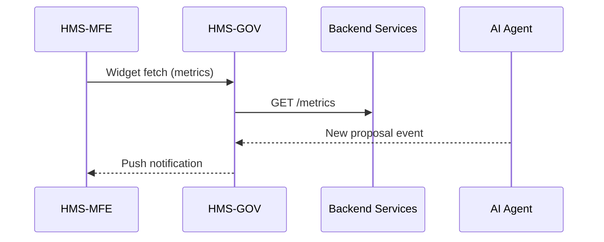

# Chapter 6: Core System Platform (HMS-GOV)

*[← Back to Chapter 5: Policy / Process Module](05_policy___process_module_.md)*  

---

## 1. Why Do We Need a “Mission-Control Tower”?

Meet **Riley**, a program analyst at the **Social Security Administration (SSA)**.  
On Monday morning she needs to:

1. Check if yesterday’s **Disability Claims** ran within SLA.  
2. Review an AI proposal that suggests *auto-fast-tracking* veterans’ claims.  
3. Confirm that a new **GDPR** rule is enforced for EU citizens requesting benefits while overseas.

Today Riley opens **five** different dashboards, calls two dev teams, and still has gaps.

**HMS-GOV** promises: *“Log in once and see it all.”*

---

## 2. The Big Picture in Plain English

| HMS-GOV Concept | Everyday Analogy | Why It Matters |
|-----------------|------------------|----------------|
| **Dashboard Hub** | Airport control tower screens | One glance = whole status |
| **Orchestrator** | Air-traffic controller issuing clearances | Coordinates every HMS module |
| **Access Matrix** | TSA badge zones | Staff only see what they’re cleared for |
| **Plugin Slot** | USB port | Any HMS component can “dock” & show data |
| **Audit Trail** | CCTV recording | Every click is logged for compliance |

---

## 3. A 3-Minute “Hello, World”

### Goal  
Create a **mini dashboard widget** that shows how many Disability claims finished in the last 24 h.

```js
// file: widgets/claimsCounter.js  (⬇ 12 lines)
import { registerWidget } from '@hms-gov/sdk';

registerWidget('ssa.dailyClaims', {
  title: 'Daily Disability Claims',
  refresh: '1h',
  async fetch() {
    const r = await fetch('/api/ssa/metrics?window=24h');
    const { count } = await r.json();
    return `${count} processed`;
  }
});
```

What just happened?  
1. `registerWidget` tells HMS-GOV a new tile exists.  
2. The Orchestrator fetches data every hour (you set `refresh`).  
3. Riley drags the tile onto her dashboard—no deploy required.

---

## 4. Breaking Down the Core Pieces

### 4.1 Dashboard Hub

* Drag-and-drop layout stored in Riley’s profile.
* Widgets auto-resize for kiosk screens in field offices.

### 4.2 Orchestrator

* Reads **Policy Modules** (see [Chapter 5](05_policy___process_module_.md)) and schedules each step.
* Emits events like `claim.completed` so widgets & AI Agents can react.

### 4.3 Access Matrix

```yaml
# file: access/ssa.yaml (⬇ 9 lines)
roles:
  analyst:
    canView:
      - dashboard.widgets.*
      - policy.*.read
    canApprove:
      - ai.proposal.disabilityFastTrack
```

*Beginner tip*: star `*` wild-cards work like folders; `dashboard.widgets.*` covers every widget.

### 4.4 Plugin Slot

Any micro-service can expose a small **manifest.json** and instantly appear in GOV:

```json
{ "name": "ssa-compliance-log",
  "entry": "https://logs.ssa.gov/widget.js",
  "permissions": ["dashboard.mount"] }
```

---

## 5. Using HMS-GOV to Solve Riley’s Tasks

### 5.1 Check SLA

1. Riley opens **“Daily Disability Claims”** widget.
2. A red badge shows *“30 m over SLA”*.
3. She clicks *Details* → Orchestrator timeline appears.

### 5.2 Review AI Proposal

The AI Agent (see [Chapter 3](03_ai_representative_agent__hms_a2a__.md)) published `prop-fast-track-vets`.

```bash
curl -H "Authorization: Bearer $TOKEN" \
     https://gov.hms/api/proposals/prop-fast-track-vets
```

GOV returns:

```json
{ "status":"awaiting_review", "impact":"+8% faster processing" }
```

Riley clicks **Approve** in the GOV UI; audit trail captures her action.

### 5.3 GDPR Compliance Check

She opens the **Compliance Center** tab:

```
GDPR Rule 23-B · Active ✅   · Last updated: 2 days ago (v3)
```

No phone calls needed!

---

## 6. What Happens Behind the Curtain?



Four actors, one loop—simple.

---

## 7. Peeking at the Implementation

### 7.1 Orchestrator Task Table (PostgreSQL ‑ 10 lines)

```sql
CREATE TABLE tasks (
  id          TEXT PRIMARY KEY,
  policy_id   TEXT,
  step_id     TEXT,
  status      TEXT,      -- queued, running, done, error
  assignee    TEXT,      -- micro-service or human
  updated_at  TIMESTAMPTZ
);
```

### 7.2 Tiny Go Handler: “Emit Task Event”

```go
// file: api/task_event.go  (⬇ 16 lines)
func MarkDone(w http.ResponseWriter, r *http.Request) {
  id := mux.Vars(r)["id"]
  db.Exec(`UPDATE tasks SET status='done', updated_at=now() WHERE id=$1`, id)
  bus.Publish("task.done", id)       // Kafka topic
  w.WriteHeader(204)
}
```

Explanation  
* Updates DB.  
* Emits a single `task.done` event—widgets and A2A pick it up.

### 7.3 Super-Simple AuthZ Middleware

```ts
// file: middleware/authz.ts  (⬇ 13 lines)
import { can } from '@hms-gov/acl';

export function authz(action: string) {
  return (req, res, next) => {
    const user = req.user;      // set by auth layer
    if (!can(user.role, action))
      return res.status(403).send('Forbidden');
    next();
  };
}
```

Attach it to any route:

```ts
app.post('/proposals/:id/approve', authz('proposal.approve'), approveHandler);
```

---

## 8. Quick Start for Your Agency

1. **Bootstrap GOV locally**

```bash
npx degit hms-gov/template my-governance
cd my-governance && docker compose up
```

2. **Add a widget**

```bash
cp widgets/claimsCounter.js plugins/
```

3. **Seed roles**

```bash
hms-gov roles import access/ssa.yaml
```

4. **Log in** at `http://localhost:3000` with the default admin user.  
5. **Drag** your new widget onto the dashboard—done!

---

## 9. Where HMS-GOV Fits in the Stack

• It **hosts** widgets from [Multi-Frontend Experience](01_multi_frontend_experience__hms_mfe__.md).  
• It **executes** policies defined in [Policy / Process Module](05_policy___process_module_.md).  
• It receives **AI proposals** from [AI Representative Agent](03_ai_representative_agent__hms_a2a__.md) and routes them to [HITL Oversight](04_human_in_the_loop__hitl__oversight_.md).  
• It calls into the heavy-duty services explained next in [Backend API / Service Layer](07_backend_api___service_layer__hms_api__hms_svc__.md).

---

## 10. Summary & What’s Next

You’ve learned:

* Why HMS-GOV is the *mission-control tower* for every agency.  
* How dashboards, the orchestrator, access controls, and plugins work together.  
* A 12-line widget demo and the minimal tables & handlers powering the platform.  
* How HMS-GOV glues earlier abstractions together and prepares data for deeper back-end services.

Ready to dive into the pipes that move data and actions behind the scenes?  
Head over to ➡ [Chapter 7: Backend API / Service Layer (HMS-API, HMS-SVC)](07_backend_api___service_layer__hms_api__hms_svc__.md)

---

Generated by [HardisonCo [NARA-DOC]](https://github.com/The-Pocket/Tutorial-Codebase-Knowledge)