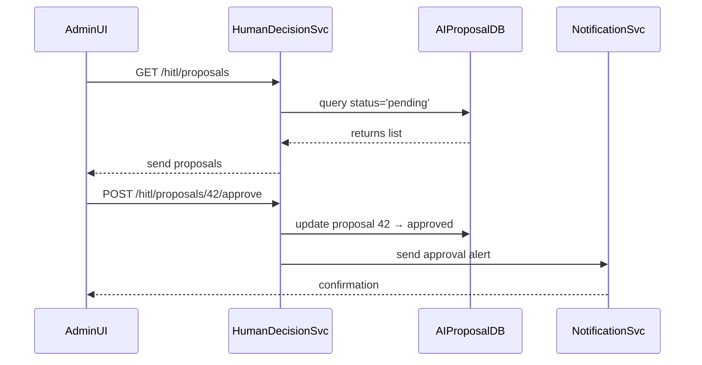

# Chapter 6: Human Decision Maker (HITL)

Welcome back! In [Chapter 5: AI Representative Agent](05_ai_representative_agent_.md), you saw how an AI “smart bureaucrat” analyzes complaints and drafts proposals. Now, we introduce the **Human Decision Maker**—the real person who reviews, adjusts, and finally approves or rejects those AI-generated suggestions.

---

## Why a Human-in-the-Loop?

**Use Case:**  
Imagine the Environmental Protection Agency (EPA) receives an AI-drafted rule to tighten noise limits around a national park. Before it becomes official, a regulator (the Human Decision Maker) must:

1. Check the AI’s analysis against social and legal factors.  
2. Ask questions like “Will this affect local businesses?”  
3. Approve, request changes, or override the AI’s suggestion.

Without this role, the system would lack accountability and a human perspective on community impacts.

---

## Key Concepts

1. **Accountability & Oversight**  
   The Human Decision Maker is responsible for the final call—just like a judge overseeing expert witnesses.

2. **Ethical Compliance**  
   They ensure proposals follow ethics, civil rights, and public policy standards.

3. **Override Authority**  
   If the AI misses something important, the human can veto or modify the proposal.

4. **Legal & Social Balance**  
   In government, decision-makers weigh AI efficiency against laws, budgets, and politics.

---

## Using the Human Decision Maker

Here’s a simple script showing how a portal might let a regulator fetch and act on pending proposals:

```javascript
import { HumanDecisionMaker } from 'hms-gov-client'

async function reviewProposals() {
  // 1. Get all AI-drafted proposals awaiting review
  const list = await HumanDecisionMaker.fetchPending()
  console.log("Pending proposals:", list)

  // 2. Approve the first one
  const firstId = list[0].id
  await HumanDecisionMaker.approveProposal(firstId)
  console.log("Approved proposal", firstId)

  // 3. Override the second with a note
  const secondId = list[1].id
  await HumanDecisionMaker.overrideProposal(secondId, 
    "Local business impact needs more study")
  console.log("Overridden proposal", secondId)
}

reviewProposals()
```

Explanation:  
- `fetchPending()` returns proposals with status “pending.”  
- `approveProposal(id)` marks it approved.  
- `overrideProposal(id, reason)` vetoes with a human rationale.

---

## What Happens Under the Hood?



1. The UI asks the Human Decision Service for pending items.  
2. The service queries the AI proposals database.  
3. After the human clicks “Approve,” the service updates status and notifies stakeholders.

---

## Inside: Service Implementation

### `hms-svc/src/services/humanDecisionService.js`

```javascript
class HumanDecisionService {
  async fetchPending() {
    return db.getProposalsByStatus('pending')
  }
  async approve(id) {
    await db.updateProposal(id, 'approved')
    notify.send('approved', id)
  }
  async override(id, reason) {
    await db.updateProposal(id, 'overridden')
    notify.send('overridden', id, reason)
  }
}
module.exports = new HumanDecisionService()
```

*Explanation:*  
- `fetchPending()` reads all proposals still awaiting review.  
- `approve()` or `override()` updates the record and calls a notification helper.

### `hms-api/src/routes/hitlRouter.js`

```javascript
const express = require('express')
const router = express.Router()
const humanSvc = require('../services/humanDecisionService')

router.get('/hitl/proposals', async (req, res) => {
  res.json(await humanSvc.fetchPending())
})

router.post('/hitl/proposals/:id/approve', async (req, res) => {
  await humanSvc.approve(req.params.id)
  res.json({ status: 'approved' })
})

router.post('/hitl/proposals/:id/override', async (req, res) => {
  await humanSvc.override(req.params.id, req.body.reason)
  res.json({ status: 'overridden' })
})

module.exports = router
```

*Explanation:*  
- We expose HTTP endpoints so the front end can list, approve, or override proposals.

---

## Conclusion

In this chapter, you saw how the **Human Decision Maker (HITL)** sits at the center of accountability—reviewing AI proposals, ensuring ethical and legal compliance, and having the final override power. Next up, we’ll dive deeper into the rules and workflows that guide these decisions in the [Policy/Process Module](07_policy_process_module_.md).

---

Generated by [HardisonCo [NARA-DOC]](https://github.com/The-Pocket/Tutorial-Codebase-Knowledge)