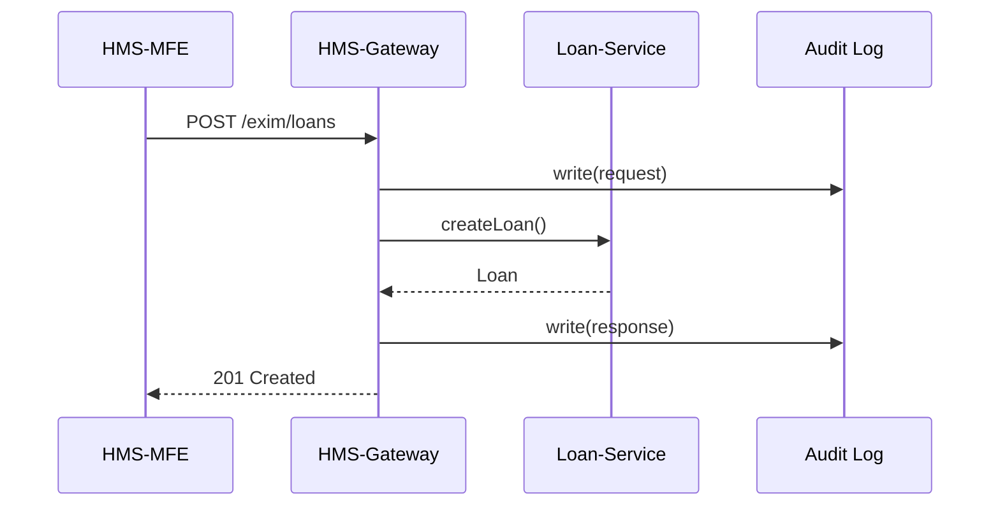

# Chapter 7: Backend API / Service Layer (HMS-API, HMS-SVC)

[← Back to Chapter 6: Core System Platform (HMS-GOV)](06_core_system_platform__hms_gov__.md)

---

## 1. Why Do We Need Yet Another Layer?

Picture the **Export-Import Bank of the United States (EXIM)**.  
On Tuesday morning three different things happen at once:

1. A citizen, *Maya*, submits a new loan-guarantee request from the public portal.  
2. The **AI Representative Agent** spots a slow queue and wants to publish a *“Weather-Delay Policy”* update.  
3. Treasury pushes an **ACH settlement** back to EXIM.

Without a common “pneumatic tube network,” every micro-service would talk to every other one directly—50+ SSL certs to juggle, inconsistent logging, and no single place to enforce **FOIA-grade** auditing.

**HMS-API / HMS-SVC** is that tube network:

* One door in, one door out.  
* Every request is authenticated, rate-limited, and written to an immutable log.  
* Micro-services stay tiny because the heavy plumbing is centralised.

---

## 2. Key Concepts in Plain English

| Concept            | Everyday Analogy                                       | Why It Matters                          |
|--------------------|---------------------------------------------------------|-----------------------------------------|
| **Endpoint**       | Mailing address (“1600 Pennsylvania Ave.”)             | Where clients send requests             |
| **Gateway**        | Security guard at the lobby door                       | Checks ID, scans for contraband         |
| **Service Token**  | Official government badge                              | Proves a service is allowed inside      |
| **Adapter**        | Language interpreter in a meeting                      | Translates formats between systems      |
| **Audit Log**      | CCTV footage stored off-site                           | Non-repudiation & FOIA compliance       |
| **Version Header** | “Form 1040-EZ (2024)” stamp                            | Lets old and new clients coexist safely |

Keep these six ideas in mind; the rest of the chapter is just showing them in action.

---

## 3. A 60-Second “Hello, World”

Goal: **Create a loan-guarantee record** at EXIM from the front-end.

### 3.1 The Call (cURL, 14 lines)

```bash
TOKEN=$(hms auth token)          # issued by HMS-GOV SSO

curl -X POST https://api.hms.gov/exim/loans \
  -H "Authorization: Bearer $TOKEN" \
  -H "X-Api-Version: 1" \
  -d '{
        "companyName":   "Acme Rockets",
        "amount":        750000,
        "destination":   "Brazil"
      }'
```

Expected response:

```json
{ "loanId": "LN-85472",
  "status": "received",
  "links": { "self": "/exim/loans/LN-85472" } }
```

Beginner take-aways  
1. **One** HTTPS call; the client never worries which micro-service handles loans.  
2. The `X-Api-Version` header freezes the response contract.  
3. If Maya later asks for status, she follows `links.self`.

---

## 4. What Happens Behind The Curtain?



Only four actors—easy to remember.

---

## 5. Peeking at the Gateway Code

Below is a *mini* Express.js‐style route—12 lines.

```js
// file: routes/exim.js
import { verify } from '../lib/auth.js';
import { log }    from '../lib/audit.js';
import { create } from '../svc/loan.js';

export default function(router) {
  router.post('/exim/loans', async (req, res) => {
    const user = await verify(req);          // 1) check token
    log(req);                                // 2) write request
    const loan = await create(req.body, user);
    log(res, loan);                          // 3) write response
    res.status(201).json(loan);              // 4) reply
  });
}
```

Explanation for newcomers  
1. `verify` rejects bad or expired tokens.  
2. `log` streams JSON to the immutable Audit service.  
3. `create` is the **business logic** (minimal because all plumbing is handled).

---

### 5.1 Tiny Token Verification (8 lines)

```js
// file: lib/auth.js
import jwt from 'jsonwebtoken';
export function verify(req) {
  const token = req.headers.authorization?.split(' ')[1];
  const data  = jwt.verify(token, process.env.PUBLIC_KEY);
  if (!data.sub) throw Error('401');
  return data;                 // { sub:"user-123", role:"citizen" }
}
```

No OAuth deep-dive—just enough to show concept.

### 5.2 Audit Log Insert (SQL, 7 lines)

```sql
INSERT INTO audit_log(id, ts, actor, path, body)
VALUES (gen_random_uuid(), now(), :actor, :path, :body::jsonb);
```

Every API hit becomes an immutable row.  
The table lives in a *WORM* (Write-Once-Read-Many) Postgres cluster for FOIA compliance.

---

## 6. Adding a New Micro-Service in 3 Steps

Suppose the **AI Agent** (see [Chapter 3](03_ai_representative_agent__hms_a2a__.md)) wants to publish a *Weather-Delay Policy* update via `hms-svc-weather`.

1. **Register the Service**

```yaml
# file: registry/weather.yaml
id: weather
routes:
  - method: POST
    path:  /policies/weather
    dest:  http://weather-svc:4000/policies
```

2. **Issue a Service Token**

```bash
hms api issue-token weather --scope write:policy
# prints JWT; mounted as K8s secret
```

3. **Write the Lightweight Handler** (Node, 17 lines)

```js
// file: svc/weather.js
import express from 'express';
import { verifySvc } from '../lib/auth.js';
const app = express().use(express.json());

app.post('/policies', verifySvc('write:policy'), (req, res) => {
  // store policy, invalidate caches, etc.
  res.status(202).send('Policy queued');
});

app.listen(4000);
```

Now any client (AI Agent or human) can `POST /policies/weather` through the same secure gateway—no additional firewall rules, no new certs.

---

## 7. First-Time Integration Checklist

| Step | Command / Action                              | Time |
|------|-----------------------------------------------|------|
| 1. Scaffold a stub service | `npx degit hms/template-svc my-svc` | 1 min |
| 2. Add route in registry   | see weather.yaml above             | 1 min |
| 3. Request service token   | `hms api issue-token`              | 30 s |
| 4. Deploy to K8s           | `helm install my-svc charts/basic` | 2 min |
| 5. Verify health           | `curl /healthz` via gateway        | 30 s |

Total ≈ **5 minutes**.

---

## 8. Where HMS-API / HMS-SVC Fits in the Big Picture

* Users enter through [Multi-Frontend Experience](01_multi_frontend_experience__hms_mfe__.md).  
* Their intents are planned by the [Intent Engine](02_intent_driven_navigation___ai_guided_journeys_.md).  
* Data and commands then **must** pass through HMS-API, which:  
  1. Authenticates them.  
  2. Logs them forever.  
  3. Routes them to the right HMS-SVC micro-service.  
* Those services might modify **Policy Modules** (see [Chapter 5](05_policy___process_module_.md)) or kick off tasks in **HMS-GOV** (Chapter 6).

---

## 9. Summary & Next Steps

You learned:

* Why a single Gateway simplifies security, logging, and versioning.  
* Six beginner-level concepts: Endpoint, Gateway, Token, Adapter, Audit, Version.  
* A 14-line cURL example that creates a loan.  
* Under-the-hood Express.js snippets for auth & audit.  
* How to register and deploy a new micro-service in 5 minutes.

Ready to see how dozens of these services play nicely together across datacenters?  
Continue to ➡ [Chapter 8: Microservices & Service Mesh Architecture](08_microservices___service_mesh_architecture_.md)

---

Generated by [HardisonCo [NARA-DOC]](https://github.com/The-Pocket/Tutorial-Codebase-Knowledge)