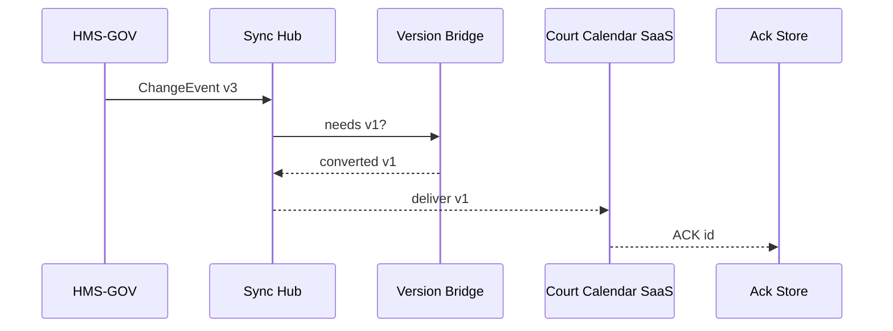

# Chapter 7: External System Synchronisation  
*(A sequel to [Backend Service Mesh (HMS-SVC)](06_backend_service_mesh__hms_svc__.md))*  

> “Update the rule once, watch 37 vendor systems salute.”  
> – a county-court CIO  

---

## 1  Why Do We Need an *External* Sync Layer?  

In Chapter 6 the mesh let **internal** micro-services talk safely.  
But many mission-critical partners live **outside** our data centers:

* State court-calendar vendors  
* Hospital EMRs reporting COVID-19 lab results  
* Defense contractors’ SAP/ERP systems  

When *HMS-GOV* publishes *“New filing deadline: 4 p.m.”*, those partners must know **immediately**—or citizens miss court dates, hospitals send wrong codes, invoices fail audits.  

Think of the National Weather Service: the moment NOAA pushes a tornado alert, *every* TV station and cell tower rebroadcasts it within seconds.  
**External System Synchronisation (ESS)** brings that “weather-alert reliability” to government rule changes.

---

## 2  Running Example – “New Court Filing Deadline”  

1. The Administrative Office updates the rule in *HMS-SYS*:  
   “Civil filings must be submitted by 4 p.m. local court time.”  
2. *HMS-GOV* publishes the policy spec.  
3. ESS broadcasts a **Change Event** to:  
   • State electronic-filing portals  
   • Law-firm calendaring SaaS  
   • County kiosk software  
4. Each partner system receives, converts to its own schema, applies, and sends an **Acknowledgement**.  

Goal for this chapter: build that loop in under 30 minutes.

---

## 3  Key Concepts (Weather-Alert Cheat-Sheet)  

| Weather term | ESS term | What beginners need to remember |
|--------------|----------|---------------------------------|
| Alert bulletin | **Change Event** | JSON blob that says *what* changed. |
| Broadcast tower | **Sync Hub** | Central HTTPS endpoint that fans out events. |
| TV / radio channel | **Channel** | Delivery tech: Webhook, SFTP drop, MQTT… |
| Closed-caption track | **Adapter** | Mini script that reshapes payload for one partner. |
| “Alert received” beep | **Acknowledgement (ACK)** | Partner’s receipt so we know they heard us. |
| New vs old alert formats | **Version Bridge** | Auto-converts `v2` events for `v1` partners. |

Put these six nouns on a sticky note—90 % of ESS is just them.

---

## 4  Quick Start – Broadcasting One Rule Change

> Prerequisites  
> • Python ≥ 3.9  
> • `pip install hms-ess` (mini SDK, ~25 KB)  
> • Access to the sandbox Sync Hub (`https://hub.sandbox.gov`)

### 4.1  Emit a Change Event (from HMS-GOV)

```python
# emit_change.py
from hms_ess import ChangeEvent, publish

event = ChangeEvent(
    id       = "RULE-COURT-DEADLINE-V3",
    version  = 3,
    payload  = { "deadline": "16:00", "timezone": "local" }
)

publish(event, hub="https://hub.sandbox.gov")
```

Explanation  
1. `ChangeEvent` is only three required fields.  
2. `publish()` POSTs to Sync Hub; the hub records it, then pushes to every subscribed channel.

### 4.2  Receive & ACK (partner side)

```python
# partner_webhook.py
from flask import Flask, request
from hms_ess import ack

app = Flask(__name__)

@app.post("/court-calendar/update")
def update():
    event = request.json        # auto-parsed by Flask
    apply_rule(event["payload"])  # ← your business logic
    return ack(event["id"])     # responds: {"ack": "..."}
```

Explanation  
1. Any framework works; just parse JSON.  
2. `ack()` returns a tiny JSON confirming receipt; Sync Hub stores it.

*That’s the full end-to-end path—under 20 lines total.*

---

## 5  What Happens Behind the Curtain?



1. HMS-GOV pushes **v3**.  
2. Sync Hub sees that Court Calendar only understands **v1** → forwards through the Version Bridge.  
3. Partner applies the rule → sends ACK stored for audits.

No more than 5 actors—easy to reason about.

---

## 6  Under-the-Hood Walkthrough (Plain English)

1. **Publish** – Hub writes the event to an *Event Log* (append-only).  
2. **Fan-out** – For each registered channel, the hub enqueues a delivery job.  
3. **Version Bridge** – If the partner pinned an older schema, the bridge maps fields (uses JSONata scripts).  
4. **Delivery** – A worker hits the partner’s endpoint with exponential back-off.  
5. **Ack Tracker** – Waits up to *N* seconds for an ACK; on timeout, retries or escalates to Ops.  

Everything is message-driven; no partner can block another.

---

## 7  Tiny Peek at Sync Hub Worker (≤ 15 Lines)

```python
# hub/worker.py (simplified)
def deliver(job):
    evt = load_event(job.event_id)
    payload = version_bridge(evt, job.partner_version)
    ok = http_post(job.url, payload)
    if ok:
        mark_ack(job.event_id, job.partner_id)
    else:
        retry(job)
```

Beginner take-away: a worker is basically *load → translate → POST → mark*.

---

## 8  Adding a New Partner in 3 Lines

```yaml
# partners/court-saas.yaml
id: COURT-CAL
url: https://api.courtcal.com/update
accepts_version: 1        # hub auto-converts
channel: webhook
```

Deploy:

```bash
hms-ess partner add partners/court-saas.yaml
```

Finished—future events flow automatically.

---

## 9  Common Recipes (60-Second Each)

### 9.1  Send a “test only” event

```python
publish(event, hub, dry_run=True)
```
Partners receive with header `X-HMS-Test: true`; no real changes applied.

### 9.2  Query ACK status

```python
from hms_ess import status
print(status("RULE-COURT-DEADLINE-V3"))
# ➜ {'COURT-CAL': 'ack', 'LAW-FIRM-SYS': 'pending'}
```

### 9.3  Replay a missed event

```bash
hms-ess replay RULE-COURT-DEADLINE-V2 --to LAW-FIRM-SYS
```

---

## 10  Best Practices (Sticky-Note Edition)

1. **Pin schema versions** in partner configs; surprise-free.  
2. **Keep payloads atomic** – one logical change per event.  
3. **Require ACKs**; un-ACKed partners appear on a dashboard.  
4. **Use dead-letter queue** for partners offline > 24 h.  
5. **Document your Adapter** scripts—future you will thank present you.

---

## 11  How ESS Fits the HMS Universe

```mermaid
graph LR
HMSGOV[HMS-GOV<br/>policy spec] --> ESS[External Sync<br/>(this chapter)]
ESS -->|Change Events| Partner[Partner Systems]
ESS --> OPS[Monitoring & OPS<br/>(Ch 13)]
```

Internally, events may still ride the **mesh** from [Chapter 6](06_backend_service_mesh__hms_svc__.md); externally, ESS handles the last mile.

---

## 12  Summary & Next Steps  

You now know how to:  

• Emit a **Change Event** with one function call.  
• Let the **Sync Hub** fan it out to any number of partners.  
• Auto-bridge old versions and track **ACKs** for audits.  

Your rules can now reach courts, hospitals, and contractors in seconds—no mass emails required.  

Next we empower smart agents to monitor those events and act on your behalf in real time:  
[Agent Framework (HMS-AGT / HMS-AGX)](08_agent_framework__hms_agt___hms_agx__.md)  

---

---

Generated by [HardisonCo [NARA-DOC]](https://github.com/The-Pocket/Tutorial-Codebase-Knowledge)