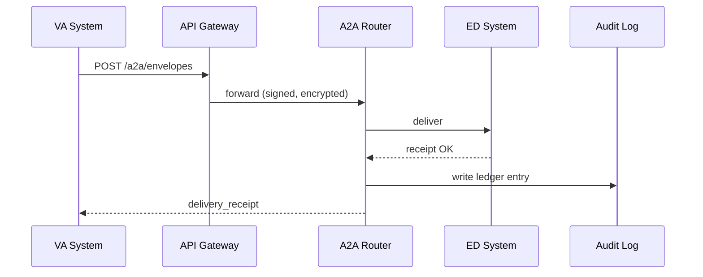

# Chapter 7: Inter-Agency Exchange Protocol (HMS-A2A)

*(From [Backend API Gateway](06_backend_api_gateway_.md) you saw how one agency exposes a single, tidy door to its own services.  
But what if **two different agencies** must talk to each other—safely, traceably, and without arguing about formats?  
That is exactly why HMS-A2A exists.)*

---

## 1. Why Do We Need A2A? 📫

### Central Use-Case  
The **Department of Veterans Affairs (VA)** must verify a veteran’s education benefits with the **Department of Education (ED)** before releasing tuition money.  

Without A2A they would:

1. Export a CSV from VA.  
2. Encrypt it (maybe).  
3. Email or SFTP it to ED.  
4. Wait days for a manual “got it” reply.  

Result: slow payments, lost files, zero audit trail.  
HMS-A2A replaces that mess with a **digital diplomatic pouch**:

```
┌──────── Envelope (JSON) ────────┐
│  Header: who, what, when        │
│  Payload: user-encrypted data   │
│  Stamp: sender’s signature      │
└─────────────────────────────────┘
```

Send it once; A2A handles routing, encryption, delivery receipts, and immutable logs.

---

## 2. Key Concepts (Plain English)

| Concept | Think of it as… | Why a Beginner Cares |
|---------|-----------------|----------------------|
| Envelope | A JSON wrapper | Holds payload + meta |
| Stamp | Digital wax seal | Proves sender identity |
| Courier | Background worker | Moves envelopes between agencies |
| Manifest | Inbox dashboard | Shows “sent” / “received” items |
| Audit Trail | Tamper-proof ledger | Required by OIG & GAO |
| Handshake | One-time key exchange | Keeps messages secret |

---

## 3. Five-Minute Quick-Start  🚀

Below is a **minimal** Node demo that sends a benefit-verification request from **VA** to **ED**.

### 3.1  Install the CLI

```bash
npm i -g @hms-a2a/cli      # mock package for demo
```

### 3.2  Create & Send an Envelope (≤18 lines)

```bash
# send.js
echo '{
  "to":   "ED:benefits",
  "from": "VA:benefits",
  "type": "VerifyStudent",
  "body": { "veteranId": "VA-123", "schoolId": "ED-456" }
}' > request.json

hms-a2a send request.json
```

Expected terminal output:

```
✔  Envelope signed with VA key
✔  Routed via api.va.gov/a2a
✔  Delivery receipt #9f82d logged
```

### 3.3  Peek at ED’s Inbox (≤10 lines)

```bash
hms-a2a inbox --agency ED
```

```
┌───────────────┬─────────────┬────────┐
│ Envelope ID   │ Type        │ Status │
├───────────────┼─────────────┼────────┤
│ 9f82d         │ VerifyStudent│ NEW   │
└───────────────┴─────────────┴────────┘
```

One CLI, zero email chains!

---

## 4. How Does It Work? (Step-By-Step)



1. **Gateways** (Chapter 6) tunnel traffic—no open firewalls.  
2. **A2A Router** validates stamp & schema.  
3. **Audit Log** stores an append-only record for both agencies.

---

## 5. Envelope Anatomy 🩺

```json
{
  "header": {
    "id":   "9f82d",
    "to":   "ED:benefits",
    "from": "VA:benefits",
    "type": "VerifyStudent",
    "sent": "2024-05-01T14:03:22Z"
  },
  "payload": "BASE64( AES-encrypted JSON )",
  "stamp":   "BASE64( sender_signature )"
}
```

Beginner notes  
• `payload` is encrypted with the receiver’s public key—only ED can read it.  
• `stamp` is a sign-over of the **header + payload** to guarantee integrity.

---

## 6. Coding It Yourself (Mini Snippets)

### 6.1  Seal an Envelope (≤20 lines)

```js
// seal.js
const crypto = require("crypto");
function seal(toPubKey, fromPrivKey, obj){
  const header = { id: crypto.randomUUID(), ...obj.meta };
  const cipher  = crypto.publicEncrypt(toPubKey, Buffer.from(JSON.stringify(obj.body)));
  const stamp   = crypto.sign("sha256", Buffer.concat([Buffer.from(JSON.stringify(header)), cipher]), fromPrivKey);
  return { header, payload: cipher.toString("base64"), stamp: stamp.toString("base64") };
}
```

Explanation:  
1. Encrypt payload with **receiver’s** key.  
2. Sign both header & cipher with **sender’s** key.

### 6.2  Verify & Open (≤18 lines)

```js
// open.js
function open(envelope, toPrivKey, fromPubKey){
  const { header, payload, stamp } = envelope;
  const ok = crypto.verify(
    "sha256",
    Buffer.from(JSON.stringify(header) + payload),
    fromPubKey,
    Buffer.from(stamp, "base64")
  );
  if(!ok) throw "Bad stamp!";
  const plain = crypto.privateDecrypt(toPrivKey, Buffer.from(payload,"base64"));
  return JSON.parse(plain);
}
```

### 6.3  Send via Gateway (≤12 lines)

```js
// transmit.js
async function transmit(env){
  const res = await fetch("https://api.va.gov/a2a/envelopes", {
    method:"POST", body: JSON.stringify(env),
    headers: { "Authorization":"Bearer DEMO", "Content-Type":"application/json" }
  });
  return res.json();   // {receiptId:"..."}
}
```

All snippets stay under 20 lines and map 1-to-1 to the high-level flow.

---

## 7. Relation to Other HMS Pieces

| Layer | Role in A2A |
|-------|-------------|
| [Three-Layer Governance Model](01_three_layer_governance_model_.md) | Policies define *who* may talk to *whom*. |
| [Backend API Gateway](06_backend_api_gateway_.md) | Provides the HTTPS endpoint `/a2a/*`. |
| HMS-SYS Registry | Lets the router find the destination gateway. |
| [Event & Workflow Orchestration](08_event___workflow_orchestration__hms_act___hms_oms__.md) | Triggers downstream workflows when an envelope arrives. |

---

## 8. Common Pitfalls & Quick Fixes

| Symptom | Probable Cause | Fast Fix |
|---------|----------------|----------|
| `Bad stamp!` error | Sender used wrong private key | Double-check key IDs in `~/.hms-keys/` |
| Stuck in “IN TRANSIT” | Destination gateway unreachable | Verify agency DNS & that port 443 is open |
| Duplicate envelopes | Sender retries too aggressively | Include `header.id`; receiver deduplicates by ID |

---

## 9. Hands-On Exercise (10 min)

1. Clone sample repo:  
   `git clone https://github.com/hms-samples/a2a-demo && cd a2a-demo`  
2. Run `docker-compose up` – spins up VA gateway, ED gateway, and A2A router.  
3. `node examples/send-va.js` – watch envelope travel.  
4. Open `http://localhost:4000/manifest` to see ED’s inbox update live.  
5. Kill the router container; resend; note auto-retry logic.

---

## 10. Recap & What’s Next

You learned how **HMS-A2A** acts as the **digital diplomatic pouch**:

• Wrap data in a standard envelope.  
• Seal it with encryption + stamp.  
• Let background couriers move it safely.  
• Record every hop in an immutable audit log.

In the next chapter we will orchestrate what *happens* after an envelope lands—automatic approvals, multi-step workflows, and human escalations.  
Continue to [Event & Workflow Orchestration (HMS-ACT / HMS-OMS)](08_event___workflow_orchestration__hms_act___hms_oms__.md).

---

Generated by [HardisonCo [NARA-DOC]](https://github.com/The-Pocket/Tutorial-Codebase-Knowledge)