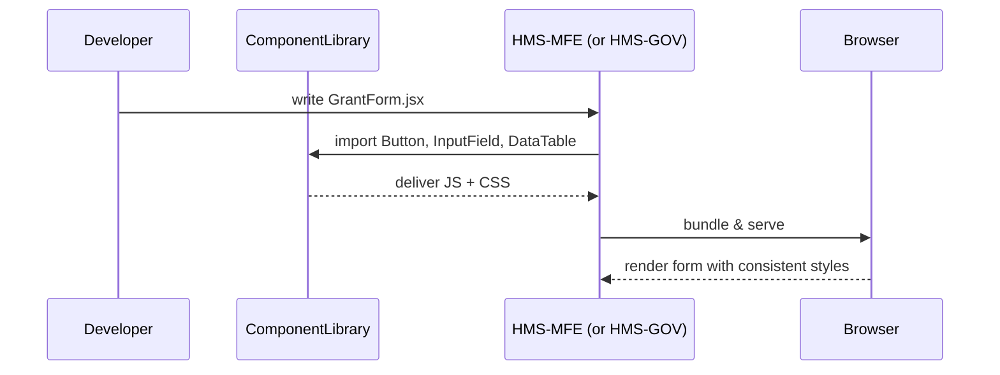

# Chapter 7: Shared Frontend Component Library

In [Chapter 6: Citizen Frontend (HMS-MFE)](06_citizen_frontend__hms_mfe__.md) we built a public‐facing portal. We also have the admin portal from [Chapter 5: Administration Portal (HMS-GOV)](05_administration_portal__hms_gov__.md). Both UIs need the same forms, tables, buttons, and charts—styled identically. Instead of copying code, we create a **Shared Frontend Component Library**: a “stationery closet” of reusable UI pieces that ensures consistent branding and usability.

---

## 7.1 Why a Shared Library? A Real-World Motivation

Imagine the Federal Grants Office:
- Citizens submit grant applications using a “Submit” button and name fields.
- Back-office staff view applications in tables and generate charts.
- A small CSS tweak to button padding shouldn’t need two separate fixes.

A Shared Component Library gives you:
- One place for all UI pieces (forms, tables, charts, buttons).
- A consistent look—like a government letterhead and matching stamps.
- Faster development: front-end teams simply “grab” what they need.

---

## 7.2 Key Concepts

1. **Components**  
   Self-contained UI elements (Button, InputField, DataTable, Chart).  

2. **Props**  
   Configuration options you pass into a component (e.g., `label`, `onClick`, `columns`).  

3. **Theming**  
   Centralized colors, fonts, and spacing so every portal looks uniform.  

4. **Stories / Demos**  
   Live examples that show how each component behaves with different props.

---

## 7.3 Using the Library: A Minimal Example

Let’s say you’re building a new form in the citizen portal:

```jsx
// file: GrantForm.jsx
import { Button, InputField, DataTable } from 'hms-component-lib';

export function GrantForm({ onSubmit, records }) {
  return (
    <div>
      <h2>Apply for Grant</h2>
      <InputField label="Full Name" name="name" />
      <InputField label="Email Address" name="email" />
      <Button onClick={onSubmit}>Submit Application</Button>
      <h3>Your Past Applications</h3>
      <DataTable columns={['ID','Status']} data={records} />
    </div>
  );
}
```

Explanation:
- We import `Button`, `InputField`, `DataTable` from our shared library.
- The same import works in both citizen and admin portals.
- No CSS import needed—styles come bundled.

---

## 7.4 What Happens Under the Hood?

When you build the portal, here’s the simplified flow:



1. Developer writes code that *imports* shared components.  
2. The portal build resolves those imports from the ComponentLibrary package.  
3. Library provides pre-built JavaScript and CSS for each component.  
4. The browser renders a unified UI in both portals.

---

## 7.5 Under the Hood: Library Implementation

Let’s peek at a few files in `hms-component-lib/src/components`.

### 7.5.1 Button Component (`Button.jsx`)

```jsx
// file: src/components/Button.jsx
import React from 'react';
import './button.css';  // shared styling

export function Button({ children, onClick }) {
  return (
    <button className="hms-btn" onClick={onClick}>
      {children}
    </button>
  );
}
```

Explanation:
- A simple React button with class `hms-btn`.
- Styles in `button.css` define colors, padding, font.

### 7.5.2 DataTable Component (`DataTable.jsx`)

```jsx
// file: src/components/DataTable.jsx
import React from 'react';
import './table.css';

export function DataTable({ columns, data }) {
  return (
    <table className="hms-table">
      <thead>
        <tr>{columns.map(c => <th key={c}>{c}</th>)}</tr>
      </thead>
      <tbody>
        {data.map((row,i)=>(
          <tr key={i}>
            {columns.map(col => <td key={col}>{row[col.toLowerCase()]}</td>)}
          </tr>
        ))}
      </tbody>
    </table>
  );
}
```

Explanation:
- Renders a table with provided `columns` and `data`.
- Shares CSS rules in `table.css` for borders, spacing, and hover effects.

### 7.5.3 Library Entry Point (`index.js`)

```js
// file: src/index.js
export { Button }      from './components/Button';
export { InputField }  from './components/InputField';
export { DataTable }   from './components/DataTable';
export { Chart }       from './components/Chart';
// Additional components go here
```

Explanation:
- Exports all components so consumers can import from `'hms-component-lib'`.

---

## 7.6 Conclusion

You’ve learned how the **Shared Frontend Component Library** bundles reusable UI elements—buttons, forms, tables, and charts—into one package that both the citizen portal and the admin portal can use. This ensures consistent branding, reduces duplication, and speeds up development.

Next, we’ll add a unified **[Governance Layer](08_governance_layer_.md)** to manage access, policies, and compliance across all services.

---

Generated by [HardisonCo [NARA-DOC]](https://github.com/The-Pocket/Tutorial-Codebase-Knowledge)