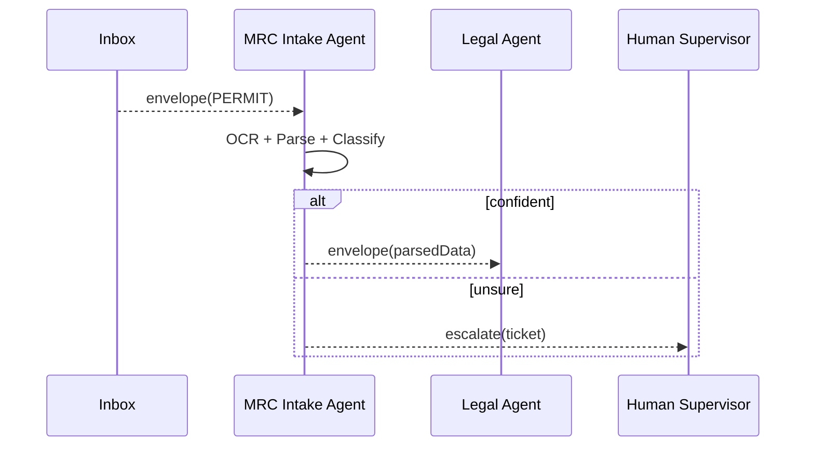

# Chapter 8: Agent Framework (HMS-AGT / HMS-AGX)

[← Back to Chapter 7: External System Synchronisation](07_external_system_synchronisation_.md)

---

> “Give every rule a tiny civil-service robot and watch paperwork disappear.” 
> – an MRC flood-permit clerk

---

## 1. Why Do We Need Agents?

Federal desks overflow with repeatable tasks:

* The **Mississippi River Commission (MRC)** triages thousands of drainage-permit PDFs.
* The **Bureau of Economic Analysis (BEA)** re-keys market figures from 50 spreadsheets.
* The **Labor Department** matches employer reports against wage rules.

Humans burn hours copy-pasting, yet each case must still be **logged**, **justified**, and sometimes **handed to a supervisor**.  

**HMS-AGT / HMS-AGX** turns those chores into disciplined AI “employees” that:

1. Receive work through the same secure pipes we built in [Inter-Agency Protocol](05_inter_agency_protocol__hms_a2a__.md).  
2. Execute skills pulled from a plug-in marketplace.  
3. Record every action for audits and escalate when a human touch is required.

Think of them as **civil-service robots with a shared HR manual.**

---

## 2. The Skeleton & the Attachments

```
      ┌──────────┐
      │ HMS-AGT  │   ← uniform skeleton (identity, inbox, schedule, logs)
      └──────────┘
          ▲ ▲
 attach   │ │ plug-in
 skills   │ │ (HMS-AGX)
      ┌───┴─┴───┐
      │ Legal   │  Analytics  │  Medical │ ...
```

* **HMS-AGT (Agent Core)** – Minimal runtime that understands messages, timers, provenance logs, and escalation hooks.  
* **HMS-AGX (Skill Pack)** – Snap-in modules that teach an agent a specialty: legal reasoning, CPT medical coding, market analytics, etc.

Developers write almost no boilerplate; they “hire” skills like a manager assigns tasks.

---

## 3. Key Concepts (Beginner Cheat-Sheet)

| Term | Beginner Definition |
|------|---------------------|
| **Agent** | A single long-running AI process with an inbox/outbox. |
| **Skill (AGX)** | Python/JS module that adds one capability (e.g., `cpt_coder`). |
| **Manifest** | YAML file declaring the agent’s ID, skills, and permissions. |
| **Inbox / Outbox** | Folders or queues where envelopes from [HMS-A2A](05_inter_agency_protocol__hms_a2a__.md) land. |
| **Schedule** | Cron-style rules telling the agent when to wake up. |
| **Provenance Log** | Append-only JSON file—every decision, every field value. |
| **Escalation Hook** | Function that forwards “I’m not sure” cases to humans via [Human-in-the-Loop Control Loop](12_human_in_the_loop_control_loop_.md). |

These seven nouns cover 90 % of daily agent work.

---

## 4. Build Your First Agent (10-Minute Tour)

### 4.1 Create the Manifest

```yaml
# file: mrc_intake.manifest.yaml
id: AGENT-MRC-INTAKE
inbox: a2a://MRC.PERMITS
outbox: a2a://MRC.LEGAL
skills:
  - pdf_ocr              # built-in AGX
  - flood_form_parser    # custom AGX
  - legal_classifier@1.2 # marketplace AGX
schedule: "*/5 * * * *"  # every 5 minutes
escalateIf: "confidence < 0.8"
```

**What it does**  
Defines a robot that checks its inbox every five minutes, runs three skills, and escalates doubtful cases.

---

### 4.2 Install the Skills

```bash
pip install agx-pdf-ocr agx-flood-parser agx-legal-classifier==1.2
```

*All skills are plain Python wheels—nothing exotic.*

---

### 4.3 Write 12 Lines of Agent Code

```python
# file: run_agent.py
from hms_agt import Agent

a = Agent("mrc_intake.manifest.yaml")

@a.skill("pdf_ocr")
def ocr(doc):
    return pdf_ocr.run(doc)

@a.skill("flood_form_parser")
def parse(text):
    return flood_parser.extract(text)

@a.skill("legal_classifier")
def classify(fields):
    return legal_classifier.predict(fields)

a.run_forever()
```

**Explanation**  
1. `Agent` loads the manifest and wires inbox/outbox, schedule, logs.  
2. Decorator `@a.skill` binds each AGX function.  
3. `a.run_forever()` hands control to HMS-AGT; you never write loops, retries, or logs.

---

### 4.4 Fire It Up

```bash
python run_agent.py
```

What you’ll see:

```
[AGENT-MRC-INTAKE] 🎉 Online
⏰ Next run in 5m
📩 3 new envelopes
✅ processed PERMIT-2024-001  (confidence 0.92)
⚠️  PERMIT-2024-002 low confidence; escalated
```

No extra dev-ops steps—the skeleton handled scheduling, logging, and escalation.

---

## 5. What Happens Under the Hood?



1. **Inbox** hands a sealed permit PDF to the agent.  
2. Skills run sequentially; HMS-AGT measures confidence.  
3. On high confidence → forward to downstream Legal Agent.  
4. Otherwise → open a human ticket.

Only four actors—easy to debug.

---

## 6. Inside HMS-AGT (Light Code Peek)

```python
# hms_agt/core.py (excerpt, 15 lines)
class Agent:
    def __init__(self, manifest):
        self.cfg = yaml.safe_load(open(manifest))
        self.load_skills()
    def run_forever(self):
        while True:
            self.tick()
            sleep(self.delay())
    def tick(self):
        env = inbox.pull(self.cfg['inbox'])
        if not env: return
        ctx = self.apply_skills(env.payload)
        self.route(ctx)
    def route(self, ctx):
        if ctx.confidence < self.cfg['escalateIf'].split('<')[-1]:
            escalate(ctx)
        else:
            outbox.push(self.cfg['outbox'], ctx)
```

Take-away: the core loop is **tiny**—just pull → process → route. Heavy lifting lives in AGX skills.

---

## 7. Common Recipes (≤60 s Each)

### 7.1 Add a Daily Summary Email

```yaml
# in manifest
schedule: ["*/5 * * * *", "0 18 * * *"]   # every 5 min + 6 p.m.
```

If the trigger is 18:00, HMS-AGT auto-calls `summary()` skill.

### 7.2 Chain Agents Without Coding

```yaml
outbox: a2a://MRC.LEGAL      # Intake agent
# Legal agent manifest
inbox: a2a://MRC.LEGAL
outbox: a2a://MRC.ARCHIVE
```

Messages flow through [HMS-A2A](05_inter_agency_protocol__hms_a2a__.md) with zero glue code.

### 7.3 Quick Escalation to Teams Chat

```python
# escalation.py (AGX)
def escalate(ticket):
    teams.post(f"Check permit {ticket.id} – confidence {ticket.conf}")
```

Add `- escalation` to the manifest; you’re done.

---

## 8. Best Practices (Sticky-Note Edition)

1. Keep skills **single-purpose**; easier to audit.  
2. Pin skill versions (`@1.2`) to avoid surprise behaviour.  
3. Log **both** the raw payload hash and the decision—helpful in audits.  
4. Escalate early; humans forgive extra tickets, not silent errors.  
5. Use [Monitoring, Metrics & OPS](13_monitoring__metrics___ops_.md) to watch confidence trends.

---

## 9. Where Agents Fit in the HMS Universe

```mermaid
graph LR
A2A[Secure Messages<br/>(HMS-A2A)] --> AGT[Agents<br/>(HMS-AGT)]
AGT --> AGX[Skills<br/>(HMS-AGX)]
AGT --> HITL[Escalation<br/>(Ch 12)]
AGT --> DTA[Data Lake<br/>(Ch 9)]
```

Agents **consume** envelopes, **apply** skills, and **emit** new envelopes or human tickets—all logged for the Data Lake.

---

## 10. Summary & What’s Next

You built a civil-service robot that:

1. Reads secured messages every five minutes.  
2. Runs modular skills from a marketplace.  
3. Records every decision and escalates tricky cases.

In the next chapter we’ll see where all those logs and payloads rest:  
[Data Lake & Registry (HMS-DTA)](09_data_lake___registry__hms_dta__.md)

Welcome to the age of disciplined AI public servants!

---

Generated by [HardisonCo [NARA-DOC]](https://github.com/The-Pocket/Tutorial-Codebase-Knowledge)