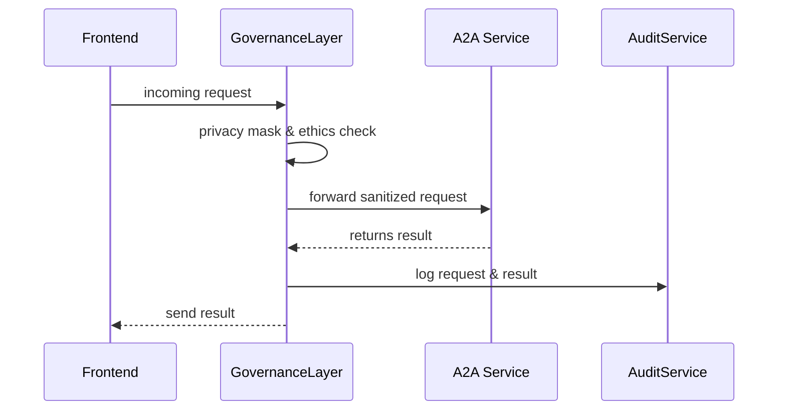

# Chapter 8: AI Governance Values

In [Chapter 7: Policy/Process Module](07_policy_process_module_.md), you learned how workflows and policies get versioned and updated. Now let’s dive into the *values* that guide every AI decision—think of them as our system’s moral compass, constitution, and handbook all rolled into one.

## Why Governance Values Matter

Problem: If we let AI run unchecked, it can make unfair, biased, or even harmful decisions—just like a court without a constitution.  
Solution: Embed core principles—transparency, truth, safety, ethics, privacy—at every layer. This ensures our automated decisions are lawful, fair, and trusted by citizens.

**Example Use Case**  
The U.S. Department of Housing and Urban Development (HUD) uses an AI agent to recommend housing voucher allocations. We must ensure:

- A family’s personal data stays private (Privacy)  
- Every recommendation can be explained to a reviewer (Transparency)  
- The AI’s data sources are accurate and up to date (Truth)  
- No demographic group is unfairly disadvantaged (Ethics)  
- The system can’t be tricked into harmful behavior (Safety)  

## Key Governance Concepts

1. **Transparency**  
   – Audit logs, explainable results, clear rationale.  
   – Analogy: A court transcript showing every argument.

2. **Truth**  
   – Data validation, accuracy checks, source verification.  
   – Analogy: A fact-checker in journalism.

3. **Safety**  
   – Reject harmful inputs, enforce rate limits, guard rails.  
   – Analogy: Seat belts in a car.

4. **Ethics**  
   – Bias detection, fairness algorithms, inclusive rules.  
   – Analogy: A nondiscrimination clause in law.

5. **Privacy**  
   – Mask PII, enforce access controls, limit data retention.  
   – Analogy: A locked file cabinet for personal records.

## Applying Governance Values: A Simple Example

Imagine every request to our Finance Agent goes through a governance check before execution:

```javascript
import { governanceMiddleware } from 'hms-gov-service'
import { SpecializedAgent }      from 'hms-a2a-client'

// 1. Wrap your request in governance checks
app.post('/loan-checklist', governanceMiddleware, async (req, res) => {
  // 2. If we pass checks, call the finance agent
  const agent = SpecializedAgent.create('finance')
  const result = await agent.getChecklist(req.body)
  // 3. Log result for transparency
  req.governance.log('transparency', { request: req.body, result })
  res.json(result)
})

// Inside governanceMiddleware (simplified):
function governanceMiddleware(req, res, next) {
  // Audit the incoming data
  req.governance = {
    log: (value, info) => AuditSvc.record(value, info)
  }
  // Privacy: mask sensitive fields
  req.body = PrivacySvc.maskFields(req.body)
  // Ethics: reject unfair profiles
  if (!EthicsSvc.isFair(req.body)) {
    return res.status(403).send('Unfair request')
  }
  next()
}
```

Explanation:  
1. We mask personal data (Privacy).  
2. We check fairness (Ethics).  
3. We record an audit log (Transparency).  
4. If all checks pass, we execute the AI call.

## Under the Hood: Governance in Action



1. **GovernanceLayer** masks and checks data.  
2. It calls the **A2A Service** (e.g., Finance Agent).  
3. It logs both request and response.  
4. Finally, the result goes back to the UI.

## Inside the Governance Layer

### governanceService.js (`hms-gov-service/src/services/governanceService.js`)

```javascript
class GovernanceService {
  // Check compliance for a given value
  async check(value, data) {
    // pretend: consult value rules (e.g., fairness thresholds)
    return true  // or false if violation
  }

  // Record an audit event
  async log(value, info) {
    // pretend: write to a durable audit store
  }
}

module.exports = new GovernanceService()
```

### Configuring Value Rules (`config/governanceValues.json`)

```json
{
  "transparency": { "logRequests": true },
  "privacy":      { "maskFields": ["ssn","birthDate"] },
  "ethics":       { "biasThreshold": 0.1 },
  "safety":       { "rateLimit": 100 },
  "truth":        { "dataSources": ["HUD_DB","Census_API"] }
}
```

Explanation:  
- Each value has its own settings—what to mask, how often to log, thresholds for bias, approved data sources, etc.

## Conclusion

In this chapter, you learned how **AI Governance Values**—transparency, truth, safety, ethics, and privacy—act as our system’s foundation, ensuring every AI-driven recommendation is fair, legal, and trustworthy. These values are woven into middleware, agents, and audit logs across the entire HMS stack.

Next up, see how we keep your AI system in sync with external services in [Chapter 9: External System Synchronization](09_external_system_synchronization_.md).

---

Generated by [HardisonCo [NARA-DOC]](https://github.com/The-Pocket/Tutorial-Codebase-Knowledge)