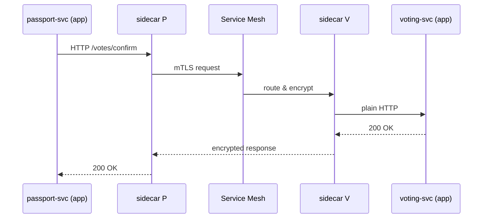

# Chapter 8: Microservices & Service Mesh Architecture
[← Back to Chapter 7: Backend API / Service Layer (HMS-API, HMS-SVC)](07_backend_api___service_layer__hms_api__hms_svc__.md)

---

## 1. Why Split the Big “Monolith” into Tiny Offices?

Imagine **Tasha**, a U.S. citizen living abroad, who needs to:

1. Renew her **passport** through the State Department,  
2. Update her **voting address** with the Federal Voting Assistance Program, and  
3. Request **overseas medical coverage** from TRICARE.

Those actions travel through very different rules, data models, and peak-traffic patterns.  
Instead of one gigantic, tangled application, HMS breaks work into **tiny, single-purpose services** (“offices”) and lets a **service mesh** (“secure hallway system”) connect them.

Benefits for beginners:

* **Faster changes** – tweak one office without repainting the whole building.  
* **Safer isolation** – a broken medical-coverage rule can’t crash the passport service.  
* **Built-in security & metrics** – the hallway badges every request and shows who went where.

---

## 2. Key Concepts in Plain English

| Concept            | Analogy in a Federal Building                     | Why It Matters                         |
|--------------------|---------------------------------------------------|----------------------------------------|
| Microservice       | A dedicated office (e.g., “Passport Desk”)        | Focused scope → easier to test & deploy |
| Service Mesh       | Secure hallway with cameras & keycards            | Auto-handles discovery, encryption, logs |
| Sidecar Proxy      | Security guard standing *inside* every office     | Enforces hallway rules for that office  |
| Discovery          | Office directory in the lobby                     | A service finds others without hard-coding URLs |
| mTLS Encryption    | Talking through a locked, traceable phone line    | Stops eavesdropping between services    |
| Observability      | CCTV + hallway logbook                            | Lets ops staff see traffic, errors, latency |
| Circuit Breaker    | “Room closed” sign when an office is overwhelmed  | Prevents cascading failures             |

Keep this cheat-sheet handy; we’ll refer back to it.

---

## 3. A 3-Minute “Hello, World” Walk-Through  
### Goal: Passport Service calls Voting Service inside the Mesh

We will:

1. Spin up two **tiny** Docker containers (`passport-svc` and `voting-svc`).  
2. Inject a **sidecar proxy** (Envoy) automatically.  
3. Watch the call succeed *without* writing any networking code.

> NOTE: Names & ports are for illustration; your real agency chart may differ.

### 3.1 Kubernetes Deployment (14 lines)

```yaml
# file: k8s/passport.yaml
apiVersion: apps/v1
kind: Deployment
metadata: { name: passport-svc }
spec:
  replicas: 1
  selector: { matchLabels: { app: passport } }
  template:
    metadata:
      labels: { app: passport }
      annotations:
        mesh.istio.io/inject: "true"   # 1️⃣ auto-add sidecar
    spec:
      containers:
        - name: app
          image: hms/passport:1.0       # 2️⃣ main office
          ports: [{ containerPort: 3000 }]
```

Explanation  
1. `mesh.istio.io/inject: "true"` tells the mesh (Istio) to place a **sidecar proxy** next to the `passport` container.  
2. We don’t open firewalls; the sidecar knows hallway rules automatically.

### 3.2 Passport Service Calls Voting Service (Node, 11 lines)

```js
// file: src/passport.js
import express from 'express';
import fetch   from 'node-fetch';
const app = express();

app.get('/renew', async (_, res) => {
  // Mesh DNS auto-resolves 'voting-svc'
  const voting = await fetch('http://voting-svc/votes/confirm');
  const ok     = await voting.text();
  res.send(`Passport renewed. Voting status: ${ok}`);
});

app.listen(3000);
```

What’s magic here?  
* `http://voting-svc` works **only inside** the mesh.  
* The call is encrypted with mTLS by the **sidecar proxies**, not by this code.

### 3.3 See the Traffic (kubectl, 1 line)

```bash
istioctl dashboard kiali   # opens a live graph in your browser
```

Kiali shows a green arrow from `passport-svc` → `voting-svc`, latency, and error rate—no extra logging code required.

---

## 4. What Happens Behind the Curtain?



* Apps talk **plain HTTP** to their own sidecar.  
* Sidecars handle **encryption, retries, circuit breakers**.  
* The central **Hall** (control plane) keeps the directory and hallway rules.

---

## 5. Quick Peek at Internal Implementation

### 5.1 Envoy Sidecar Bootstrap (trimmed to 12 lines)

```yaml
# auto-generated by mesh, shown for learning
static_resources:
  listeners:
    - name: outbound
      address: { socket_address: { address: 0.0.0.0, port_value: 15001 } }
  clusters:
    - name: voting-svc
      connect_timeout: 2s
      type: STRICT_DNS
      lb_policy: ROUND_ROBIN
      hosts: [{ socket_address: { address: voting-svc, port_value: 3000 } }]
      circuit_breakers: { thresholds: [{ max_connections: 100 }] }
```

Take-aways for beginners  
* **Listeners** accept in-pod traffic on port `15001`.  
* **Clusters** list where to forward (DNS name + port).  
* `circuit_breakers` stops floods (>100 open connections).

### 5.2 Simple Policy to Encrypt Every Call (YAML, 6 lines)

```yaml
# file: mesh/policy.yaml
apiVersion: security.istio.io/v1beta1
kind: PeerAuthentication
metadata: { name: default }
spec:
  mtls: { mode: STRICT }   # every office must use hallway phones
```

Zero code changes → security enforced platform-wide.

---

## 6. First-Time Integration Checklist

| Step | Command / Action                              | Time |
|------|-----------------------------------------------|------|
| 1. Install mesh add-on (Istio in dev) | `istioctl install --set profile=demo` | 2 min |
| 2. Label namespace for injection  | `kubectl label ns my-agency istio-injection=enabled` | 10 s |
| 3. Deploy your first microservice | `kubectl apply -f passport.yaml` | 30 s |
| 4. Verify hallway health          | `istioctl proxy-status` | 10 s |
| 5. Add global mTLS policy         | `kubectl apply -f mesh/policy.yaml` | 5 s |

Total ≈ **3 minutes** to gain encryption, discovery & tracing.

---

## 7. Where the Mesh Touches Other HMS Layers

* Front-end calls first hit the [Gateway](07_backend_api___service_layer__hms_api__hms_svc__.md).  
* Behind the Gateway, **every** HMS microservice speaks through the mesh—no hard-coded IPs.  
* Mesh telemetry feeds **HMS-A2A** (see [AI Representative Agent](03_ai_representative_agent__hms_a2a__.md)) so the AI can spot bottlenecks.  
* Security policies from the upcoming [Data Privacy & Compliance Framework](09_data_privacy___compliance_framework_.md) compile down to mesh rules (mTLS, egress blocks).

---

## 8. Tips & Pitfalls for New Agencies

1. **Start Small** – Mesh only one namespace (e.g., `pilot-program`) before the whole fleet.  
2. **Limit Mesh Policies to Code Owners** – A bad YAML can blockade traffic; use role-based access.  
3. **Watch Out for Legacy Protocols** – If an old COBOL service uses raw TCP, add a sidecar *permissive* policy or place it behind an adapter.  
4. **Tune Circuit Breakers Early** – Default limits may be too low during real emergencies.  
5. **Use Canary Deploys** – Mesh can shift 5 % of calls to v2 of a service; perfect for gradual rollouts.

---

## 9. Summary & Next Steps

You just learned:

* Why HMS chooses lots of tiny “offices” over one mega bureaucracy.  
* How a **service mesh** provides invisible hallways with **security, discovery, and observability** baked in.  
* A minimal Kubernetes + Node demo that renews a passport and confirms voting status with zero networking code.  
* Internal Envoy snippets, global mTLS policy, and a first-time integration checklist.

Next, we’ll dig into **privacy controls and legal compliance** that ride on top of this mesh.  
Continue to ➡ [Chapter 9: Data Privacy & Compliance Framework](09_data_privacy___compliance_framework_.md)

---

Generated by [HardisonCo [NARA-DOC]](https://github.com/The-Pocket/Tutorial-Codebase-Knowledge)