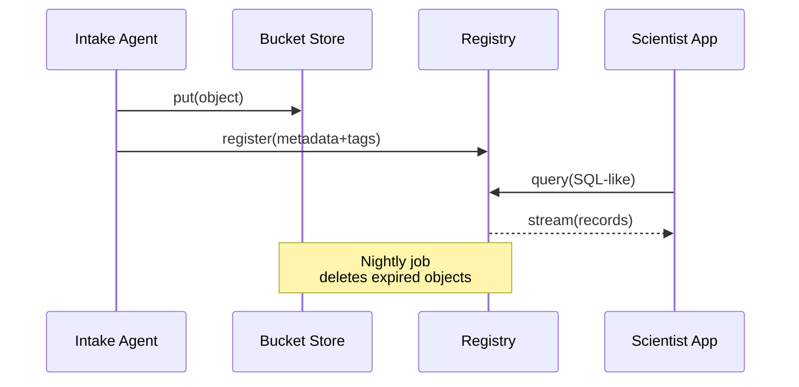

# Chapter 9: Data Lake & Registry (HMS-DTA)

[← Back to Chapter 8: Agent Framework (HMS-AGT / HMS-AGX)](08_agent_framework__hms_agt___hms_agx__.md)

---

> “Put every file in one vault, label it like the Library of Congress,  
> keep only what the law allows—then answer any question in seconds.”  
> – a State Archives records manager

---

## 1 . Why Do We Need HMS-DTA?

### A 90-Second Story — *“One Flood Permit, Many Stakeholders”*

1. An **MRC Intake Agent** (from the last chapter) finishes processing a PDF flood-permit application.  
2. **Environmental scientists** need its land-use metadata.  
3. **FOIA officers** need a redacted copy if citizens request it.  
4. **Auditors** must delete personal data after 7 years —no earlier, no later.

If every team keeps its own copy, someone will:

* store PII longer than allowed, or  
* change a number and break the “single source of truth.”

**HMS-DTA** fixes this by acting as:

* A **Data Lake** – one giant, cheap, immutable store.  
* A **Registry** – a brain that knows *why* a file exists, *who* may see it, and *when* it must vanish.

---

## 2 . The Use Case We’ll Build

We will:

1. Ingest the processed flood-permit JSON from the agent.  
2. Attach privacy & retention tags.  
3. Query the lake for “permits near the Mississippi River in the last 30 days.”  
4. Demonstrate automatic deletion after the retention clock expires.

All in <40 lines of Python.

---

## 3 . Key Concepts (Beginner Cheat-Sheet)

| “Record-Office” Analogy | HMS-DTA Term | One-Line Explanation |
|-------------------------|--------------|----------------------|
| Filing cabinet | **Bucket** | Physical storage of raw bytes (S3, Azure Blob…). |
| Index card | **Catalog Entry** | Searchable metadata row about one object. |
| Colored sticker | **Policy Tag** | Labels: `PROTECTED_B`, `FOIA_PUBLIC`, etc. |
| Date stamp | **Retention Clock** | Earliest & latest legal delete dates. |
| Reading room | **Secure Stream API** | Read-only window that enforces tags in real time. |

Remember these five nouns; 80 % of HMS-DTA is just them.

---

## 4 . Quick Start — Ingest, Tag & Query in 20 Lines

> Prerequisites  
> ```bash
> pip install hms-dta
> export DTA_ENDPOINT=https://lake.sandbox.gov
> ```

```python
# dta_demo.py  (≤20 lines)
from hms_dta import Bucket, Catalog, query

# 1. Store the file --------------------------------------------------
bucket = Bucket("permits-raw")
obj_id  = bucket.put("permit_2024_042.json", open("permit.json","rb"))

# 2. Register metadata & tags ---------------------------------------
Catalog.register(
    id       = obj_id,
    title    = "2024 Flood Permit #42",
    agency   = "MRC",
    geo      = {"lat": 29.9, "lon": -90.0},
    tags     = ["PROTECTED_B", "PERSONAL_DATA"],
    retain   = "7y"
)

# 3. Query last 30 days near river ----------------------------------
for rec in query("""
    SELECT title, geo
    WHERE tags !~ 'PROTECTED_B'
      AND geo.lon < -85
      AND date_ingested > now() - 30d
"""):
    print(rec)

# 4. Run retention sweep (demo only) --------------------------------
Catalog.retention_sweep()
```

### What Happens?

1. `bucket.put` uploads the raw JSON to the lake.  
2. `Catalog.register` writes an index card with tags and retention rules.  
3. `query` returns only safe records (no `PROTECTED_B`) for the scientist’s dashboard.  
4. `retention_sweep()` would normally run nightly via cron; here we call it manually.

---

## 5 . Behind the Curtain – Five-Step Flow



1. **Agent** writes bytes + metadata separately.  
2. **Registry** keeps the brains; **Bucket** keeps the bulk.  
3. **Apps** never read the bucket directly—only through the registry’s filtered stream.  
4. A retention job prunes data invisibly.

---

## 6 . Under the Hood (Plain-English Walkthrough)

1. **Write** – The SDK uploads to an S3-style store and receives an `obj_id` (SHA-256 hash).  
2. **Register** – A lightweight PostgreSQL table stores `(obj_id, json_meta, tags, delete_after)`.  
3. **Query** – The registry parses a tiny SQL-like DSL, filters rows, and streams S3 presigned URLs.  
4. **Retention Sweep** – A cron job deletes objects whose clock < `now()` and marks the row `tombstoned`.  
5. **Audit Log** – Every read & delete is appended to a separate log bucket for auditors.

No fancy Hadoop—just commodity pieces glued with strict policy checks.

---

## 7 . Tiny Code Peek – Registry Insert (≤15 Lines)

```python
# registry/write.py (simplified)
def register(id, **meta):
    row = {
      "id": id,
      "meta": json.dumps(meta),
      "tags": meta.get("tags", []),
      "delete_after": calc_date(meta.get("retain"))
    }
    sql = """
      INSERT INTO catalog(id, meta, tags, delete_after)
      VALUES (%(id)s, %(meta)s, %(tags)s, %(delete_after)s)
    """
    pg.execute(sql, row)
```

Take-away: a *single row* in Postgres is the brains; the bytes live elsewhere.

---

## 8 . Policy Tags: How Enforcement Works

* `PUBLIC`              – anyone with an API key may read.  
* `PROTECTED_B`         – encrypted in transit; must strip PII fields.  
* `CLASSIFIED_SECRET`   – endpoint refuses; only listed agent IDs can request.  
* `FOIA_REVIEW`         – not visible until a human toggles it.

During `query()`, the registry compares:

```
user.clearance >= tag.level      AND
current_time  < delete_after
```

If either fails, the record is skipped—no partial leaks.

---

## 9 . Common Recipes (≤60 Seconds Each)

### 9.1 Add a Redacted View

```python
Catalog.register_view(
    name = "permits_public",
    base = "permits-raw",
    transform = "remove(fields=['ssn','phone'])",
    tags = ["PUBLIC"]
)
```

Apps can now `SELECT * FROM permits_public`.

### 9.2 Bulk Import Legacy Files

```bash
hms-dta bulk-import \
   --bucket legacy-scans \
   --tag PROTECTED_B \
   --retain 10y \
   scans/*.tif
```

### 9.3 Trigger Early Deletion (Court Order)

```python
Catalog.force_delete("permit_2024_042.json", reason="Court order 23-567")
```

Audit log records the reason string.

---

## 10 . Best Practices (Sticky-Note Edition)

1. **Separate bytes & brains** – always `put()` then `register()`.  
2. **Use short retention** by default; extend only when the law says so.  
3. **Pin tag vocabulary** in version control to avoid “FREEFORM_TAG_MESS”.  
4. **Encrypt at rest** for any tag ≥ `PROTECTED_B`.  
5. **Never** let apps read S3 directly—go through the registry stream; otherwise policy checks aren’t enforced.

---

## 11 . How HMS-DTA Fits in the Bigger Picture

```mermaid
graph LR
AGT[Agents<br/>(HMS-AGT)] --> DTA[Data Lake + Registry]
A2A[Secure Envelopes<br/>(HMS-A2A)] --> DTA
DTA --> MFE[Micro-Frontends<br/>(HMS-MFE)]
DTA --> MCP[Models & Context<br/>(Ch 10)]
DTA --> OPS[Monitoring<br/>(Ch 13)]
```

Everything—agent outputs, inter-agency messages, citizen uploads—flows **into** HMS-DTA and **out** through policy-aware streams.

---

## 12 . What’s Next?

You now know how to:

1. Store any file in a single government-wide lake.  
2. Tag it with privacy and retention metadata.  
3. Query it safely, and watch the robot janitor delete it on schedule.

Next we’ll learn how AI models pull the **right slice of that lake** as context without leaking secrets:  
[Model Context Protocol (HMS-MCP)](10_model_context_protocol__hms_mcp__.md)

---

---

Generated by [HardisonCo [NARA-DOC]](https://github.com/The-Pocket/Tutorial-Codebase-Knowledge)