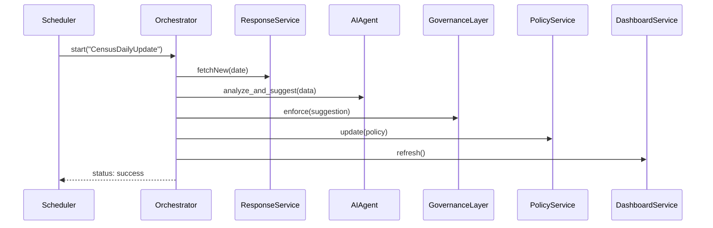

# Chapter 9: Management Layer

In [Chapter 8: Governance Layer](08_governance_layer_.md), we added automated checks—ethics, privacy, safety, compliance—before any AI suggestion takes effect. Now it’s time to coordinate all the pieces—AI agents, microservices, dashboards, governance checks—into end-to-end workflows. Welcome to the **Management Layer**, the “project manager” of your system.

## 9.1 Why a Management Layer? A Real-World Motivation

Imagine the U.S. Census Bureau needs to run a **daily pipeline**:
1. Fetch new citizen survey responses.
2. Ask an AI agent to spot under-surveyed regions.
3. Run governance checks on the AI’s suggestion.
4. Update the official policy if approved.
5. Refresh the public dashboard.

Without a central orchestrator, you’d write brittle glue scripts or manually trigger each step. The Management Layer automates this: you define a workflow once, then hit “Start,” and it drives each task in order.

## 9.2 Key Concepts

1. **Workflow**  
   A named sequence of **tasks** you want to run end-to-end.  
2. **Task**  
   One unit of work—calling a microservice, an AI agent, or a governance check.  
3. **Orchestrator**  
   The engine that loads workflows and runs tasks in order.  
4. **Trigger**  
   How workflows start: manually, on a schedule, or on an event.  
5. **Result**  
   A summary of each task’s success or failure.

## 9.3 Defining and Running a Workflow

### 9.3.1 Define a Workflow

Create a simple JSON file `census_workflow.json`:

```json
{
  "id": "CensusDailyUpdate",
  "tasks": [
    { "name":"CollectResponses", "service":"ResponseService", "action":"fetchNew" },
    { "name":"AnalyzeData",      "agent":"CensusCoverageAdvisor", "action":"analyze_and_suggest" },
    { "name":"GovernanceReview", "layer":"GovernanceLayer",        "action":"enforce" },
    { "name":"UpdatePolicy",     "service":"PolicyService",       "action":"update" },
    { "name":"RefreshDashboard", "service":"DashboardService",    "action":"refresh" }
  ]
}
```

Explanation:  
- Each task refers to a microservice (see [Chapter 3: Microservices Framework (HMS-SVC)](03_microservices_framework__hms_svc__.md)), an AI agent ([Chapter 1: HMS-A2A](01_ai_agents_module__hms_a2a__.md)), or the governance layer ([Chapter 8](08_governance_layer_.md)).

### 9.3.2 Start the Workflow

Use a small script:

```python
# file: orchestrator_app.py
from hms_mgmt import Orchestrator

orc = Orchestrator()
orc.load_workflow("census_workflow.json")        # Load our definition
result = orc.start("CensusDailyUpdate", {"date":"2024-06-01"})
print("Workflow status:", result.status)
```

Explanation:  
- We load the JSON, then call `start()`.  
- The orchestrator runs each task in order, passing the date into every call.

## 9.4 What Happens Under the Hood?



1. A scheduler or user triggers the orchestrator.  
2. Orchestrator calls **ResponseService** to get new data.  
3. It passes data to an AI agent from [HMS-A2A](01_ai_agents_module__hms_a2a__.md).  
4. The raw suggestion goes through the [Governance Layer](08_governance_layer_.md).  
5. If approved, it calls the [Policy Management API](04_policy_management_api__hms_api___hms_mkt__.md) and then the dashboard service.  
6. Finally, it returns a summary status.

## 9.5 Inside the Orchestrator: Simplified Code

### `hms_mgmt.py`

```python
import json
class Result:
    def __init__(self, status): self.status = status

class Orchestrator:
    def __init__(self):
        self.workflows = {}

    def load_workflow(self, path):
        wf = json.load(open(path))
        self.workflows[wf["id"]] = wf["tasks"]

    def start(self, wf_id, params):
        for task in self.workflows[wf_id]:
            self._run_task(task, params)
        return Result(status="success")

    def _run_task(self, task, params):
        # Decide what to call based on task type
        if task.get("service"):
            svc = ServiceFactory.get(task["service"])
            svc.call(task["action"], params)
        elif task.get("agent"):
            agent = AIAgent(task["agent"])
            agent.analyze_and_suggest(params)
        else:
            layer = GovernanceLayer()
            layer.enforce(params)
```

Explanation:  
- `load_workflow`: reads tasks from JSON.  
- `start`: loops through tasks and delegates each to the right component.  
- `_run_task`: picks a microservice, AI agent, or governance layer.

## 9.6 Conclusion

You’ve seen how the **Management Layer** ties together microservices, AI agents, governance checks, and dashboards into repeatable workflows. Define once, run anywhere—no more brittle scripts or manual steps.  

Next up: adding humans back into the loop with [Chapter 10: Human-in-the-Loop Oversight](10_human_in_the_loop_oversight_.md).

---

Generated by [HardisonCo [NARA-DOC]](https://github.com/The-Pocket/Tutorial-Codebase-Knowledge)