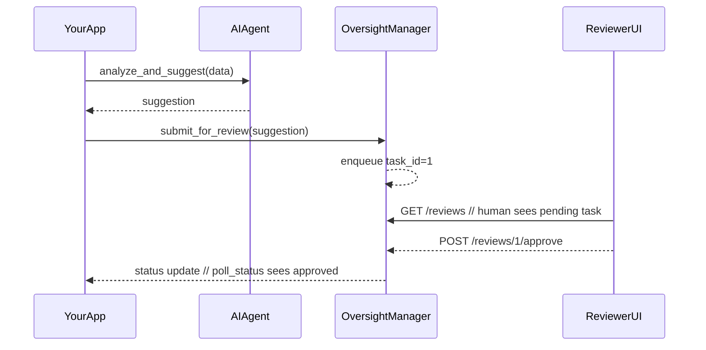

# Chapter 10: Human-in-the-Loop Oversight

In [Chapter 9: Management Layer](09_management_layer_.md) we saw how to automate end-to-end workflows across AI agents, services, and governance checks. Now we’ll add a critical safety net: **Human-in-the-Loop Oversight**—just like a safety pilot in an automated aircraft, a human reviewer is always ready to inspect or override AI proposals before they go live.

## 10.1 Why Human-in-the-Loop Oversight? A Real-World Use Case

Imagine **U.S. Citizenship and Immigration Services (USCIS)** uses an AI agent to pre-screen Green Card applications. The AI flags cases that look like potential fraud (e.g., inconsistent addresses or missing documents). Before any enforcement action or follow-up letter is sent, a trained caseworker must review the AI’s suggestion:

1. The AI proposes “Interview Required” for applicant #123.  
2. The caseworker checks supporting documents.  
3. They **approve** the interview or **override** with “No Interview” plus a reason.

This prevents unintended denials or unnecessary interviews, keeps citizens safe, and ensures fairness.

## 10.2 Key Concepts

- **Suggestion**  
  The AI’s output needing review (e.g., “Request interview for #123”).  
- **ReviewTask**  
  A record that wraps a suggestion and tracks its status (pending, approved, overridden).  
- **OversightManager**  
  The component that accepts suggestions, queues them for human review, and records decisions.  
- **Approve / Override**  
  Two outcomes: green-light the AI suggestion or replace it with a human decision.  
- **ReviewQueue**  
  The list of all pending tasks awaiting human action.

## 10.3 Using Human-in-the-Loop Oversight

Here’s how your application can submit an AI suggestion and wait for a human to decide:

```python
from hms_a2a import AIAgent
from hms_oversight import OversightManager

# 1. AI agent makes a suggestion
agent    = AIAgent(name="GreenCardFraudDetector")
suggest  = agent.analyze_and_suggest(application_data)

# 2. Send suggestion for human review
oversight = OversightManager()
task_id   = oversight.submit_for_review(suggest)
print("Waiting on review task:", task_id)

# 3. Poll until the human approves or overrides
while True:
    status = oversight.poll_status(task_id)
    if status["state"] != "pending":
        break

# 4. Act on the decision
if status["state"] == "approved":
    agent.apply_suggestion(suggest)
else:
    print("Overridden:", status["reason"])
```

Explanation:

1. We call the AI agent from [Chapter 1: AI Agents Module (HMS-A2A)](01_ai_agents_module__hms_a2a__.md).  
2. We hand the raw suggestion to our `OversightManager`.  
3. The manager gives us a `task_id` we can poll.  
4. Once a human reviewer acts, we either apply the original suggestion or handle an override.

## 10.4 What Happens Under the Hood?



1. **App** asks the **AIAgent** for a suggestion.  
2. **OversightManager** enqueues it for review and returns a `task_id`.  
3. A human uses a simple **ReviewerUI** to list pending reviews.  
4. The reviewer clicks “Approve” or “Override.”  
5. The **App** polls `poll_status(task_id)` to learn the final decision.

## 10.5 Inside OversightManager: Simplified Code

### File: hms_oversight.py

```python
class OversightManager:
    def __init__(self):
        self._queue = {}  # task_id -> record

    def submit_for_review(self, suggestion):
        tid = str(len(self._queue)+1)
        self._queue[tid] = {"suggestion": suggestion, "state": "pending"}
        return tid

    def poll_status(self, task_id):
        return self._queue[task_id]

    def human_approve(self, task_id):
        self._queue[task_id]["state"] = "approved"

    def human_override(self, task_id, reason):
        rec = self._queue[task_id]
        rec["state"]  = "overridden"
        rec["reason"] = reason
```

Explanation:

- We keep an in-memory `_queue` of tasks.  
- `submit_for_review` creates a new record with `"pending"`.  
- `poll_status` returns the current state.  
- `human_approve` and `human_override` let a reviewer change the state.

### Reviewer UI Endpoints

```javascript
// file: reviewer_ui.js
const express = require('express');
const { OversightManager } = require('hms-oversight');
const app = express();
app.use(express.json());
const oversight = new OversightManager();

// List pending reviews
app.get('/reviews', (req, res) => {
  res.json(oversight._queue);
});

// Approve a task
app.post('/reviews/:id/approve', (req, res) => {
  oversight.human_approve(req.params.id);
  res.send('Approved');
});

// Override a task
app.post('/reviews/:id/override', (req, res) => {
  oversight.human_override(req.params.id, req.body.reason);
  res.send('Overridden');
});

app.listen(4000, ()=>console.log("Reviewer UI up"));
```

Explanation:

- A small Express server shows all tasks at `GET /reviews`.  
- Reviewers `POST /approve` or `/override` to signal their decision.

## 10.6 Conclusion

In this chapter you learned how **Human-in-the-Loop Oversight** lets you queue AI suggestions, wait for a trained human to inspect them, and then either approve or override—just like a safety pilot in a plane. This keeps your public-sector workflows safe, fair, and compliant.  

Next, we’ll explore the [Autonomous Workflow Engine](11_autonomous_workflow_engine_.md), where fully unattended pipelines can run end-to-end when no human step is required.

---

Generated by [HardisonCo [NARA-DOC]](https://github.com/The-Pocket/Tutorial-Codebase-Knowledge)