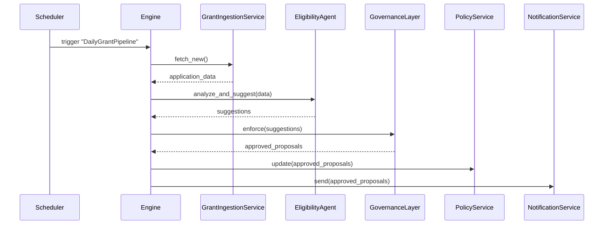

# Chapter 11: Autonomous Workflow Engine

In the previous chapter we added **Human-in-the-Loop Oversight** to pause and review AI suggestions before they go live ([Chapter 10: Human-in-the-Loop Oversight](10_human_in_the_loop_oversight_.md)). Now we’ll remove all manual starts and build a system that runs entire pipelines—ingestion, analysis, proposals, and deployment—fully unattended once configured.

## 11.1 Why an Autonomous Workflow Engine? A Real-World Motivation

Imagine the Rehabilitation Services Administration runs a **daily grant-award pipeline**:

1. Ingest new grant applications from a public API.  
2. Ask an AI agent to score each applicant’s eligibility.  
3. Run governance checks on high-score proposals.  
4. Auto-generate award letters.  
5. Publish approved awards on the public portal.

Manually kicking off each step is like starting every station on a factory line by hand. An **Autonomous Workflow Engine** is the conveyor belt that, once set up, moves work from station to station without human intervention—yet adapts automatically if the “product” (data) changes.

## 11.2 Key Concepts

1. WorkflowDefinition  
   A list of **tasks** in order, like stations on an assembly line.  
2. Task  
   A single action (e.g., `ingest_data`, `analyze_and_suggest`, `deploy_policy`).  
3. Trigger  
   What starts the engine: a **schedule** (cron), an **event** (new file), or **manual**.  
4. Engine  
   The runner that reads definitions, fires tasks in sequence, and handles retries.  
5. Monitor  
   Logs progress, alerts on failures, and can pause or reroute tasks if needed.

## 11.3 Defining and Running a Workflow

Below is a minimal example of a daily grant-processing workflow.

File: `grant_workflow.py`
```python
workflow = {
  "id": "DailyGrantPipeline",
  "trigger": {"type":"schedule", "cron":"0 2 * * *"},  # every day at 2 AM
  "tasks": [
    {"name":"Ingest", "service":"GrantIngestionService", "action":"fetch_new"},
    {"name":"Score",  "agent":"EligibilityAgent",     "action":"analyze_and_suggest"},
    {"name":"Review","layer":"GovernanceLayer",       "action":"enforce"},
    {"name":"Award", "service":"PolicyService",       "action":"update"},
    {"name":"Notify","service":"NotificationService", "action":"send"}
  ]
}
```
This Python dict:

- Gives the workflow an `id`.  
- Uses a cron `trigger`.  
- Lists tasks by type: microservice, AI agent, governance layer.

File: `run_engine.py`
```python
from engine import AutonomousWorkflowEngine
from grant_workflow import workflow

engine = AutonomousWorkflowEngine()
engine.register(workflow)                # load our definition
engine.start("DailyGrantPipeline")       # begin running on its trigger
```
- `register` tells the engine about our workflow.  
- `start` makes it active: it will fire every day at 2 AM.

## 11.4 What Happens Under the Hood?


1. A **Scheduler** (cron or event listener) fires the engine.  
2. The engine calls **GrantIngestionService** to fetch new applications.  
3. It passes data to **EligibilityAgent** for scoring.  
4. Suggestions go through **GovernanceLayer** checks.  
5. Approved proposals are pushed to **PolicyService** and **NotificationService**.

## 11.5 Inside the Engine: Simplified Code

### File: `engine.py`
```python
import threading, time

class AutonomousWorkflowEngine:
    def __init__(self):
        self.workflows = {}

    def register(self, wf):
        self.workflows[wf["id"]] = wf

    def start(self, wf_id):
        wf = self.workflows[wf_id]
        # In reality: schedule with cron library; here, run immediately
        thread = threading.Thread(target=self._run, args=(wf,))
        thread.start()

    def _run(self, wf):
        for task in wf["tasks"]:
            self._execute(task)

    def _execute(self, task):
        if "service" in task:
            svc = ServiceFactory.get(task["service"])
            svc.call(task["action"])
        elif "agent" in task:
            agent = AIAgent(task["agent"])
            agent.analyze_and_suggest([])
        else:
            gov = GovernanceLayer()
            gov.enforce(None)
```
- `register` stores workflows.  
- `start` spins a thread (or scheduler) to run `_run`.  
- `_run` loops through tasks in order.  
- `_execute` dispatches to the right component.

### File: `service_factory.py`
```python
class ServiceFactory:
    @staticmethod
    def get(name):
        # In reality: dynamic import or registry
        return globals()[name]()

class GrantIngestionService:
    def call(self, action):
        print("📥 Fetching new grants...")  # stub

class PolicyService:
    def call(self, action):
        print("✅ Publishing awards...")    # stub
```
- A simple factory returns a service instance by name.  
- Each service has a `call(action)` stub to show activity.

## 11.6 Conclusion

You now know how the **Autonomous Workflow Engine** chains together ingestion, AI analysis, governance checks, policy updates, and notifications—just like a self-driving assembly line in a factory. Once you register a workflow and start it, the engine takes care of everything on its schedule.

Next, we’ll learn how to keep all our systems in sync with outside partners in [External System Synchronization](12_external_system_synchronization_.md).

---

Generated by [HardisonCo [NARA-DOC]](https://github.com/The-Pocket/Tutorial-Codebase-Knowledge)