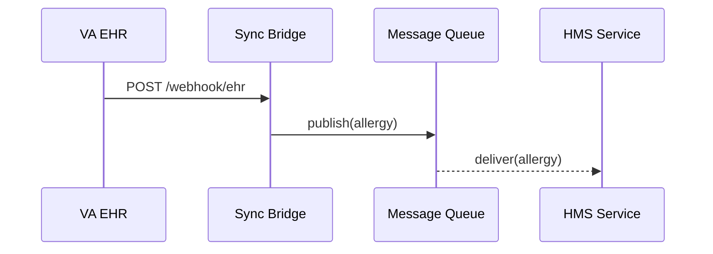

# Chapter 11: External System Sync
[← Back to Chapter 10: AI Governance Layer (Transparency, Ethics, Safety, Privacy)](10_ai_governance_layer__transparency__ethics__safety__privacy__.md)

---

## 1. Why Do We Need a “Data Bridge”?

Imagine **Camila**, a nurse at the Department of Veterans Affairs (VA).  
She updates a veteran’s allergy record inside the hospital EHR.  
Minutes later the same veteran requests a **disability-benefit increase** through HMS.  
If HMS still thinks the veteran can take penicillin, a bad decision (and a worse medical prescription) could follow.

Problem:  
• The EHR lives **outside** HMS in a locked-down hospital network.  
• Manual nightly CSV exports are too slow.  
• VA policy says no direct DB access allowed.

**External System Sync** solves this by acting as the *real-time bridge* between HMS and any outside system—whether it speaks webhooks, SFTP, or cold-war-era message queues.

---

## 2. Key Concepts in Plain English

| Concept | Everyday Analogy | Why It Matters |
|---------|------------------|----------------|
| **Webhook** | Post Office “Change of Address” card—system mails you the update | Instant push; no polling |
| **Message Queue** | Airport baggage carousel | Handles bursts without dropping bags |
| **Secure File Drop** | Locked drop-box outside a courthouse | Works even for legacy mainframes |
| **Adapter** | Plug converter for U.S. ↔ EU outlets | Translates data formats (XML ⇄ JSON) |
| **Health Ping** | Daily “I’m OK” text from a hiking friend | Detects silent link failures |

Keep these five in mind; we’ll use them in the example.

---

## 3. Use Case Walk-Through  
**Goal:** When the VA EHR updates an allergy, HMS receives the change within seconds.

### 3.1 20-Second “Hello, World” (Node, 18 lines)

```js
// file: ehr_webhook.js
import express from 'express';
import { sendToQueue } from '@hms/ext-sync';

const app = express().use(express.json());

// 1️⃣ VA EHR calls this URL on every update
app.post('/webhook/ehr', async (req, res) => {
  const payload = req.body;                 // { vetId, allergy, ts }
  await sendToQueue('va.ehr.allergies', payload);  // fan-out inside HMS
  res.sendStatus(202);
});

app.listen(8080, () => console.log('🌉  Bridge listening'));
```

Explanation  
1. VA’s EHR is configured to POST to `/webhook/ehr`.  
2. `sendToQueue()` hands the message to HMS’s internal **RabbitMQ** topic `va.ehr.allergies`.  
3. Any HMS micro-service (e.g., Benefits Calculator) can subscribe with zero extra code.

---

## 4. Zooming Out: What Really Happens?



Four actors—simple enough for day-one engineers.

---

## 5. Under the Hood (Tiny But Tasty Code)

### 5.1 Queue Helper (TypeScript, 15 lines)

```ts
// file: lib/queue.ts
import amqp from 'amqplib';

let chan: amqp.Channel;

export async function init(url = process.env.AMQP_URL) {
  const conn = await amqp.connect(url);
  chan = await conn.createChannel();
}

export async function publish(topic: string, msg: object) {
  if (!chan) await init();
  chan.assertExchange('hms', 'topic', { durable: true });
  chan.publish('hms', topic, Buffer.from(JSON.stringify(msg)), {
    persistent: true
  });
}
```

Used by the bridge’s `sendToQueue()` wrapper—nothing for integrators to tweak.

### 5.2 Legacy Fallback: Secure File Drop (Bash, 10 lines)

```bash
# file: nightly_pull.sh
sftp va_mainframe:/outgoing/claims_$(date +%F).csv \
     ./drops/claims.csv

hms-cli file-sync \
  --src ./drops/claims.csv \
  --adapter csv2json \
  --queue va.claims.nightly
```

When a system can’t push webhooks, HMS **pulls** a file and re-queues it.

---

## 6. Health & Alerting

1. Every adapter sends an hourly **Health Ping** to the HMS monitoring topic `ext.health`.  
2. AI Representative Agent ([Chapter 3](03_ai_representative_agent__hms_a2a__.md)) watches these pings; missing two in a row triggers a proposal:  
   “Switch VA allergy sync to *fail-open* fallback (read-only).”

---

## 7. First-Time Integration Checklist

| Step | Action | Time |
|------|--------|------|
| 1 | Choose mode: Webhook, Queue, or File Drop | 1 min |
| 2 | Install SDK: `npm i @hms/ext-sync` | 30 s |
| 3 | Register external system in HMS-GOV UI → *Connections* | 1 min |
| 4 | Configure secrets (`AMQP_URL`, SFTP creds) in K8s | 2 min |
| 5 | Ship a test message & watch in “Live Stream” dashboard | 30 s |

Total ≈ **5 minutes**.

---

## 8. Common Pitfalls & Tips

1. **Clock Skew**  
   • EHR timestamps in UTC-5, HMS in UTC—always convert to ISO-8601.  
2. **Message Storms**  
   • Set queue TTL; old allergy changes expire after 24 h.  
3. **Silent Failures**  
   • Rely on Health Pings, not human memory.  
4. **Giant CSVs**  
   • Split into 10 MB chunks; stream each into the queue.

---

## 9. Where This Fits in the HMS Puzzle

* Data enters through **External System Sync**, **then** gets governed by the privacy controls from [Chapter 9](09_data_privacy___compliance_framework_.md).  
* AI Agents use the fresh data to draft policy tweaks and pass them through [HITL Oversight](04_human_in_the_loop__hitl__oversight_.md).  
* Every sync message carries a Provenance Stamp consumed by the [AI Governance Layer](10_ai_governance_layer__transparency__ethics__safety__privacy__.md).

---

## 10. Recap & What’s Next

You now know how to:

* Bridge **any** outside system—modern or mainframe—to HMS.  
* Pick the right sync mode (Webhook, Queue, File Drop).  
* Wire a 18-line Node script that publishes real-time updates.  
* Monitor health and let AI act on outages.

In the next chapter we’ll learn how HMS decides **when to retire or auto-scale** parts of the system based on live performance:  
[Chapter 12: Autonomous Performance & Replacement Logic](12_autonomous_performance___replacement_logic_.md)

*Real-time data in, smarter government out—one bridge at a time.*

---

Generated by [HardisonCo [NARA-DOC]](https://github.com/The-Pocket/Tutorial-Codebase-Knowledge)