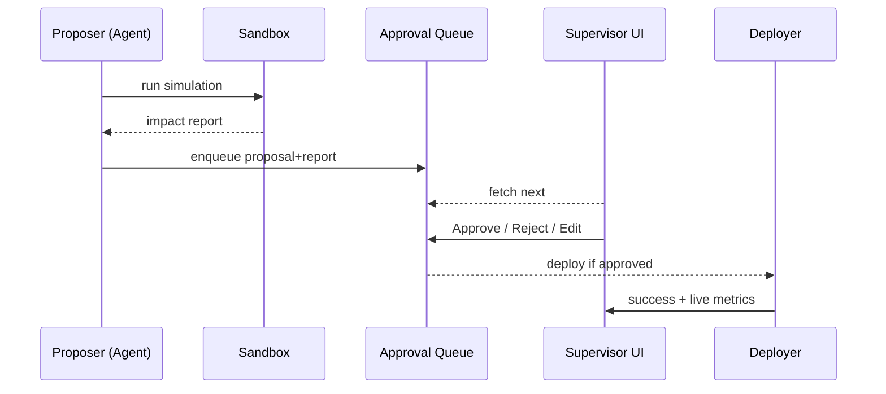

# Chapter 12: Human-in-the-Loop Control Loop  
*(A sequel to [Marketplace of Capabilities (HMS-MKT)](11_marketplace_of_capabilities__hms_mkt__.md))*  

> “Even the smartest autopilot won’t land the plane without the captain’s nod.”  
> – a GSA programme manager  

---

## 1  Why Do We Need a Human-in-the-Loop (HITL) Loop?

### Real-World Story – “$10 Million Typo Prevention”

1. The **Treasury-Budget-AI** capability (installed in Chapter 11) proposes to bump every *administrative* budget line by 0.5 %.  
2. If deployed instantly, **1 600 federal grants** would overshoot their caps—an IG nightmare.  
3. With **HITL** turned on:  
   * AI → *proposes* the 0.5 % tweak.  
   * System → *simulates* impact in a sandbox.  
   * Result → *queued* for a budget officer.  
   * Officer → clicks **Reject**.  
   * Decision + reason → *logged* for auditors.  
4. Taxpayers save $10 million, nobody ends up in front of Congress.

HITL is the safety net between *“look what I can do”* and *“yes, please do it.”*

---

## 2  Key Concepts (Crash-Course Glossary)

| Airline Analogy | HITL Term | 1-Line Beginner Definition |
|-----------------|-----------|----------------------------|
| Autopilot       | **Proposer** | Agent or AI service suggesting a change. |
| Flight Simulator| **Sandbox** | Runs “what if?” without touching prod. |
| Cockpit Alert   | **Queue** | List of pending proposals waiting for humans. |
| Captain’s Y/N   | **Sign-off** | Human click: *Approve*, *Tweak*, or *Reject*. |
| Flight Recorder | **Audit Log** | Immutable record of every click & outcome. |
| Co-pilot hand-over | **Rollback Lever** | Instant undo if prod misbehaves. |

Stick these six words on a sticky-note—90 % of HITL is just them.

---

## 3  End-to-End Flow in One Picture



Five actors, no mystery lines.

---

## 4  Spin Up a HITL Loop in 18 Lines

> Prerequisites  
> `pip install hms-hitl`

```python
# file: budget_guard.py  (≤18 lines)
from hms_hitl import HitlLoop, propose

loop = HitlLoop(
    sandbox="hms-esr://budget-sim",      # uses Chapter 14 sandbox
    queue  ="hitl://TREASURY.BUDGET",
    approver_role="BUDGET_OFFICER"       # RBAC tag
)

def suggest(change):
    report = loop.simulate(change)       # ①
    if report["risk"] < 0.05:
        loop.auto_approve(report)        # tiny tweaks auto-pass
    else:
        propose(loop.queue, report)      # ② human decides

# Called by the AI capability:
suggest({"line":"AdminOps", "delta_pct":0.5})
```

**What happens?**  
1. `simulate()` runs the change in the **Sandbox** and returns risk metrics.  
2. Risk ≥ 5 % → proposal lands in the **Queue**.  
3. Officers see it in their dashboard; one click decides the fate.

---

### Officer’s View (auto-generated)

| Proposal | Impact | Decision Buttons |
|----------|--------|------------------|
| Increase *AdminOps* by **0.5 %** | +$12.3 M, 7 budgets exceed cap | ✅ Approve & Deploy | ✏️ Edit to 0.1 % | ❌ Reject |

No extra UI code—`hms-hitl` renders a default React page.

---

## 5  Under the Hood – 4 Steps, Zero Magic

1. **Simulation** – `hms-esr` container spins up throw-away DBs, runs rule engine.  
2. **Queueing** – Proposal saved in a Postgres table + WebSocket event to UI.  
3. **Sign-off** – Officer’s click hits `/decision` API (`approve`, `edit`, `reject`).  
4. **Deployment** – Approved JSON piped to [Policy Lifecycle Engine](02_policy_lifecycle_engine__hms_cdf__.md) which versions & publishes.

Each step writes a row in the **Audit Log**:

```
2024-05-04T13:02Z  PROPOSE  id=42   by=treasury-budget-ai
2024-05-04T13:05Z  REJECT   id=42   by=j.doe   reason="exceeds caps"
```

---

## 6  Internal Code Peek – Queue Worker (≤14 Lines)

```python
# hms_hitl/worker.py (simplified)
def watch_queue():
    while True:
        row = db.fetch_one("SELECT * FROM queue WHERE status='PENDING' LIMIT 1")
        if not row: time.sleep(2); continue
        decision = wait_click(row.id)         # WebSocket blocking call
        if decision == "APPROVE":
            deploy(row.payload)
        elif decision == "EDIT":
            new = sandbox_replay(row)         # produce new report
            db.update(row.id, new)
        else:
            archive(row.id, "REJECTED")
```

Take-away: HITL is just **DB rows + WebSockets + a deploy call**—no black magic.

---

## 7  Common Recipes (≤60 s Each)

### 7.1 Auto-approve Routine Optimisations

```python
loop.auto_policy(
    if_risk_below=0.02,        # ≤2 % variance
    if_same_change_seen=3      # already approved 3× this month
)
```

### 7.2 Escalate After N Hours

```python
loop.escalate_after(hours=24, to="TREASURY.CHIEF")
```

### 7.3 Instant Rollback

```bash
hms-hitl rollback --id 42    # reverts the last deployed change
```

---

## 8  Best Practices (Sticky-Note Edition)

1. **Keep simulations cheap** – fast risk score beats fancy model nobody waits for.  
2. **Define clear auto-approve rules** – save humans for real judgement.  
3. **Capture a reason on every click** – auditors care more about *why* than *who*.  
4. **Version everything** – proposals, simulations, approvals. Rollback is then easy.  
5. **Alert on queue backlogs** – long queues mean your AI is too chatty or rules too strict.

---

## 9  Where HITL Sits in the HMS Universe

```mermaid
graph LR
AGT[Agents (HMS-AGT)] --> HITL[Human-in-the-Loop]
HITL --> CDF[Policy Lifecycle (HMS-CDF)]
HITL --> OPS[Metrics & OPS (Ch 13)]
HITL --> ESQ[Compliance & Legal (Ch 15)]
```

HITL is the **checkpoint** between automated insight and real-world impact.

---

## 10  Summary & Next Steps

You built a safety net that:

1. Simulates every AI proposal.  
2. Queues risky ones for humans.  
3. Records every click for auditors.  
4. Provides one-command rollback.

Next we’ll watch those approvals in real time and turn clicks into dashboards:  
[Monitoring, Metrics & OPS](13_monitoring__metrics___ops_.md)

---

---

Generated by [HardisonCo [NARA-DOC]](https://github.com/The-Pocket/Tutorial-Codebase-Knowledge)