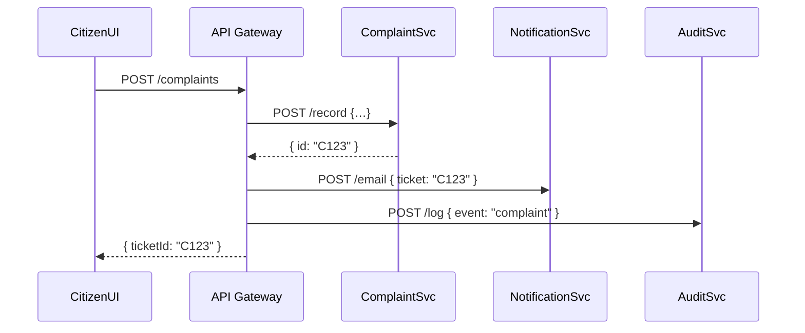

# Chapter 13: Microservices Architecture

In the last chapter we saw how HMS-SYS provides identity, logging, and service discovery in [Chapter 12: Core Infrastructure (HMS-SYS)](12_core_infrastructure__hms_sys__.md). Now we’ll zoom in on how we break our monolithic backend into *many* small, independent services—just like separate city departments handling water, electricity, and records.

---

## Motivation & Central Use Case

Problem: When everything lives in one big application, a simple change (say, updating the noise-complaint logic) requires redeploying the whole system. It’s like closing City Hall every time you tweak one office.  

Solution: **Microservices Architecture** splits the system into small, focused services—each with its own database, codebase, and deployment. Teams can update, scale, and maintain them independently.

**Use Case:**  
Alice files a noise complaint via the citizen portal. Internally, this touches three microservices:

1. **Complaint Service** records the report  
2. **Notification Service** emails the local inspector  
3. **Audit Service** logs the event for transparency  

Each service runs on its own. If we scale up inspections, we only scale the Notification Service—no need to touch Complaint or Audit.

---

## Key Concepts

1. **Service Boundary**  
   Each microservice owns a single function (e.g., complaints, notifications, audit).  
2. **Independent Deployment**  
   Teams deploy and upgrade services on their own schedules without impacting others.  
3. **Communication**  
   Services talk over APIs (HTTP or messaging) with clear contracts—like memos between departments.  
4. **Data Ownership**  
   Each service has its own database/schema. No two services share the same tables.

---

## Using Microservices

Here’s a simple example showing how the API Gateway routes a citizen complaint to multiple services:

```javascript
// In API Gateway
app.post('/complaints', async (req, res) => {
  const complaint = await fetch('http://ComplaintService/record', {
    method: 'POST', body: JSON.stringify(req.body)
  }).then(r => r.json())

  // notify the inspector
  await fetch('http://NotificationService/email', {
    method: 'POST',
    body: JSON.stringify({ to: 'inspector@city.gov', ticket: complaint.id })
  })

  // log for audit
  await fetch('http://AuditService/log', {
    method: 'POST', body: JSON.stringify({ event: 'complaint', id: complaint.id })
  })

  res.json({ ticketId: complaint.id })
})
```

Explanation:  
1. We call the **Complaint Service** to save the complaint.  
2. We call the **Notification Service** to send an email.  
3. We call the **Audit Service** to record the event.

---

## Request Flow: Step-by-Step



1. **API Gateway** receives the complaint.  
2. For each department (service), it sends a separate request.  
3. Finally, it replies to the citizen with the new ticket ID.

---

## Inside Each Microservice

### 1. Complaint Service Entry (`complaint-service/src/index.js`)

```javascript
const express = require('express')
const app = express()
app.use(express.json())

app.post('/record', (req, res) => {
  // pretend: save to its own DB
  const newId = 'C' + Date.now()
  res.json({ id: newId })
})

app.listen(3001)
```

Explanation:  
- Listens on port 3001.  
- Receives `/record` calls, assigns an ID, and returns it.

### 2. Notification Service (`notification-service/src/index.js`)

```javascript
const express = require('express')
const app = express()
app.use(express.json())

app.post('/email', (req, res) => {
  // pretend: send email to inspector
  console.log('Email sent to', req.body.to)
  res.sendStatus(200)
})

app.listen(3002)
```

Explanation:  
- Runs on port 3002.  
- Logs an “email sent” message for simplicity.

### 3. Audit Service (`audit-service/src/index.js`)

```javascript
const express = require('express')
const app = express()
app.use(express.json())

app.post('/log', (req, res) => {
  // pretend: write audit record
  console.log('Audit log:', req.body)
  res.sendStatus(200)
})

app.listen(3003)
```

Explanation:  
- On port 3003.  
- Prints audit events to the console (in real life it’d write to a store).

---

## How Services Discover Each Other

We rely on the **Service Registry** from [Chapter 12: Core Infrastructure (HMS-SYS)](12_core_infrastructure__hms_sys__.md):

```javascript
// registryService.js in HMS-SYS
class RegistryService {
  constructor() { this.map = {} }
  register(name, url) { this.map[name] = url }
  lookup(name) { return this.map[name] }
}
```

Each service calls `register('ComplaintService', 'http://localhost:3001')` at startup. The gateway uses `lookup('ComplaintService')` to find where to send requests.

---

## Conclusion

You’ve learned how **Microservices Architecture** splits a system into small, independent “city departments,” each with its own code and database. We saw:

- Why microservices make scaling and maintenance easier  
- Key concepts like service boundaries and communication patterns  
- A minimal example with Complaint, Notification, and Audit services  
- How service discovery from [HMS-SYS](12_core_infrastructure__hms_sys__.md) glues everything together  

Next up, we’ll zoom into the classic layered approach with [Chapter 14: Three-Layer Architecture](14_three_layer_architecture_.md).

---

Generated by [HardisonCo [NARA-DOC]](https://github.com/The-Pocket/Tutorial-Codebase-Knowledge)