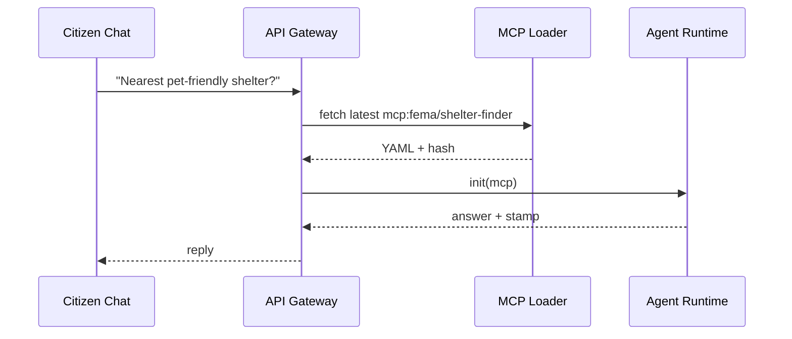

# Chapter 13: Model Context Protocol (HMS-MCP)

*(From [Human-in-the-Loop (HITL) Oversight](12_human_in_the_loop__hitl__oversight_.md) you saw how a **human** can override an AI decision.  
But how does the AI even know **which toolbox** it may use, **which memory** it may read, and **which rules** it must obey in that moment?  
That knowledge comes from one tiny but powerful file: the **Model Context Protocol (MCP)**.)*

---

## 1. Why Do We Need MCP? ✈️

### Central Use-Case  
The **Federal Emergency Management Agency (FEMA)** deploys an AI **“Shelter-Finder”** bot to help citizens during hurricanes.

1. A citizen types: “Where is the nearest open shelter that accepts pets?”  
2. The bot must:
   * Search a geospatial shelter database.  
   * Hide any shelters reserved for first responders.  
   * Follow HITL escalation rules if no shelter is found.  

If we hard-code these rules inside the model prompt, tomorrow’s developers will **forget to update** them when policies change—leading to chaos or legal breaches.

**MCP** solves this by acting like a **flight plan** filed before take-off.  
One small JSON (or YAML) file tells *any* model:

```
• which TOOLS it can use  (databases, APIs)
• which MEMORY scopes     (today only, last week, all history)
• which CONVERSATION RULES (privacy, tone, escalation)
```

Change the file → every agent instantly follows the new plan.

---

## 2. Key Concepts (Plain English)

| MCP Field | Beginner Analogy | Why It Matters |
|-----------|------------------|----------------|
| `tools`   | List of gadgets in your carry-on | Prevents a model from “packing” forbidden APIs |
| `memory`  | Pages the pilot may read | Controls data retention & privacy scope |
| `rules`   | Air-traffic instructions | Tone, language, escalation, value guard flags |
| `stamp`   | Flight plan number + signature | Auditable proof the plan was approved |
| `expires` | Departure window | Forces model to fetch a fresh plan tomorrow |

---

## 3. MCP by Example (≤18 Lines)

Below is a **complete** MCP document for the Shelter-Finder bot.

```yaml
# shelter_finder.mcp.yaml
id: mcp:fema/shelter-finder/v2
expires: 2024-10-01T00:00:00Z
tools:
  - name: geo_shelter_api     # read-only
  - name: sms_notify          # send SMS
memory:
  scope: "last_48_hours"      # discard older chats
rules:
  - "Never reveal shelter IDs flagged private"
  - "Escalate to HUMAN if no open shelter within 50 mi"
stamp:
  signed_by: "FEMA-Chief-AI-Officer"
  hash: "e3ab7c..."           # SHA-256 of entire file
```

**What this does**  
1. Limits the model to **two tools**.  
2. Cuts off memory older than 48 hours.  
3. Bakes in two conversation guard-rails.  
4. Gives auditors a **hash** to verify immutability.

---

## 4. Loading MCP Inside an Agent (≤17 Lines)

```python
# load_mcp.py
import yaml, agt

def load_agent(mcp_path):
    mcp = yaml.safe_load(open(mcp_path))
    bot = agt.Agent(name="ShelterFinder")
    bot.allow_tools(mcp["tools"])
    bot.set_memory_scope(mcp["memory"]["scope"])
    bot.set_rules(mcp["rules"])
    bot.attach_stamp(mcp["stamp"])
    return bot

agent = load_agent("shelter_finder.mcp.yaml")
print(agent.reply("Need a pet-friendly shelter near 29401"))
```

Explanation  
1. Reads the YAML.  
2. Configures tools, memory, and rules **before** the first prompt.  
3. Attaches the `stamp` so future logs show which plan was used.

---

## 5. Step-By-Step Under the Hood



Only **one extra lookup** (MCP Loader) is needed during initialization.

---

## 6. Internal Implementation Peeks

### 6.1 Tiny MCP Registry (Go ≤18 Lines)

```go
// registry/handler.go
var store = map[string][]byte{}          // id -> yaml bytes

func GetMCP(id string) []byte { return store[id] }

func PutMCP(id string, y []byte) {
    h := sha256.Sum256(y)
    store[id] = y                       // naïve in-memory
    log.Printf("MCP %s saved hash=%x", id, h)
}
```

Beginner takeaway: an MCP registry is just a **key-value map** plus a hash log.

### 6.2 Minimal Validator (Python ≤16 Lines)

```python
# mcp_validator.py
import jsonschema, yaml

SCHEMA = {
  "type":"object",
  "required":["tools","memory","rules","stamp","expires"]
}

def validate(path):
    doc = yaml.safe_load(open(path))
    jsonschema.validate(doc, SCHEMA)
    print("✔ MCP is valid!")

validate("shelter_finder.mcp.yaml")
```

No model starts unless its MCP passes this linter—protecting against typos.

### 6.3 Runtime Guard (Python ≤14 Lines)

```python
# guard.py
def enforce(agent, mcp):
    for tool in agent.requested_tools:
        if tool["name"] not in [t["name"] for t in mcp["tools"]]:
            raise ValueError("Tool not in MCP!")
    # same idea for memory scope & rules
```

Called automatically before each tool invocation.

---

## 7. How MCP Integrates with Other HMS Layers

| HMS Layer | Interaction |
|-----------|-------------|
| [AI Agent Framework](10_ai_agent_framework__hms_agt___hms_agx__.md) | Reads MCP at start-up to configure tools & memory |
| [AI Governance Values Layer](11_ai_governance_values_layer_.md) | Adds rule IDs like `no_pii` directly inside `rules` |
| [HITL Oversight](12_human_in_the_loop__hitl__oversight_.md) | Queue shows which `mcp:id` produced each AI suggestion |
| [Backend API Gateway](06_backend_api_gateway_.md) | Caches & serves MCP files at `/mcp/*` |
| [Simulation & Testing Environment](15_simulation___testing_environment__hms_esr__.md) | Uses MCP to spin up agents in sandboxed tests |

---

## 8. Common Pitfalls & Quick Fixes

| Problem | Quick Fix |
|---------|-----------|
| “Tool not allowed” errors | Add the tool name to `tools:` list or remove unauthorized call |
| Memory leaks beyond scope | Ensure `memory.scope` is enforced by calling `agent.prune()` hourly |
| Old MCP still in cache | Call `PUT /mcp/refresh?id=...` on the Gateway to bust cache |

---

## 9. Hands-On Exercise (10 min)

1. `git clone https://github.com/hms-samples/mcp-demo && cd mcp-demo`  
2. `python mcp_validator.py` – confirm sample YAML passes.  
3. `python chat.py` – chat with the Shelter-Finder bot.  
4. Edit `expires` to **yesterday**, rerun → loader rejects with “MCP expired.”  
5. Add a fake tool `root_db_access` and observe the guard error.

---

## 10. Recap & What’s Next

You learned that **Model Context Protocol** is the tiny “flight plan” that:

• Lists approved **tools**, **memory scope**, and **conversation rules**.  
• Carries a signed **stamp** for easy auditing.  
• Lets developers change agent behavior **without touching code**.  

In the next chapter we will see how the platform keeps MCP-powered agents perfectly in sync with **live data coming from external systems**:  
[Real-Time External System Sync](14_real_time_external_system_sync_.md) ⏱️

---

Generated by [HardisonCo [NARA-DOC]](https://github.com/The-Pocket/Tutorial-Codebase-Knowledge)