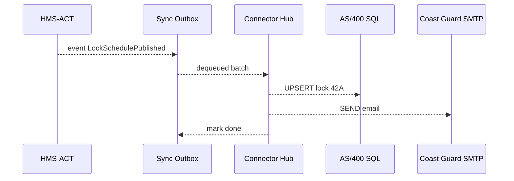

# Chapter 14: Real-Time External System Sync

*(From [Model Context Protocol (HMS-MCP)](13_model_context_protocol__hms_mcp__.md) you learned how a single YAML “flight plan” keeps every AI agent in line.  
Now let’s make sure **the rest of the world** stays in line, too!)*  

---

## 1. Why Do We Need Instant Sync? ⏱️

### Central Use-Case  

Tonight at **11 p.m.** the **St. Lawrence Seaway** approves a last-minute lock schedule in HMS.  
Within **15 seconds** four outside systems must know:

| Legacy System | Why it cares | Old manual process |
|---------------|-------------|--------------------|
| IBM AS/400 lock scheduler | Opens physical gates | Operator re-types schedule at 6 a.m. |
| Coast Guard email list | Plans patrols | Bulk email at noon |
| Shipper ERP (EDI) | Sends tug boats | CSV import nightly |
| Public Google Calendar | Informs citizens | Staff exports ICS weekly |

Delays create** stranded ships, security gaps, and angry citizens**.  
**Real-Time External System Sync** is the universal **power adaptor** that converts HMS events into each legacy system’s dialect—*in seconds, not days*.

---

## 2. Key Concepts (Plain English)

| Term            | Beginner Analogy                           | What It Does |
|-----------------|--------------------------------------------|--------------|
| Connector       | Power plug adaptor                         | Talks one legacy protocol (SQL, SFTP, EDI, etc.) |
| Mapping         | Phrase book                                | Turns HMS JSON fields into legacy column names |
| Outbox Queue    | Shopping cart at checkout                  | Buffers events so nothing is lost on failure |
| Delivery Mode   | “At least once” vs “Exactly once” sticker  | Controls duplicate tolerance |
| Replay Window   | DVR rewind                                 | Re-send last *N* minutes if a connector was down |

---

## 3. Quick-Start: Sync a Lock Schedule to Two Systems

### 3.1  Describe the Sync Job (≤ 18 lines)

```yaml
# sync_jobs/lock_schedule.yml
event: LockSchedulePublished      # HMS event to watch
connectors:
  - id: as400_sql
    type: mssql
    conn: "mssql://USER:PW@as400.gov/locks"
    mapping:
      lock_id:  "{{data.lockId}}"
      open_at:  "{{data.start}}"
      close_at: "{{data.end}}"
    mode: upsert
  - id: coast_guard_email
    type: smtp
    to: "ops@uscg.mil"
    subject: "New Lock Schedule {{data.lockId}}"
    template: "lock_email.html"   # handlebars file
```

A human readable YAML: **zero** code required.

### 3.2  Run the Sync Hub (1 command)

```bash
hms-sync start
```

Console:

```
✔  Loaded 1 job (lock_schedule)
✔  Listening for event LockSchedulePublished …
```

### 3.3  Emit a Test Event (≤ 12 lines)

```python
# emit_test.py
import requests, datetime, json
event = {
  "name": "LockSchedulePublished",
  "data": {
    "lockId": "42A",
    "start": "2024-06-15T23:00Z",
    "end":   "2024-06-16T01:00Z"
  }
}
requests.post("http://localhost:8100/act/events", json=event)  # ACT API
```

Sync Hub log:

```
→ as400_sql … OK (row upserted)
→ coast_guard_email … OK (sent, id: <20240615…>)
```

That’s it—two legacy systems updated in under **20 lines** of YAML + **12 lines** of test code.

---

## 4. What Happens Under the Hood?



* Only **one** new service (Connector Hub) sits between HMS and the outside world.  
* If C1 or C2 is down, OBOX retries until success (Replay Window).

---

## 5. Under-the-Hood Code Peeks

### 5.1  Outbox Table (PostgreSQL ≤ 8 lines)

```sql
CREATE TABLE outbox(
  id         UUID PRIMARY KEY,
  event_name TEXT,
  payload    JSONB,
  delivered  BOOLEAN DEFAULT FALSE,
  ts         TIMESTAMPTZ DEFAULT now()
);
```

Every HMS event gets a row; safe even if the hub crashes.

---

### 5.2  Minimal Connector Skeleton (Python ≤ 18 lines)

```python
# connectors/mssql.py
import pyodbc, jinja2

def send(event, cfg):
    sql = """
    MERGE locks AS t
    USING (SELECT ? AS lock_id, ? AS open_at, ? AS close_at) AS s
      ON t.lock_id = s.lock_id
    WHEN MATCHED THEN UPDATE SET open_at=s.open_at, close_at=s.close_at
    WHEN NOT MATCHED THEN INSERT VALUES (s.lock_id, s.open_at, s.close_at);
    """
    with pyodbc.connect(cfg["conn"]) as db:
        db.execute(sql,
           cfg["mapping"]["lock_id"](event),
           cfg["mapping"]["open_at"](event),
           cfg["mapping"]["close_at"](event))
```

Notes for beginners  
1. Connector functions take **event JSON** + **connector config**.  
2. Jinja2 templates (auto-generated by the hub) render mappings.

---

### 5.3  Retry Loop (Go ≤ 16 lines)

```go
// hub/retry.go
func worker() {
  for e := range fetchUndelivered() {
     ok := deliver(e)               // picks connector by type
     if ok { markDone(e.ID) }
     else  { time.Sleep(10 * time.Second) } // simple back-off
  }
}
```

Keeps trying until each `delivered` flag is **true**.

---

## 6. How It Talks to Other HMS Layers

| Layer | Role |
|-------|------|
| [Event & Workflow Orchestration](08_event___workflow_orchestration__hms_act___hms_oms__.md) | Emits the original events. |
| [Micro-Services Backbone](05_micro_services_backbone__hms_sys___hms_svc__.md) | Registers **Connector Hub** as `sync-hub` service. |
| [Backend API Gateway](06_backend_api_gateway_.md) | Exposes `/sync/*` metrics; applies auth. |
| [Central Data Lake & Registry](09_central_data_lake___registry__hms_dta__.md) | Receives delivery logs for analytics. |
| [Simulation & Testing Environment](15_simulation___testing_environment__hms_esr__.md) | Mocks external systems for safe dry-runs. |

---

## 7. Common Pitfalls & Quick Fixes

| Symptom | Likely Cause | Fast Fix |
|---------|--------------|----------|
| Duplicate rows in AS/400 | Mode missing `upsert` | Add `mode: upsert` in connector config |
| Emails not sent | SMTP port blocked | Whitelist Hub IP or switch to SES connector |
| Outbox growing huge | Failed connector silently looping | Check hub logs & set `max_retries` in YAML |

---

## 8. Hands-On Exercise (10 min)

1. `git clone https://github.com/hms-samples/sync-demo && cd sync-demo`  
2. `docker-compose up` – launches Outbox DB + Hub + fake SMTP + fake MSSQL.  
3. `python emit_test.py` (from above).  
4. Open `http://localhost:9090/metrics` – see `sync_success_total` = 2.  
5. Stop `fake-smtp`, emit again, watch Hub retry & Outbox grow.  
6. Restart `fake-smtp`, confirm retries flush and `sync_success_total` increments.

---

## 9. Recap & What’s Next

You now know how **Real-Time External System Sync**:

• Listens to HMS events via an **Outbox**.  
• Uses pluggable **Connectors** + **Mappings** to speak any legacy dialect.  
• Guarantees delivery with simple, durable retries.  
• Keeps audits, metrics, and even replays—so **nobody** is left behind when policies change at 11 p.m.

In the final chapter we’ll see how to test these connectors against virtual AS/400s, fake email servers, and stress storms without touching production:  
[Simulation & Testing Environment (HMS-ESR)](15_simulation___testing_environment__hms_esr__.md)

---

---

Generated by [HardisonCo [NARA-DOC]](https://github.com/The-Pocket/Tutorial-Codebase-Knowledge)