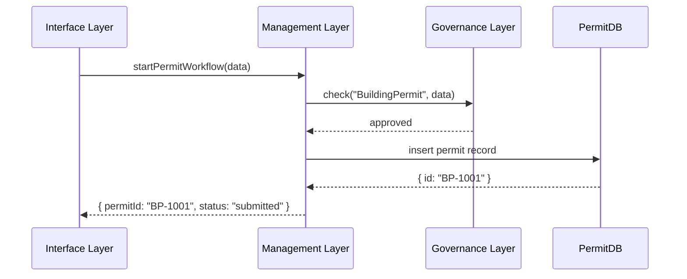

# Chapter 14: Three-Layer Architecture

In [Chapter 13: Microservices Architecture](13_microservices_architecture_.md), we learned how splitting into small services helps us scale and deploy independently. Now we’ll see how to organize those services into three clear layers—**Governance**, **Management**, and **Interface**—so policies stay clear, operations stay efficient, and user interactions stay smooth.

## Why Three Layers?

Imagine your city wants to issue **building permits** online. You need to:

- Keep the rules (zoning laws, fee schedules) under tight control.  
- Run the permit workflow (check documents, send notifications, log events) reliably.  
- Offer a friendly web portal where citizens apply and track their permit.

Without clear separation, policy changes get tangled in code, background jobs mix with UI code, and it’s hard to see who’s responsible for what. The Three-Layer Architecture solves this by:

- Governance Layer: City Council setting and enforcing rules.  
- Management Layer: City Departments running inspections and notifications.  
- Interface Layer: Public Service Centers talking directly to citizens.

## Key Concepts

1. **Governance Layer**  
   - Holds policies, regulations, ethics and compliance rules.  
   - Approves or rejects high-level actions (e.g., “Is Mary allowed to build here?”).

2. **Management Layer**  
   - Houses business logic and orchestrates microservices (e.g., permit checks, notifications).  
   - Executes workflows under rules from Governance.

3. **Interface Layer**  
   - Exposes portals and APIs for citizens and admins (e.g., HMS-MFE, HMS-GOV).  
   - Validates input, shows status, and routes requests to Management.

## Using the Three Layers

Let’s walk through a citizen applying for a building permit.

1. **Interface Layer** receives the form.  
2. It calls **Management Layer** to start the permit workflow.  
3. Management asks **Governance Layer** “Is this allowed?”  
4. Governance checks zoning rules and returns approval.  
5. Management saves the permit, triggers notifications, and returns a permit ID.  
6. Interface shows the ID and status to the citizen.

Here’s a minimal code sketch of how these calls link up:

```javascript
// in interfaceLayer.js
import { Management } from 'hms-svc'
const mgmt = new Management()

async function handleApplyPermit(req) {
  const result = await mgmt.startPermitWorkflow(req.body)
  return { permitId: result.id, status: result.status }
}
// Explanation: The interface layer just forwards validated input to Management
```

```javascript
// in managementLayer.js
import { Governance } from 'hms-sys'
const gov = new Governance()

export class Management {
  async startPermitWorkflow(data) {
    if (!await gov.check('BuildingPermit', data)) {
      throw new Error('Policy violation')
    }
    // call microservices, e.g. save to DB, send email...
    return { id: 'BP-1001', status: 'submitted' }
  }
}
// Explanation: The management layer enforces policy then runs business logic
```

```javascript
// in governanceLayer.js
export class Governance {
  async check(moduleName, data) {
    // pretend: look up rules, e.g., zoning map, fee table
    return data.location.zone === 'residential' && data.feesPaid
  }
}
// Explanation: The governance layer is our rule engine and policy store
```

## Step-by-Step Flow



1. **Interface** forwards user data to **Management**.  
2. **Management** consults **Governance** for policy checks.  
3. On approval, **Management** persists the permit in **PermitDB**.  
4. The permit ID and status go back to the **Interface** to show the citizen.

## Internal Implementation

### `hms-sys/src/layers/governanceLayer.js`

```javascript
export class Governance {
  constructor(rulesRepo) { this.rules = rulesRepo }
  async check(module, data) {
    const rules = await this.rules.load(module)
    // very simple example: location and fee check
    return data.zone === rules.allowedZone && data.fee >= rules.minFee
  }
}
```
*Explanation:* Loads policy definitions (e.g., allowed zones, fees) and returns true/false.

### `hms-svc/src/layers/managementLayer.js`

```javascript
import { Governance } from 'hms-sys/src/layers/governanceLayer'
export class Management {
  constructor(db, notifier) {
    this.gov = new Governance(/* repo */)
    this.db  = db
    this.notify = notifier
  }
  async startPermitWorkflow(data) {
    if (!await this.gov.check('BuildingPermit', data)) {
      throw new Error('Policy violation')
    }
    const record = await this.db.insert('permits', data)
    await this.notify.send('PermitSubmitted', record)
    return { id: record.id, status: record.status }
  }
}
```
*Explanation:* After policy checks, it saves the record and sends a notification event.

### `hms-mfe/src/layers/interfaceLayer.js`

```javascript
import { Management } from 'hms-svc/src/layers/managementLayer'
const mgr = new Management(dbClient, notifierClient)

app.post('/apply', async (req, res) => {
  try {
    const result = await mgr.startPermitWorkflow(req.body)
    res.status(201).json(result)
  } catch (e) {
    res.status(400).json({ error: e.message })
  }
})
```
*Explanation:* The Interface Layer handles HTTP, catches errors, and formats the response.

## Conclusion

You’ve seen how the **Three-Layer Architecture** cleanly divides your system into:

- A **Governance Layer** that holds and enforces policies  
- A **Management Layer** that runs workflows and coordinates services  
- An **Interface Layer** that interacts with users and external clients  

This separation keeps regulations clear, operations reliable, and user experiences smooth. You’re now ready to apply this structure across all government and AI-driven services in HMS.

---

Generated by [HardisonCo [NARA-DOC]](https://github.com/The-Pocket/Tutorial-Codebase-Knowledge)