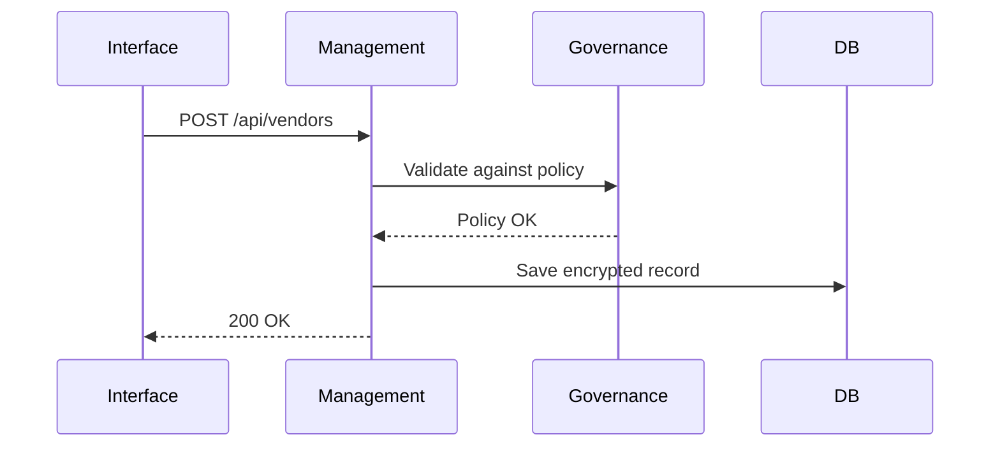

# Chapter 1: Three-Layer Governance Model

> “A good platform feels like city hall on a quiet day—everything works, nobody is lost, and the rules are clear.”

---

## 1. Why do we need a governance model?

Imagine you are a new developer asked to build an online permit application for the **Chief Acquisition Officers Council (CAOC)**.  
Right away you face three recurring questions:

1. What are the legal & privacy rules?  
2. Who runs the daily operations?  
3. How do citizens and agency staff actually use the service?

If every agency solved these questions differently, chaos—and security holes—would follow.  
The **Three-Layer Governance Model** gives every HMS module (from healthcare to shipping) the **same three floors** to work on, just like a standardized government campus.

---

## 2. The Elevator Pitch 🛗

```
┌───────────────────────────────┐
│  Governance Floor  (Level 3)  │  ← writes policies & guard-rails
├───────────────────────────────┤
│  Management Floor (Level 2)   │  ← enforces policies day-to-day
├───────────────────────────────┤
│  Interface Floor  (Level 1)   │  ← portals & APIs for users/agents
└───────────────────────────────┘
```

Every feature you build must clearly answer:

• **Which floor sets the rule?**  
• **Which floor keeps the rule?**  
• **Which floor presents the rule?**

---

## 3. Meet the Three Floors

| Floor | Who lives here? | Plain-English Job |
|-------|----------------|-------------------|
| Governance | Lawyers, ethicists, compliance bots | Write laws, ethics, privacy mandates (e.g., “Encrypt citizen data”) |
| Management | DevOps teams, schedulers, AI watchdogs | Make sure the laws are always followed (e.g., auto-rotate keys) |
| Interface | Web apps, mobile apps, chatbots | Serve citizens & officials; surface only allowed data |

---

## 4. Walking Through a Real Use-Case

Use-Case: **“Submit a Vendor Registration”** for CAOC.

1. **Citizen** opens the Vendor Registration form (Interface Floor).  
2. Form submits data to backend; a **validation service** checks budget codes (Management Floor).  
3. Validation service consults the **Data Privacy Policy** that forbids storing SSNs in plain text (Governance Floor).  
4. If everything looks good, the service encrypts & stores the record; citizen gets a confirmation.

### Tiny Demo Code (Frontend)

```ts
// vendorForm.ts – Interface Floor
async function submitVendor(data) {
  // 1. call the Management Floor API
  const res = await fetch('/api/vendors', {
    method: 'POST',
    headers: {'Content-Type': 'application/json'},
    body: JSON.stringify(data)
  });
  return res.json();
}
```

Explanation:  
The frontend doesn’t worry about encryption or legal wording; it simply calls the Level 2 API.

---

### Tiny Demo Code (Backend Stub)

```python
# vendors.py – Management Floor
def create_vendor(raw):
    assert_policy(raw)    # Governance check
    secure_data = encrypt(raw)   # Encryption enforced
    db.save(secure_data)  # Store safely
    return {"status": "ok"}
```

Explanation:  
`assert_policy` pulls rules from the Governance Floor before data ever touches the database.

---

## 5. What happens under the hood?

Below is an ultra-simple sequence to see the “elevator” in action.



Key Takeaway: Interface never talks to Governance directly; Management is the “middle floor.”

---

## 6. Inside the Codebase

File snippets come from `hms-a2a_main.txt` (placeholder):

```python
# policy_engine.py – Governance Floor
RULES = {"no_plain_ssn": True}

def check(record):
    if RULES["no_plain_ssn"] and "ssn" in record:
        raise ValueError("SSN must be encrypted")
```

```python
# router.py – Management Floor
from policy_engine import check

def post_vendor(req):
    check(req.json)
    # rest of save logic...
```

Plain English:  
1. Governance file stores the rules.  
2. Management file imports the rules and enforces them.  
3. Interface code never needs to read `policy_engine.py`.

---

## 7. Benefits Recap

🛡  Single source of truth for laws & ethics  
📊  Clear operational responsibilities  
🔌  Plug-and-play for **all** HMS sub-systems (health, commerce, media, etc.)  
🚀  Faster onboarding: new teams only need to map features to floors

---

## 8. Where you’ll meet these floors next

Every upcoming chapter will reference the Three-Layer model:

• The **[Government Admin Portal (HMS-GOV)](02_government_admin_portal__hms_gov__.md)** lives mostly on the Interface Floor but can push policies up.  
• The **[Legislative Workflow Engine (HMS-CDF)](03_legislative_workflow_engine__hms_cdf__.md)** automates Governance tasks.  
• The **[Backend API Gateway](06_backend_api_gateway_.md)** enforces Management concerns like throttling.

---

## 9. Conclusion & Next Steps

In this chapter you learned how HMS splits responsibilities into three clear floors, keeping projects safe, compliant, and easy to navigate.

Ready to see a real admin portal built on top of these floors?  
Continue to [Government Admin Portal (HMS-GOV)](02_government_admin_portal__hms_gov__.md).

---

Generated by [HardisonCo [NARA-DOC]](https://github.com/The-Pocket/Tutorial-Codebase-Knowledge)