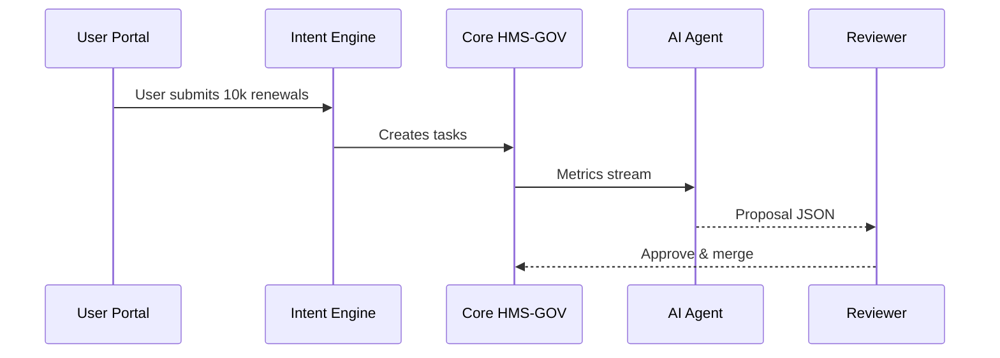

# Chapter 3: AI Representative Agent (HMS-A2A)


[← Back to Chapter 2: Intent-Driven Navigation & AI-Guided Journeys](02_intent_driven_navigation___ai_guided_journeys_.md)

---

## 1. Why Do We Need an “AI Representative Agent”?

Picture the U.S. Department of Transportation (**DOT**) on a busy Monday.  
Thousands of citizens just renewed commercial driver licenses through HMS.  
A queue inside DOT’s legacy system is now **15× slower** than last week.

A flesh-and-blood junior officer would:

1. Notice the growing queue in a dashboard.  
2. Draft a memo: “Let’s auto-route overflow requests to Region 2.”  
3. Email their supervisor for sign-off.  
4. If approved, update the routing rule in production.

HMS-A2A is that tireless junior officer—but digital:

* **Watches** every metric 24 / 7.  
* **Writes** a fully-formed process-change proposal.  
* **Submits** it for review or, if pre-authorized, **publishes** it instantly.

Result: DOT spends minutes, not weeks, reacting to bottlenecks.

---

## 2. Key Concepts in Plain English

| Term | Analogy | Why It Matters |
|------|---------|----------------|
| **Watcher** | A thermostat reading room temp. | Detects when something drifts from “normal.” |
| **Insight** | “It’s too hot.” | A plain statement of the problem. |
| **Proposal** | “Lower AC to 70 °F.” | A structured change suggestion. |
| **Guardrail** | House rules: “Don’t set below 65 °F.” | Keeps the Agent from unsafe actions. |
| **Mode** | “Ask Mom first” vs “Do it yourself.” | Human-in-the-Loop vs Autonomous publish. |

These map directly to HMS modules you’ll meet later, especially  
[Human-in-the-Loop Oversight](04_human_in_the_loop__hitl__oversight_.md).

---

## 3. A 60-Second “Hello, World”

Below is a **tiny** script that asks HMS-A2A, “Show me any process bottlenecks for DOT → LicenseRenewal.”

```bash
# file: demo_call.sh
curl -X POST https://api.hms.gov/a2a/insights \
     -d '{ "agency":"DOT",
           "flow":"LicenseRenewal",
           "since":"1h" }' \
     -H "Authorization: Bearer $TOKEN"
```

Typical JSON response:

```json
{
  "insightId": "dot-license-bottleneck-2309",
  "description": "Queue 'DL_VERIFICATION' latency ↑ 480% (15 → 72 min).",
  "proposedFix": {
    "action": "reroute",
    "targetQueue": "REGION_2_BACKUP",
    "rollBackMinutes": 30
  },
  "confidence": 0.93,
  "next": "awaiting_approval"
}
```

Explanation for beginners
1. We **POST** a timeframe; the Agent returns an *Insight* plus a *Proposed Fix*.  
2. `confidence` is the Agent’s self-reported certainty.  
3. `next` tells you what must happen (human approval, auto-publish, etc.).

---

## 4. How Does HMS-A2A Fit into a Journey?



Only five actors—simple!

---

## 5. Peeking Inside the Agent

### 5.1 Minimal Bottleneck Rule (Python)

```python
# file: rules/bottleneck.py
def detect_bottleneck(queue):
    if queue.latency_min > queue.baseline * 3:
        return {
            "description": f"Queue '{queue.name}' latency ↑",
            "action": "reroute",
            "target": "REGION_2_BACKUP"
        }
    return None
```

What it does  
• Compares current latency to the historical baseline.  
• If > 3×, suggests a reroute fix.  
• Returns `None` if all is well.

### 5.2 Drafting the Proposal Document

```ts
// file: writer.ts
export function draftProposal(insight) {
  return {
    id: `prop-${Date.now()}`,
    title: "Auto-Reroute Overflow",
    body: `
      Problem: ${insight.description}
      Proposed Action: ${insight.action} to ${insight.target}
      Roll-back: 30 minutes if error rate >2%
    `,
    createdAt: new Date().toISOString()
  };
}
```

• Formats plain JSON into a human-readable markdown body.  
• Keeps under 20 lines for clarity.

---

## 6. Configuring Guardrails & Modes

```yaml
# file: config/a2a.yaml
guardrails:
  maxReroutePercentage: 40   # never move >40% traffic
  forbiddenQueues: ["VIP_ONLY"]

mode:
  dot:
    LicenseRenewal: "HITL"   # Human approves first
    CargoPermit:    "AUTO"   # Auto-publish
```

Beginners’ takeaway  
1. **Guardrails** enforce safety limits.  
2. **Mode** lets each agency decide: manual review or autonomous.

---

## 7. First-Time Integration Steps

1. Enable the microservice:  
   `helm install hms-a2a charts/a2a --values config/a2a.yaml`
2. Stream metrics to A2A (one line of code):

   ```ts
   hmsMetrics.pipeTo("a2a://dot");
   ```
3. Decide review mode in the YAML above.  
4. Subscribe reviewers’ emails in [HITL Oversight](04_human_in_the_loop__hitl__oversight_.md).  
5. Test: flood a staging queue, watch A2A propose a reroute.

Total setup time: ≈ 15 minutes.

---

## 8. Recap & What’s Next

You learned:

* Why HMS-A2A acts like a sleepless junior policy officer.  
* Key concepts—Watcher, Insight, Proposal, Guardrail, Mode.  
* A curl-level demo that surfaces and fixes a DOT bottleneck.  
* Under-the-hood rules and YAML guardrails.  
* How to wire A2A into your agency with just a few commands.

But who **approves** or **rejects** these AI-generated proposals?  
That’s the job of the humans we trust.  
Continue to ➡ [Human-in-the-Loop (HITL) Oversight](04_human_in_the_loop__hitl__oversight_.md)

---

Generated by [HardisonCo [NARA-DOC]](https://github.com/The-Pocket/Tutorial-Codebase-Knowledge)