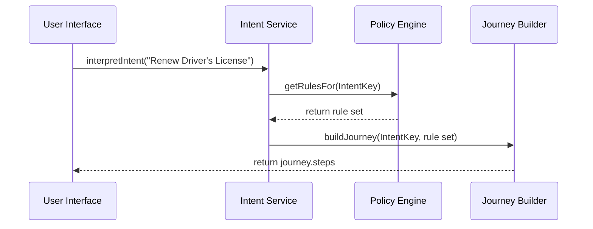

# Chapter 3: Intent-Driven Navigation

Welcome back! Now that you’ve seen how admins manage proposals in the [Admin/Gov Portal](02_admin_gov_portal_.md), let’s explore how HMS guides users step-by-step based on *what* they want to achieve—just like a helpful concierge.

---

## Why Intent-Driven Navigation?

Problem: Citizens often don’t know which form or process fits their goal.  
Solution: Ask “What do you want to accomplish?”, then dynamically craft a guided journey that meets both user needs and government policies.

**Use Case Example**  
Alice needs to renew her driver’s license. Instead of hunting through dozens of forms, HMS asks her goal—“Renew my driver’s license”—and then shows exactly the steps, checks, and forms required by the DMV and relevant regulations.

---

## Key Concepts

1. Intent Recognition  
   The system listens to a user’s goal (in plain language) and maps it to an internal “intent” (e.g., `RenewDriverLicense`).

2. Journey Builder  
   Once the intent is known, HMS assembles a sequence of steps (forms, verifications, payments) that satisfy policy rules.

3. Policy Checkpoints  
   At each step, HMS ensures compliance (age checks, fee calculations) by consulting the Policy Engine.

4. Dynamic Routing  
   Depending on user answers, the flow can branch—like “Do you want to update your address?”—and adapt in real time.

---

## Using Intent-Driven Navigation

Here’s how a citizen-facing script might start a journey for renewing a driver’s license.

```javascript
// Step 1: import the helper
import { IntentNavigator } from 'hms-portal-client';

// Step 2: create the navigator (with user session)
const navigator = new IntentNavigator({ userId: "alice123" });

// Step 3: start a journey by stating intent
navigator.startJourney({ intent: "Renew Driver's License" })
  .then(journey => {
    // journey.steps is an array of step definitions
    console.log("Follow these steps:", journey.steps);
  })
  .catch(err => console.error("Navigation failed:", err.message));
```

Explanation:  
1. We import a high-level `IntentNavigator`.  
2. Call `startJourney` with a plain-language intent.  
3. Receive a `journey` object listing each step (form IDs, instructions).

---

## What Happens Under the Hood?

When `startJourney` is called, HMS does:



1. **Intent Service** maps text to a known intent key.  
2. It fetches policies and rules from the **Policy Engine**.  
3. **Journey Builder** creates an ordered list of steps.  
4. The UI gets back a tailor-made workflow.

---

## Inside: Intent Service & Journey Builder

### 1. Intent Service (`hms-api/src/services/intentService.js`)

```javascript
// Very simple mapping of user text to an intent key
const intentMap = {
  "renew driver": "RenewDriverLicense",
  "apply business": "ApplyBusinessPermit"
};

async function interpretIntent(text) {
  const key = Object.keys(intentMap)
    .find(k => text.toLowerCase().includes(k));
  if (!key) throw new Error("Intent not recognized");
  return intentMap[key];
}

module.exports = { interpretIntent };
```

Explanation: We look for keywords in the user’s text and return a standard intent key.

### 2. Journey Builder (`hms-api/src/services/journeyBuilder.js`)

```javascript
// Define step templates for each intent
const journeyTemplates = {
  RenewDriverLicense: [
    { id: "verify-age", label: "Confirm your age" },
    { id: "upload-id",   label: "Upload government ID" },
    { id: "pay-fee",     label: "Pay renewal fee" }
  ]
};

async function buildJourney(intentKey, policyRules) {
  let steps = journeyTemplates[intentKey] || [];
  // Apply dynamic policy checks (e.g., fee waivers)
  if (policyRules.feeWaived) {
    steps = steps.filter(s => s.id !== "pay-fee");
  }
  return { steps };
}

module.exports = { buildJourney };
```

Explanation: We start from a template, then adjust the steps based on policy rules (like waiving fees for seniors).

---

## Putting It Together

1. **User clicks “Start”** and enters their goal.  
2. Frontend calls `POST /api/intent/start` with `{ intent: "Renew Driver's License" }`.  
3. Backend runs `interpretIntent`, fetches rules, builds journey, and returns `[{id, label}, …]`.  
4. UI presents each step as clickable tasks, guiding the user seamlessly.

---

## Conclusion

You’ve learned how **Intent-Driven Navigation** turns plain English goals into structured, policy-compliant workflows—just like a friendly concierge guiding you through City Hall. Next up, we’ll explore how specialized AI agents execute and enrich these journeys in [Chapter 4: Specialized AI Agents (HMS-A2A)](04_specialized_ai_agents__hms_a2a__.md).

---

Generated by [HardisonCo [NARA-DOC]](https://github.com/The-Pocket/Tutorial-Codebase-Knowledge)