# Chapter 3: Microservices Framework (HMS-SVC)

Welcome back! In [Chapter 2: Core Infrastructure (HMS-SYS)](02_core_infrastructure__hms_sys__.md) we saw how shared services—authentication, logging, discovery—power our system. Now we’ll build on that foundation and introduce the **Microservices Framework (HMS-SVC)**.

---

## 3.1 Why Microservices? A Real-World Motivation

Imagine the **Federal Grants Office** needs to:

1. Accept citizen grant applications.
2. Check eligibility.
3. Send confirmation emails.
4. Track compliance metrics.

If all this lived in one giant program, any change—say, tweaking the email template—could require redeploying everything. Instead, with microservices, we split responsibilities:

- **ApplicationService** handles incoming grant forms.  
- **EligibilityService** calculates if an applicant qualifies.  
- **NotificationService** sends emails or SMS.  
- **ComplianceService** tracks metrics over time.  

Each service can be built, tested, and scaled independently—like separate offices in a government building.

---

## 3.2 Key Concepts

1. **Microservice**  
   A small, self-contained app with a single responsibility and its own data store.  
2. **Service Discovery**  
   Uses our [HMS-SYS Service Discovery](02_core_infrastructure__hms_sys__.md) to find other services by name.  
3. **Inter-Service Communication**  
   Usually HTTP/REST or messaging; here we'll use simple HTTP calls.  
4. **Data Ownership**  
   Each service controls its own database—no shared tables.  
5. **Resilience**  
   A failure in one service doesn’t crash the whole system.

---

## 3.3 Building a Minimal Grant-Processing Example

We’ll create two microservices:

1. **ApplicationService** – accepts new grant applications.  
2. **NotificationService** – sends a confirmation email.

### 3.3.1 ApplicationService

File: `application_service.py`
```python
from flask import Flask, request, jsonify
from hms_sys import HMSCore

app = Flask(__name__)
core = HMSCore()
db = []  # simple in-memory store

@app.route('/applications', methods=['POST'])
def create_application():
    data = request.json
    db.append(data)  # save application
    # Discover NotificationService URL
    notif_url = core.discovery.lookup("NotificationService")
    # Log and (pseudo) send notification
    core.logger.info("NotifyUser", email=data["email"])
    # In reality: requests.post(f"{notif_url}/notify", json={...})
    return jsonify({"status": "created"}), 201

if __name__ == '__main__':
    app.run(port=5001)
```
Explanation:
- We use `HMSCore().discovery.lookup(...)` to find our email service.
- `db` is a placeholder for a real database.
- Logging goes through the shared **Logging Service** from HMS-SYS.

### 3.3.2 NotificationService

File: `notification_service.py`
```python
from flask import Flask, request, jsonify

app = Flask(__name__)

@app.route('/notify', methods=['POST'])
def notify():
    data = request.json
    # Stub: send an email
    print(f"📧 Sending to {data['email']}: {data['message']}")
    return jsonify({"status": "sent"}), 200

if __name__ == '__main__':
    app.run(port=5002)
```
Explanation:
- A tiny service that “sends” email by printing to the console.
- In production you’d hook into an email gateway API.

---

## 3.4 What Happens When a Citizen Applies?

```mermaid
sequenceDiagram
  participant Citizen as Frontend App
  participant AppSvc   as ApplicationService
  participant NotifSvc as NotificationService
  participant HMSCore  as HMS-SYS Discovery

  Citizen->>AppSvc: POST /applications {name, email,…}
  AppSvc->>AppSvc: save to local DB
  AppSvc->>HMSCore: lookup("NotificationService")
  HMSCore-->>AppSvc: http://localhost:5002
  AppSvc->>NotifSvc: POST /notify {email,…}
  NotifSvc-->>AppSvc: 200 OK
  AppSvc-->>Citizen: 201 Created
```



Step-by-step:
1. **Frontend** sends application data to ApplicationService.  
2. ApplicationService stores it locally.  
3. It asks the **Discovery Service** for the NotificationService address.  
4. It calls NotificationService over HTTP.  
5. NotificationService “sends” the email and returns success.  
6. ApplicationService responds to the frontend.

---

## 3.5 Under the Hood: How HMS-SVC Uses HMS-SYS

1. Each microservice imports `HMSCore` from **HMS-SYS**.  
2. It calls `core.discovery.lookup(serviceName)` to get a URL.  
3. It uses `core.logger` for consistent, centralized logging.  
4. Authentication or configuration (if needed) can be fetched from `core.auth` or `core.config`.

This keeps each service focused on business logic—HMS-SYS handles the plumbing.

---

## 3.6 Conclusion

You’ve now seen how to split functionality into small, focused services using the **Microservices Framework (HMS-SVC)**. We built two services that talk to each other via HTTP and use the shared **Discovery** and **Logging** utilities from [HMS-SYS](02_core_infrastructure__hms_sys__.md).  

Next up, we’ll learn how to expose and manage policies via the [Policy Management API (HMS-API / HMS-MKT)](04_policy_management_api__hms_api___hms_mkt__.md).  

Happy coding!

---

Generated by [HardisonCo [NARA-DOC]](https://github.com/The-Pocket/Tutorial-Codebase-Knowledge)