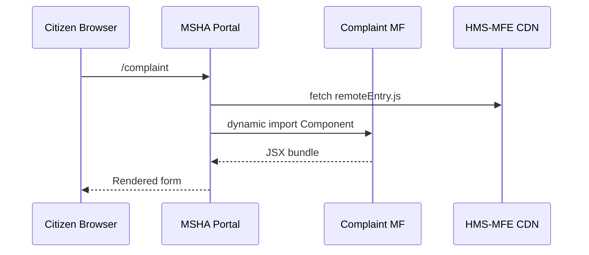

# Chapter 4: Micro-Frontend Library (HMS-MFE)

*Coming from [Legislative Workflow Engine (HMS-CDF)](03_legislative_workflow_engine__hms_cdf__.md) you have a rule that can now be “published.”  
But what do citizens actually **see** on screen?  
That’s where HMS-MFE steps in.*

---

## 1. Why a Micro-Frontend Library? 🎨

### Central Use-Case

The **Mine Safety and Health Administration (MSHA)** needs a new *“File a Safety Complaint”* page.

Requirements:

1. Must match MSHA’s blue & gold branding.  
2. Must **also** match federal accessibility rules (Section 508).  
3. Should be re-used next month by the **Smithsonian** to collect artifact donation offers—with *zero* re-coding of validation, error states, or screen-reader labels.

HMS-MFE gives both agencies the same **toolbox of Lego bricks**—buttons, forms, charts, etc.—while still letting each site paint them any color it likes.

---

## 2. Key Concepts (Plain English)

| Term | Think of it as… | Why You Care |
|------|-----------------|--------------|
| Component | One Lego brick (e.g., `<HmsButton>`) | Re-use instead of re-build |
| Micro-Frontend | A small, standalone mini-app (e.g., “Complaint Form”) | Teams work in parallel |
| Theme | A bucket of colors & fonts | Branding without code forks |
| Adapter | Glue between host app and HMS-MFE | Keeps your codebase small |
| Section 508 Checklist | Built-in accessibility tests | Saves you from audits |

---

## 3. Quick Tour: Drop a Button on the Page

Below is an **18-line** React example that ships a fully accessible button:

```tsx
// ComplaintButton.tsx
import "@hms-mfe/core/styles.css";
import { HmsButton } from "@hms-mfe/core";

export default function ComplaintButton() {
  function handleClick() {
    alert("Complaint sent!");
  }

  return (
    <HmsButton variant="primary" onClick={handleClick}>
      File a Safety Complaint
    </HmsButton>
  );
}
```

Explanation  
1. `@hms-mfe/core` already owns keyboard focus rings, aria-labels, and color contrast.  
2. You only supply the **action**.

---

## 4. Building the Full “File a Safety Complaint” Micro-Frontend

### 4.1  Create the Mini-App

```bash
npx create-hms-mfe complaint-form
cd complaint-form
npm start
```

You now have a skeleton micro-frontend running at `http://localhost:9001`.

### 4.2  Assemble Components (≤ 20 lines each)

```tsx
// Form.tsx
import { HmsInput, HmsTextarea } from "@hms-mfe/forms";

export default function ComplaintForm() {
  return (
    <form>
      <HmsInput label="Mine ID" name="mineId" required />
      <HmsTextarea label="Describe the hazard" name="details" rows={4} />
      <HmsButton type="submit">Submit</HmsButton>
    </form>
  );
}
```

What Happens  
• Each field auto-validates for empty values.  
• Error messages already meet 508 color & aria rules.

### 4.3  Expose it via Module Federation

```js
// webpack.config.js (excerpt 7 lines)
module.exports = {
  plugins: [
    new ModuleFederationPlugin({
      name: "complaintMF",
      filename: "remoteEntry.js",
      exposes: { "./ComplaintForm": "./src/Form" },
      shared: ["react", "react-dom", "@hms-mfe/core"]
    })
  ]
};
```

Host portals (MSHA, Smithsonian, Border Commission) can now import:

```js
const ComplaintForm = React.lazy(() =>
  import("complaintMF/ComplaintForm")
);
```

---

## 5. How a Portal Loads Your Micro-Frontend



Key Points  
1. Only one network hop to the shared CDN—fast!  
2. If another agency already cached `remoteEntry.js`, the browser reuses it.

---

## 6. Theming: Look Unique, Stay Standard

```css
/* smithsonian.theme.css – 12 lines */
:root {
  --hms-color-primary: #a51c30;  /* Smithsonian red */
  --hms-font-family: "Open Sans", sans-serif;
}
```

```tsx
import "smithsonian.theme.css";
import { ComplaintForm } from "complaintMF/ComplaintForm";

export default () => <ComplaintForm />;
```

Result  
• The *same* codebase now feels at home on a Smithsonian site—no rebuild required.

---

## 7. Under the Hood (Light Version)

1. **Design Tokens** – Small JSON file of colors, spacing, type scales.  
2. **Stencils** – Components compiled into native Web Components for framework-agnostic use.  
3. **Module Federation** – Webpack feature allowing runtime sharing of bundles.  
4. **Auto-Audit Bot** – CLI command `hms-mfe audit` runs axe-core & lighthouse.

### Internal Flow (Step-By-Step)

1. Developer publishes a micro-frontend to the HMS-MFE registry.  
2. CI pipeline runs `npm run audit`—fails if accessibility score < 90.  
3. Registry posts a webhook to [Micro-services Backbone (HMS-SYS)](05_micro_services_backbone__hms_sys___hms_svc__.md) so caching layers stay fresh.  
4. Portals load components lazily; browser caches per semver.

---

### Tiny Source Peek (≤ 20 lines each)

#### 7.1  Accessible Button Core

```tsx
// packages/core/Button.tsx
export function HmsButton({ children, ...props }) {
  return (
    <button
      className="hms-btn"
      aria-label={props["aria-label"] || children}
      {...props}
    >
      {children}
    </button>
  );
}
```

#### 7.2  Auto-Audit Script

```js
// scripts/audit.js
const axe = require("axe-core");
const { JSDOM } = require("jsdom");

(async () => {
  const dom = new JSDOM(`<button class="hms-btn">x</button>`);
  const { violations } = await axe.run(dom.window.document);
  if (violations.length) throw new Error("508 failures");
})();
```

Violations trigger a red build before anything reaches production.

---

## 8. Common Pitfalls & Quick Fixes

| Problem | Fix |
|---------|-----|
| Portal console: `Shared module "react" not found` | Add `"react"` to `shared` in both host & MFE webpack configs. |
| Colors fail contrast test | Run `npx hms-mfe audit --fix` to auto-suggest darker shades. |
| “Button has no accessible name” | Pass `aria-label` or ensure children text is present. |

---

## 9. Hands-On Exercise (10 min)

1. `git clone https://github.com/hms-samples/complaint-form`  
2. `npm i && npm start`  
3. Open `http://localhost:3000` – you’ll see the form hosted inside a shell app.  
4. Change `--hms-color-primary` in `theme.css`. Hot-reload shows branding instantly.  
5. Run `npm run audit` and aim for **100/100** accessibility.

---

## 10. Recap & Next Steps

You have learned to:

• Import ready-made, Section 508-compliant components.  
• Publish your own micro-frontends with Module Federation.  
• Theme them for any federal agency without forking code.  
• Trust automated audits to catch issues **before** auditors do.

In the next chapter we zoom out from the UI layer to the **pipes** that feed it all.  
Continue to [Micro-services Backbone (HMS-SYS & HMS-SVC)](05_micro_services_backbone__hms_sys___hms_svc__.md).

---

Generated by [HardisonCo [NARA-DOC]](https://github.com/The-Pocket/Tutorial-Codebase-Knowledge)