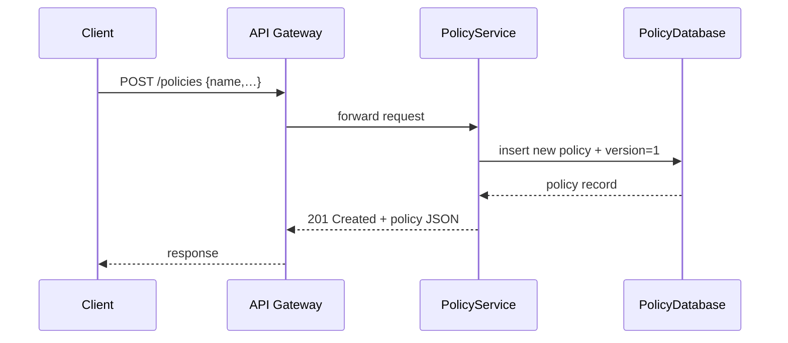

# Chapter 4: Policy Management API (HMS-API / HMS-MKT)

Welcome back! In [Chapter 3: Microservices Framework (HMS-SVC)](03_microservices_framework__hms_svc__.md), we built tiny services and saw how they talk to each other. Now it’s time to manage the *rules* that drive those services—things like eligibility thresholds, fee schedules, or workflow triggers. Enter the **Policy Management API (HMS-API / HMS-MKT)**: your programmatic “rulebook editor.”

---

## 4.1 Why a Policy API? A Real-World Motivation

Governments constantly update policies:  
- The U.S. Department of Labor raises the federal minimum wage.  
- The Environmental Protection Agency tightens emission limits.  
- A city council changes permit fees.  

Rather than manually editing config files or databases, you want a clean API to:

1. **Create** new rules.  
2. **Update** existing ones.  
3. **Version** them (so you can audit past policies).  
4. **Distribute** changes to all downstream systems.

Think of HMS-API as a digital law publisher: amend a statute, then press “Publish,” and every system instantly sees the new text.

---

## 4.2 Key Concepts

1. **Policy**  
   A single business rule (e.g., “MinimumWage”) with metadata.  
2. **Version**  
   Each change to a policy creates a new version (v1, v2, …).  
3. **Endpoints**  
   - `POST /policies` – create a policy.  
   - `GET /policies` – list all policies.  
   - `PUT /policies/{id}` – append a new version.  
   - `GET /policies/{id}/versions` – view history.  
4. **Policy Body**  
   The actual rule text or JSON logic that systems consume.

---

## 4.3 Using HMS-API: A Minimal Example

Let’s manage a “MinimumWage” policy via HTTP calls.  

### 4.3.1 Create a New Policy

```python
import requests

base = "https://api.gov/policies"
new = {
  "name": "MinimumWage",
  "description": "Set federal minimum wage to $15/hr",
  "body": {"min_wage": 15}
}
resp = requests.post(base, json=new)
print(resp.status_code, resp.json())
```

Explanation:  
- We `POST` to `/policies` with name, description, and body.  
- On success, API returns `{ "id": "1", "version": 1, … }`.

### 4.3.2 Update an Existing Policy

```python
update = { "body": {"min_wage": 16} }
resp = requests.put(f"{base}/1", json=update)
print("New version:", resp.json()["version"])
```

Explanation:  
- `PUT /policies/1` creates version 2 of policy 1.  
- Other systems will see version 2 when they fetch.

### 4.3.3 List Policies and Versions

```python
# List all policies
print(requests.get(base).json())

# View version history for policy 1
print(requests.get(f"{base}/1/versions").json())
```

---

## 4.4 What Happens Under the Hood?

When your client calls HMS-API, here’s the flow:



1. **Client** calls API Gateway.  
2. The **PolicyService** receives it.  
3. It records the policy and initial version in the **PolicyDatabase**.  
4. Service returns the new policy object back through the gateway.

---

## 4.5 Inside PolicyService: Simplified Code

### 4.5.1 Controller: `policy_controller.py`

```python
from flask import Flask, request, jsonify
from policy_store import PolicyStore

app = Flask(__name__)
store = PolicyStore()

@app.route("/policies", methods=["POST"])
def create_policy():
    data = request.json
    policy = store.create(data)
    return jsonify(policy), 201

@app.route("/policies/<pid>", methods=["PUT"])
def update_policy(pid):
    data = request.json
    updated = store.update(pid, data["body"])
    return jsonify(updated), 200
```

Explanation:  
- `create_policy` and `update_policy` call a shared `PolicyStore`.  
- We keep controllers focused on HTTP logic only.

### 4.5.2 Store: `policy_store.py`

```python
import time

class PolicyStore:
    def __init__(self):
        self._db = {}     # pid -> [versions]
        self._next_id = 1

    def create(self, data):
        pid = str(self._next_id)
        self._next_id += 1
        version = {"version":1, "body":data["body"], "timestamp":time.time()}
        self._db[pid] = [version]
        return {"id": pid, **data, "version":1}

    def update(self, pid, body):
        versions = self._db.get(pid, [])
        new_v = len(versions) + 1
        entry = {"version": new_v, "body": body, "timestamp":time.time()}
        versions.append(entry)
        return {"id": pid, "version": new_v}
```

Explanation:  
- We store versions in a simple dict of lists.  
- Each update appends a new version with a timestamp.

---

## 4.6 Summary

In this chapter, you learned how to:

- Use **HMS-API** to create, update, and version business rules.  
- Interact with endpoints via simple HTTP calls.  
- Understand the internal flow—from API Gateway through the PolicyService to the database.  

Next, we’ll build a user-friendly web interface for these policies in the [Administration Portal (HMS-GOV)](05_administration_portal__hms_gov__.md).

---

Generated by [HardisonCo [NARA-DOC]](https://github.com/The-Pocket/Tutorial-Codebase-Knowledge)