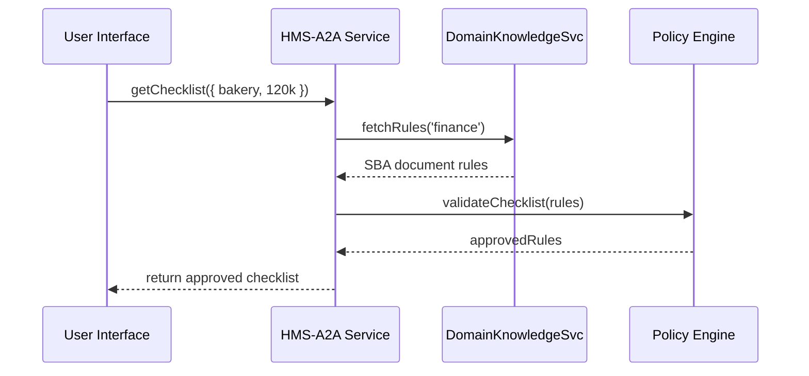

# Chapter 4: Specialized AI Agents (HMS-A2A)

Welcome back! In [Chapter 3: Intent-Driven Navigation](03_intent_driven_navigation_.md), we saw how HMS turns plain-English goals into step-by-step journeys. Now, let’s meet the **Specialized AI Agents (HMS-A2A)** that bring deep expertise—like on-demand consultants for healthcare, finance, or education.

---

## Why Specialized AI Agents?

Imagine Jane wants to apply for a small-business loan from the Small Business Administration (SBA). She’s overwhelmed by forms, rules, and deadlines. A general assistant can ask her what she needs, but a **Finance Agent** knows SBA regulations, required documents, and best practices. Behind the scenes, it:

- Understands niche policies (e.g., credit score thresholds, collateral rules)  
- Recommends exactly which forms to fill  
- Checks compliance with federal guidelines before submission  

Similarly, a **Healthcare Agent** could guide a patient through Medicare enrollment, and an **Education Agent** could help with FAFSA or scholarship applications.

---

## Key Concepts

1. **Domain Expertise**  
   Each agent is trained on a specific sector’s rules and best practices.

2. **Plug-and-Play Modules**  
   Agents register with HMS’s governance layer so they follow overall security, logging, and audit rules.

3. **Seamless Integration**  
   Regardless of domain, the way you call an agent is the same. Under the hood, HMS-A2A routes your request to the right specialist.

4. **Governance Compliance**  
   All advice passes through HMS’s policy engine to ensure nothing violates regulations.

---

## Using a Specialized Agent

Here’s a minimal example: Jane uses the Finance Agent to prepare her SBA loan application.

```javascript
// 1. Import the A2A client
import { SpecializedAgent } from 'hms-a2a-client'

// 2. Create a finance agent instance
const financeAgent = SpecializedAgent.create('finance')

// 3. Ask for document checklist based on her profile
const profile = { businessType: "bakery", annualRevenue: 120000 }
financeAgent.getChecklist(profile)
  .then(checklist => {
    console.log("Required documents:", checklist)
  })
  .catch(err => console.error("Agent error:", err.message))
```

Explanation:
- `create('finance')` returns an agent pre-configured with SBA rules.
- `getChecklist(profile)` returns an array like:
  ```json
  [
    "Form SBA-1919",
    "Balance sheet",
    "Profit & Loss statement"
  ]
  ```

You can swap `'finance'` for `'healthcare'` or `'education'` and call the same methods—it “just works.”

---

## What Happens Under the Hood?

When you call `getChecklist`, HMS-A2A does:



1. The service loads domain rules.  
2. It asks the Policy Engine to ensure compliance.  
3. Returns a final, regulation-safe checklist.

---

## Inside HMS-A2A: Simplified Code

### 1. Agent Factory (`hms-a2a/src/agentFactory.js`)

```javascript
// Map domain keys to agent modules
const agents = {
  finance: require('./agents/financeAgent'),
  healthcare: require('./agents/healthcareAgent')
}

function create(domain) {
  const AgentClass = agents[domain]
  if (!AgentClass) throw new Error("No agent for domain")
  return new AgentClass()
}

module.exports = { create }
```

Explanation:
- We keep a registry of available agents.
- `create(domain)` returns the right specialist instance.

### 2. Finance Agent (`hms-a2a/src/agents/financeAgent.js`)

```javascript
// Example: very simple SBA checklist logic
class FinanceAgent {
  async getChecklist(profile) {
    // pretend: load SBA form list and filter by profile
    const allForms = ["SBA-1919", "1010", "Balance sheet"]
    // return only critical forms for revenue > 100k
    return allForms.filter(f => f !== "1010")
  }
}
module.exports = FinanceAgent
```

Explanation:
- A real agent would call external APIs or consult a knowledge base.
- Here we hard-code a small example for clarity.

---

## How This Fits in HMS

- **User Portal** ([Chapter 1](01_user_portal___citizen_interface_.md)) collects basic info.  
- **Intent-Driven Navigation** ([Chapter 3](03_intent_driven_navigation_.md)) builds the journey.  
- **Specialized Agents** (this chapter) fill each step with domain-specific advice.  
- Later, **AI Representative Agents** ([Chapter 5](05_ai_representative_agent_.md)) can speak on behalf of agencies using this guidance.

---

## Conclusion

You’ve learned how **Specialized AI Agents (HMS-A2A)** act like expert consultants in niche domains—ensuring recommendations are both useful and compliant. Next, we’ll see how an **AI Representative Agent** can present these recommendations directly to citizens or administrators in [Chapter 5: AI Representative Agent](05_ai_representative_agent_.md).

---

Generated by [HardisonCo [NARA-DOC]](https://github.com/The-Pocket/Tutorial-Codebase-Knowledge)