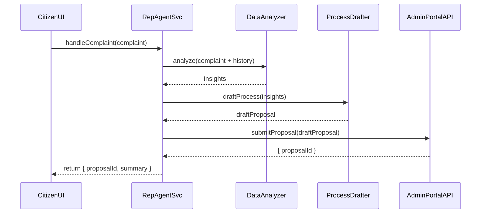

# Chapter 5: AI Representative Agent

In [Chapter 4: Specialized AI Agents (HMS-A2A)](04_specialized_ai_agents__hms_a2a__.md), you saw how domain-specific AI modules give expert advice. Now let’s meet the **AI Representative Agent**—an automated “smart bureaucrat” that reviews citizen inputs, learns from past cases, drafts optimized processes, and pushes proposals for human approval.

---

## Why an AI Representative Agent?

Imagine Maria files a **noise complaint** about low-flyer testing near an airbase. Traditionally, analysts sift through past cases, draft a mitigation plan, and write a proposal for city managers—taking days or weeks. The AI Representative Agent:

1. Scans Maria’s complaint and historical data  
2. Drafts a clear, step-by-step mitigation process  
3. Submits that draft to the Admin/Gov Portal for review  
4. Alerts a human overseer if uncertain  

This helps speed up conflict resolution, improves policy quality, and cuts down on citizen wait times.

---

## Key Concepts

1. **Data Intake & Analysis**  
   The agent gathers the new complaint plus past similar cases to find patterns.

2. **Process Drafting**  
   Using those insights, it creates a proposal (e.g., “Notify residents via SMS → Schedule noise test → Publish report”).

3. **Automated Submission**  
   The draft is automatically pushed into the [Admin/Gov Portal](02_admin_gov_portal_.md) as a pending proposal.

4. **Human Oversight**  
   If the agent’s confidence is low, it flags a staff member for review before submission.

---

## Using the AI Representative Agent

Here’s a beginner-friendly example showing how a citizen app might call the agent:

```javascript
// 1. Import the client helper
import { AIRepresentativeAgent } from 'hms-a2a-client'

// 2. Create an agent instance
const repAgent = AIRepresentativeAgent.create()

// 3. Provide a new complaint
const complaint = {
  id: "C-2024-0420",
  type: "Noise",
  description: "Loud drone flights at 3 AM near Elm Park"
}

// 4. Ask the agent to analyze & draft a proposal
repAgent.handleComplaint(complaint)
  .then(result => {
    console.log("Proposal ID:", result.proposalId)
    console.log("Summary:", result.summary)
  })
  .catch(err => console.error("Agent failed:", err.message))
```

Explanation:  
1. We import and instantiate the agent.  
2. We send it the citizen complaint object.  
3. `handleComplaint` runs analysis, drafts a process, submits a proposal, and returns a `proposalId` plus a human-readable `summary`.

---

## What Happens Under the Hood?



Step by step:  
1. **CitizenUI** calls `handleComplaint`.  
2. **RepAgentSvc** asks **DataAnalyzer** for insights.  
3. It sends those insights to **ProcessDrafter**, which builds a draft proposal.  
4. The draft is sent to **AdminPortalAPI**.  
5. The API returns a `proposalId`, and the agent sends a summary back to the UI.

---

## Inside the AI Representative Agent

### 1. Entry Point (`hms-a2a/src/agents/aiRepAgent.js`)

```javascript
class AIRepAgent {
  async handleComplaint(complaint) {
    // 1. Gather insights
    const insights = await this.analyzeComplaint(complaint)
    // 2. Draft a proposal
    const draft = await this.draftProcess(insights)
    // 3. Submit to admin portal
    const { proposalId } = await this.submitProposal(draft)
    // 4. Build a simple summary
    const summary = draft.steps.join(" → ")
    return { proposalId, summary }
  }
}
module.exports = AIRepAgent
```

Explanation:  
- `handleComplaint` ties together analysis, drafting, and submission.  
- We return both an ID and a concise summary for easy display.

### 2. Analysis & Drafting Helpers

```javascript
// hms-a2a/src/agents/aiRepHelpers.js
async function analyzeComplaint(complaint) {
  // pretend: fetch similar past cases and extract patterns
  return { riskLevel: "medium", patterns: ["night flights"] }
}

async function draftProcess(insights) {
  // pretend: create a step list based on insights
  return { steps: [
    "Notify neighbors via email",
    "Schedule noise testing between 9 AM–5 PM",
    "Publish results online"
  ] }
}
module.exports = { analyzeComplaint, draftProcess }
```

Explanation:  
- `analyzeComplaint` returns simplified insights.  
- `draftProcess` builds a concrete, ordered list of actions.

---

## Conclusion

You’ve learned how the **AI Representative Agent** acts as a smart bureaucrat: it analyzes new complaints, drafts optimized processes, and submits proposals—all while keeping humans in the loop. Up next, see how final decisions are made by real people in [Chapter 6: Human Decision Maker (HITL)](06_human_decision_maker__hitl__.md).

---

Generated by [HardisonCo [NARA-DOC]](https://github.com/The-Pocket/Tutorial-Codebase-Knowledge)