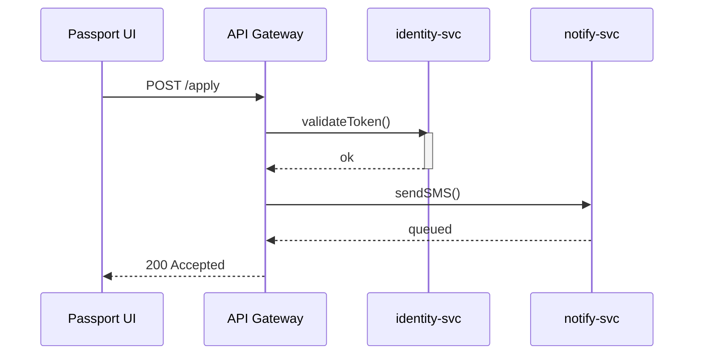

# Chapter 5: Micro-services Backbone (HMS-SYS & HMS-SVC)

*In [Chapter 4: Micro-Frontend Library (HMS-MFE)](04_micro_frontend_library__hms_mfe__.md) you learned how many tiny UI “Lego bricks” can live side-by-side on one page.  
But who delivers the data those bricks show?  
Time to meet the city’s **roads and kiosks**—our micro-services backbone.*

---

## 1. Why a Backbone? 🚦

### Use-case: “Renew Your Passport in 3 Clicks”

A citizen opens `passport.gov` and:

1. Signs in with **Login.gov** credentials.  
2. Uploads a new photo.  
3. Gets an SMS that the application was received.

Behind that *simple* flow are at least **three** separate services:

| Need | Micro-service |
|------|---------------|
| Authentication | `identity-svc` |
| File storage | `media-svc` |
| Notifications | `notify-svc` |

If all three lived in one giant program, any small bug or update would drag the whole site offline.  
Instead we lean on **HMS-SYS** and **HMS-SVC** to keep each part independent yet discoverable.

---

## 2. Meet the Two Pillars

| Layer | Analogy | Plain job |
|-------|---------|-----------|
| HMS-SYS | Roads, traffic lights, power lines | Routing, discovery, health checks, secrets |
| HMS-SVC | Kiosks on the sidewalk | Business logic like identity, notifications, case management |

**Loose coupling** means we can repave a road (upgrade HMS-SYS) or swap a kiosk (replace `notify-svc`) without closing the city.

---

## 3. Key Concepts (Beginner-Friendly)

| Term | One-liner |
|------|-----------|
| Service Registry | Phone book that lists every kiosk’s address |
| Discovery Client | Little helper each kiosk uses to find others |
| Health Probe | Ping that asks “Are you alive?” every few seconds |
| Version Tag | Sticker like `v1.2.0` so callers pick the right kiosk |
| Circuit Breaker | Automatic “closed sign” if a kiosk misbehaves |

---

## 4. Five-Minute Quick-Start

Below is a **tiny** demo that spins up a `notify-svc` and registers it with HMS-SYS.

### 4.1. Boot the Registry (HMS-SYS)

```bash
# 1. start the phone book
docker run -d --name hms-registry -p 8500:8500 hashicorp/consul:1.16
```

Consul stands in as our “roads & traffic lights” for the demo.

### 4.2. Create a Kiosk (HMS-SVC) — 18 lines

```python
# notify_svc.py
from flask import Flask, request
import requests, os, threading, time

app = Flask(__name__)

@app.route("/notify", methods=["POST"])
def send():
    # pretend to send an SMS
    print("📨", request.json)
    return {"status": "queued"}

def register():
    """Tell HMS-SYS where we live every 10s."""
    body = {"Name":"notify-svc","Address":"localhost","Port":5001}
    while True:
        requests.put("http://localhost:8500/v1/agent/service/register", json=body)
        time.sleep(10)

if __name__ == "__main__":
    threading.Thread(target=register, daemon=True).start()
    app.run(port=5001)
```

Run it:

```bash
python notify_svc.py
```

What happened?  
1. The service starts listening on **5001**.  
2. Every 10 s it registers itself with the Consul registry.

### 4.3. Discover & Call the Service — 12 lines

```python
# call_notify.py
import requests, random

# lookup address from registry
info = requests.get("http://localhost:8500/v1/catalog/service/notify-svc").json()[0]
url  = f"http://{info['ServiceAddress']}:{info['ServicePort']}/notify"

# send a test message
payload = {"to":"+12025550199", "msg":"Your passport app #123 received."}
print("POST", url)
print("RESPONSE:", requests.post(url, json=payload).json())
```

Run:

```bash
python call_notify.py
```

The console of `notify_svc.py` prints the envelope emoji, proving discovery worked.

---

## 5. What Happens Under the Hood?



1. **Gateway** (next chapter) receives the citizen’s request.  
2. Looks up `identity-svc` and `notify-svc` in HMS-SYS.  
3. Routes traffic and aggregates the final response.

---

## 6. Internal Mechanics (Simplified)

### 6.1. Service Registration (HMS-SYS) — 10 lines

```go
// registry/heartbeat.go
func Heartbeat(name, addr string, port int) {
  for {
    body := fmt.Sprintf(`{"Name":"%s","Address":"%s","Port":%d}`,
                        name, addr, port)
    http.Post("http://sys:8500/v1/agent/service/register",
              "application/json", strings.NewReader(body))
    time.Sleep(10 * time.Second)
  }
}
```

All kiosks share this helper; a stopped heartbeat means the road crew removes the listing.

### 6.2. Circuit Breaker (HMS-SYS) — 14 lines

```js
// gateway/circuit.js
let failures = 0, OPEN = false;
export async function call(url, opts){
  if(OPEN) throw "circuit open";
  try {
    const res = await fetch(url, opts);
    failures = 0; return res;
  } catch(e){
    if(++failures >= 3) OPEN = true;   // trip!
    throw e;
  }
}
```

After 3 bad calls the kiosk gets a “closed” sign until a health probe clears it.

### 6.3. Health Probe (HMS-SVC) — 9 lines

```python
# health.py
import requests, time
while True:
    try:
        requests.get("http://localhost:5001/health")
        status = "passing"
    except:
        status = "critical"
    requests.put("http://localhost:8500/v1/agent/check/pass/notify-svc" if status=="passing"
                 else "http://localhost:8500/v1/agent/check/fail/notify-svc")
    time.sleep(15)
```

Healthy services stay on the map; failing ones disappear automatically.

---

## 7. Where Other HMS Pieces Plug In

• [Backend API Gateway](06_backend_api_gateway_.md) = **official entrance ramp** onto the roads.  
• [Event & Workflow Orchestration (HMS-ACT / HMS-OMS)](08_event___workflow_orchestration__hms_act___hms_oms__.md) = **traffic police** deciding when to trigger which kiosk.  
• [Central Data Lake & Registry (HMS-DTA)](09_central_data_lake___registry__hms_dta__.md) = warehouse trucks picking data up from kiosks.

---

## 8. Common Pitfalls & Quick Fixes

| Problem | Fix |
|---------|-----|
| “Service not found” | Check that the heartbeat thread is running and Consul port `8500` is reachable. |
| Requests hang | Verify circuit breaker isn’t open; restart the faulty kiosk to reset. |
| Version mismatches | Pin callers to `/v1/` paths and enable **semantic version tags** in the registry. |

---

## 9. Hands-On Exercise (10 min)

1. Clone the sample repo:  
   `git clone https://github.com/hms-samples/micro-backbone-demo && cd micro-backbone-demo`  
2. Run `docker-compose up` — spins up registry + two kiosks.  
3. Open `http://localhost:8500/ui/` to watch services appear/disappear.  
4. Stop `email-svc`; notice the registry removes it and the gateway starts returning `503` without crashing other calls.  
5. Restart `email-svc` and watch traffic resume automatically.

---

## 10. Recap & Next Steps

You now know how **HMS-SYS** (roads) and **HMS-SVC** (kiosks) let dozens of independent services:

• Register themselves,  
• Discover each other,  
• Stay healthy, and  
• Upgrade without city-wide outages.

Next we’ll guard the city entrances with rate-limits, auth, and unified URLs—see  
[Backend API Gateway](06_backend_api_gateway_.md).

---

Generated by [HardisonCo [NARA-DOC]](https://github.com/The-Pocket/Tutorial-Codebase-Knowledge)