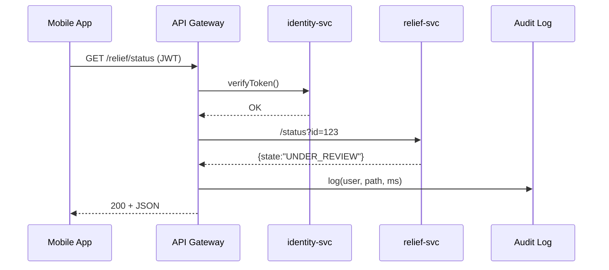

# Chapter 6: Backend API Gateway

*(Coming from [Micro-services Backbone (HMS-SYS & HMS-SVC)](05_micro_services_backbone__hms_sys___hms_svc__.md) you now have dozens of tiny “kiosks” running.  
But to citizens that maze should feel like **one** simple service.  
Enter the Backend API Gateway.)*

---

## 1. Why Do We Need a Gateway? 🛣️  

### Central Use-Case  
The **Federal Emergency Management Agency (FEMA)** releases a mobile app called **“Relief Now.”**  
A single tap on the app must…

1. Authenticate the user (→ `identity-svc`)  
2. Pull their disaster-relief application (→ `relief-svc`)  
3. Grab shipping info for temporary housing (→ `logistics-svc`)  

…all while FEMA must guarantee:

* One HTTPS address (`api.relief.gov`)  
* One access token (no juggling JWTs)  
* Strict rate-limits during hurricanes  
* A tamper-proof audit trail for Congress  

Without a gateway, every mobile client would need to know three internal URLs, three tokens, and three different throttling rules—**maintenance nightmare**.  

---

## 2. Key Concepts in Plain English

| Concept | Beginner Analogy | Why It Matters |
|---------|------------------|----------------|
| Single Endpoint | One toll plaza on the highway | Clients remember one URL, not 30 |
| Authentication Pass-Through | Bouncer checking IDs once | Re-uses the same token for all services |
| Rate Limiter | Countdown timer per license plate | Stops traffic floods & DDoS |
| Version Router | A/B lane for v1 or v2 | Lets new versions roll out safely |
| Audit Logger | Toll-booth camera | Who entered, when, and how fast |
| Aggregation | One receipt for many tolls | Combines results from multiple services |

---

## 3. Five-Minute Quick-Start

Below is a **tiny** demo gateway (Node 14, < 20 lines). It:

1. Verifies a fake bearer token  
2. Throttles to 5 requests/min per user  
3. Proxies anything under `/relief/*` to `relief-svc` discovered via HMS-SYS

### 3.1 Install Dependencies

```bash
npm i express express-rate-limit http-proxy-middleware
```

### 3.2 gateway.js — 19 lines

```js
const express = require("express");
const rateLimit = require("express-rate-limit");
const { createProxyMiddleware } = require("http-proxy-middleware");
const fetch  = require("node-fetch");                 // for discovery

const app = express();

// 1. Auth middleware
app.use(async (req, _, next) => {
  if (req.headers.authorization !== "Bearer DEMO") return next(401);
  req.user = { id: "alice" };                         // fake user
  next();
});

// 2. Rate-limiter (5 req / min / user)
app.use(rateLimit({ windowMs: 60_000, max: 5,
  keyGenerator: r => r.user.id }));

// 3. Dynamic proxy for /relief/*
app.use("/relief", async (req, res, next) => {
  // ask HMS-SYS (Consul) where relief-svc lives
  const info = await fetch("http://localhost:8500/v1/catalog/service/relief-svc")
                .then(r => r.json()).then(a => a[0]);
  createProxyMiddleware({ target: `http://${info.ServiceAddress}:${info.ServicePort}`,
                          changeOrigin: true })(req, res, next);
});

// 4. Start
app.listen(8080, () => console.log("Gateway on :8080"));
```

Explanation  
• **Lines 7-11** do one simple auth check.  
• **Lines 14-15** throttle per user.  
• **Lines 18-22** look up the real service address at runtime, so no hard-coding!  

Run it:

```bash
node gateway.js
curl -H "Authorization: Bearer DEMO" \
     http://localhost:8080/relief/status?id=123
```

Expected Output (from `relief-svc`):

```json
{ "appId": "123", "state": "UNDER_REVIEW" }
```

---

## 4. What Happens Under the Hood?



1. Gateway is the **only** public IP.  
2. Token verified **once**; downstream services trust the result.  
3. Every call is written to an append-only audit store.

---

## 5. Deeper Dive: Internal Building Blocks

### 5.1 Auth Plug (< 15 lines)

```js
// auth.js
module.exports = (req, res, next) => {
  const token = req.headers.authorization?.split(" ")[1];
  if (token !== "DEMO") return res.status(401).end();
  req.user = { id: "alice", roles: ["citizen"] };
  next();
};
```

Swap this stub with the real `identity-svc` call when ready.

### 5.2 Audit Logger (< 15 lines)

```js
// audit.js
const fs = require("fs");
module.exports = (req, res, next) => {
  const start = Date.now();
  res.on("finish", () => {
    const line = [
      new Date().toISOString(),
      req.user?.id || "anon",
      req.method, req.originalUrl,
      res.statusCode,
      Date.now() - start
    ].join(",") + "\n";
    fs.appendFile("gateway_audit.csv", line, () => {});
  });
  next();
};
```

Attach with `app.use(require("./audit"))` to get a CSV like:

```
2024-03-15T12:00:18Z,alice,GET,/relief/status,200,42
```

### 5.3 Version Router (Idea Sketch)

```js
// if URL starts with /v2, route to relief-svc:v2, else v1
const target = req.originalUrl.startsWith("/v2")
             ? discovery("relief-svc", "2.*")
             : discovery("relief-svc", "1.*");
```

A simple semver filter prevents breaking old apps.

---

## 6. Relation to Other HMS Layers

```
Citizen  →  API Gateway  →  HMS-SYS roads  →  HMS-SVC kiosks
                      │
                      └─► Audit Log (Governance Floor)
```

* The gateway **reads** service locations from HMS-SYS ([Chapter 5](05_micro_services_backbone__hms_sys___hms_svc__.md))  
* It **enforces** runtime policy set by the Legislative Engine through guard-rails ([Chapter 3](03_legislative_workflow_engine__hms_cdf__.md))  
* Upcoming **agency-to-agency data pipes** will **reuse the same gateway rules**—stay tuned for [Inter-Agency Exchange Protocol (HMS-A2A)](07_inter_agency_exchange_protocol__hms_a2a__.md)

---

## 7. Common Pitfalls & Quick Fixes

| Symptom | Likely Cause | Fast Remedy |
|---------|--------------|-------------|
| Clients see `429 Too Many Requests` | Rate-limit too low | Bump `max` in rate limiter or add role-based buckets |
| Random `502 Bad Gateway` | Wrong service address | Verify HMS-SYS registry & health checks |
| Old clients break after deploy | Missing version router | Keep `/v1/` routes alive until all apps migrate |

---

## 8. Hands-On Exercise (10 min)

1. Clone example:  
   `git clone https://github.com/hms-samples/api-gateway-demo`  
2. Run `docker-compose up` (registry + relief-svc + gateway).  
3. Hit `curl -H "Authorization: Bearer DEMO" localhost:8080/relief/status`.  
4. Tail `gateway_audit.csv` to watch entries appear.  
5. Run `ab -n 20 -c 2 ...` to hit the rate-limit; verify `429` after 5 req/min.  

---

## 9. Recap & Next Steps

You learned how the **Backend API Gateway**:

• Provides **one door** to many services  
• Centralizes **auth, throttling, and logging**  
• Transparently **routes & versions** traffic  
• Leans on HMS-SYS for discovery and feeds Governance audit trails

Ready to see how different federal agencies exchange data **between** their HMS clusters—without reinventing security each time?  
Continue to [Inter-Agency Exchange Protocol (HMS-A2A)](07_inter_agency_exchange_protocol__hms_a2a__.md).

---

Generated by [HardisonCo [NARA-DOC]](https://github.com/The-Pocket/Tutorial-Codebase-Knowledge)