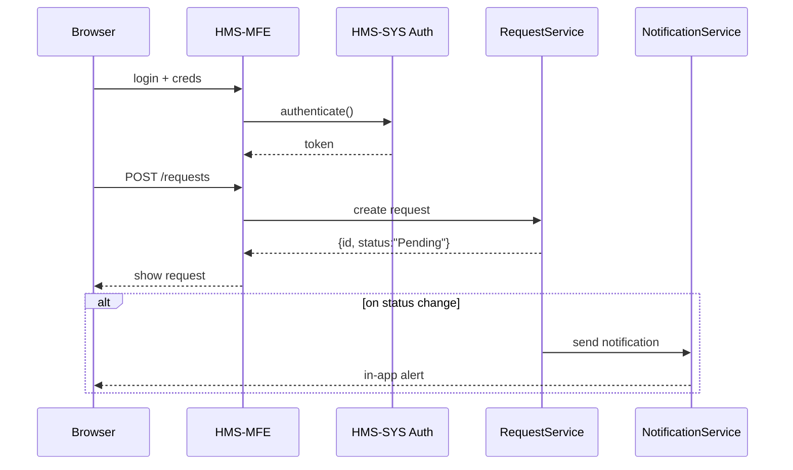

# Chapter 6: Citizen Frontend (HMS-MFE)

Welcome back! In the last chapter we built a secure, policy-maker UI with the [Administration Portal (HMS-GOV)](05_administration_portal__hms_gov__.md). Now it’s time to open the “public counter” for citizens—anyone, anywhere, 24/7—to submit requests, check on progress, and get notified. This is the **Citizen Frontend (HMS-MFE)**.

## 6.1 Why a Citizen Frontend? A Real-World Motivation

Imagine you need to apply for a building permit or renew a driver’s license:
- You don’t want to drive to City Hall, wait in line, or fill paper forms by hand.
- You’d rather log in, complete a quick form, and get updates by email or SMS.
- You want to see exactly where your request stands: “Under review,” “Inspected,” or “Approved.”

The **Citizen Frontend** is that digital counter. It connects to backend services, handles authentication, shows live status, and pushes notifications—all in a friendly web app.

## 6.2 Key Concepts

1. **Request Form**  
   A simple web form for citizens to submit a new application.  
2. **Status Dashboard**  
   A table or list showing all requests and their current status.  
3. **Notification Center**  
   Displays in-app alerts and optionally sends emails/SMS.  
4. **Authentication & Profile**  
   Secure login so each citizen sees only their own requests.

## 6.3 Using HMS-MFE: A Minimal Example

Below is a tiny example combining HTML and JavaScript to:

1. Log in a user via HMS-SYS.  
2. Submit a “permit” request to a backend “RequestService.”  
3. Show the newly created request in a list.

### 6.3.1 index.html

```html
<!DOCTYPE html>
<html>
<body>
  <h1>Apply for Permit</h1>
  <input id="token" placeholder="Auth Token"/><br/>
  <input id="type" placeholder="Permit Type"/><br/>
  <button onclick="submitPermit()">Submit</button>
  <h2>Your Requests</h2>
  <ul id="requests"></ul>
  <script src="app.js"></script>
</body>
</html>
```

This bare-bones page holds inputs, a submit button, and a list for showing requests.

### 6.3.2 app.js

```javascript
import { HMSCore } from 'hms-sys';
const core = new HMSCore();

async function submitPermit() {
  const token = document.getElementById('token').value;
  const type  = document.getElementById('type').value;
  // Find RequestService URL
  const url = core.discovery.lookup('RequestService') + '/requests';
  // Send new permit request
  const res = await fetch(url, {
    method:'POST',
    headers:{'Authorization':token,'Content-Type':'application/json'},
    body: JSON.stringify({ type })
  });
  const req = await res.json();
  addToList(`ID ${req.id}: ${req.status}`);
}

function addToList(text) {
  const li = document.createElement('li');
  li.textContent = text;
  document.getElementById('requests').appendChild(li);
}
```

Explanation:
- We use `core.discovery.lookup` from [Core Infrastructure (HMS-SYS)](02_core_infrastructure__hms_sys__.md) to find our API.
- We pass the token in `Authorization` header.
- On success, we render the new request ID and status.

## 6.4 What Happens Under the Hood?



1. Citizen logs in; MFE uses **AuthService** to get a token.  
2. Citizen submits a permit; MFE calls **RequestService**.  
3. Backend creates the request and returns its ID and status.  
4. MFE renders it in the dashboard.  
5. When the request status changes, the backend triggers **NotificationService**, which pushes an in-app alert (and can also send email/SMS).

## 6.5 Inside HMS-MFE: Simplified Code Structure

To keep things neat, we split our code:

- **index.html** – static page shell.  
- **app.js** – main logic (shown above).  
- **styles.css** – simple styling (not shown).  

In a real project you might use a framework (React, Vue) and module bundlers. But the core ideas remain:

1. Use [HMS-SYS](02_core_infrastructure__hms_sys__.md) for discovery, auth, and logging.  
2. Talk to backend microservices (see [Microservices Framework (HMS-SVC)](03_microservices_framework__hms_svc__.md)).  
3. Render forms and dynamic lists with plain HTML/JS or your favorite UI library.

## 6.6 Conclusion

You’ve learned how the **Citizen Frontend (HMS-MFE)** turns backend APIs into a friendly, 24/7 public counter—complete with forms, status dashboards, and notifications. Next up: building a shared library of UI components for all frontends in our system in the [Shared Frontend Component Library](07_shared_frontend_component_library_.md).

---

Generated by [HardisonCo [NARA-DOC]](https://github.com/The-Pocket/Tutorial-Codebase-Knowledge)