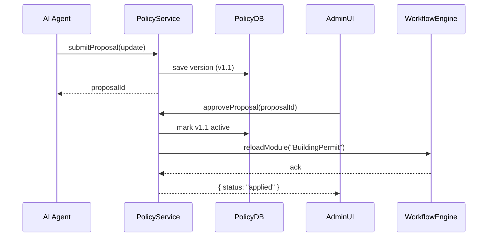

# Chapter 7: Policy/Process Module

In the previous chapter, [Chapter 6: Human Decision Maker (HITL)](06_human_decision_maker__hitl__.md), you learned how a human reviewer approves or overrides AI proposals. Now let’s explore the **Policy/Process Module**, where all the official rules, workflows, and policy statements live—think of it as the city’s ordinances book for building permits, noise complaints, and more.

---

## Why a Policy/Process Module?

Imagine your city wants to streamline **building permits**. Today the steps are:
1. Submit blueprints  
2. Environmental review  
3. Fire-safety inspection  
4. Pay fees  
5. Final sign-off  

Over time, bottlenecks appear: maybe the environmental review always takes 10 days, blocking everything else. The solution? Store that workflow in a **Policy/Process Module**. If you need to speed up reviews, you update the module—just like amending an ordinance—and every system picks up the new rules automatically.

---

## Central Use Case: Updating a Building Permit Workflow

Alice, a planning officer, notices that step 2 (environmental review) is a bottleneck. An AI Agent proposes:
- Run environmental review **in parallel** with the fire-safety inspection.
- Allow conditional sign-off if no major issues are flagged within 5 days.

Once she reviews and approves this proposal, our backend updates the “Building Permit” Policy Module and all related systems follow the new, faster flow.

---

## Key Concepts

1. **Module Definition**  
   A JSON or code file listing workflow steps, rules, and decision points.

2. **Proposal & Versioning**  
   AI Agents or humans can propose changes. Each proposal creates a new version—old versions stay for audit.

3. **Approval Workflow**  
   Proposals enter a queue (see [Admin/Gov Portal](02_admin_gov_portal_.md)). After approval, the active module is swapped.

4. **Global Effect**  
   Once live, every connected service (frontend, backend, external systems) uses the updated process immediately.

---

## Using the Policy/Process Module

### 1. Propose an Update

```javascript
import { PolicyService } from 'hms-api-client';

async function proposeParallelReview() {
  const update = {
    module: "BuildingPermit",
    changes: {
      // Insert a parallel review step
      insertAfter: "SubmitBlueprints",
      newStep: {
        id: "ParallelReview",
        label: "Environmental & Fire Review",
        parallel: ["EnvironmentalReview", "FireSafetyInspection"],
      }
    },
    reason: "Speed up approvals by running reviews in parallel."
  };

  const proposal = await PolicyService.submitProposal(update);
  console.log("Proposal ID:", proposal.id);
}
proposeParallelReview();
```

Explanation:  
- We call `submitProposal` with the module name and desired change.  
- The service returns a `proposal.id` for tracking in [Chapter 2: Admin/Gov Portal](02_admin_gov_portal_.md).

### 2. Approve & Apply

```javascript
// In the Admin Portal UI
await PolicyService.approveProposal("proposal-42");
// Backend automatically loads the new version into memory
console.log("Update applied to BuildingPermit module!");
```

Explanation:  
- `approveProposal` marks the change as live.  
- The backend reloads the “BuildingPermit” module so all workflows pick up the new step.

---

## What Happens Under the Hood?



1. **AI Agent** calls `submitProposal`.  
2. **PolicyService** saves a new version in **PolicyDB**.  
3. Admin reviews and calls `approveProposal`.  
4. **PolicyService** marks that version active and tells the **WorkflowEngine** to reload the updated module.

---

## Inside the Implementation

### policyService.js (`hms-svc/src/services/policyService.js`)

```javascript
class PolicyService {
  async submitProposal(update) {
    // 1. Save new version with status "pending"
    const version = await db.insert('policy_versions', {
      module: update.module,
      changes: update.changes,
      status: 'pending',
      reason: update.reason
    });
    return { id: version.id };
  }

  async approveProposal(id) {
    // 2. Mark pending version "active", deactivate old
    await db.transaction(async tx => {
      const v = await tx.getVersion(id);
      await tx.deactivateOld(v.module);
      await tx.activate(v.id);
    });
    // 3. Notify workflow engine to reload
    workflowEngine.reloadModule(v.module);
    return { status: 'applied' };
  }
}
module.exports = new PolicyService();
```

Explanation:  
- `submitProposal` inserts a new version record.  
- `approveProposal` flips the active flag inside a transaction, then calls the workflow engine to pick up the new rules.

### Module File Example (`policyModules/BuildingPermit.json`)

```json
{
  "module": "BuildingPermit",
  "version": "1.1",
  "steps": [
    { "id": "SubmitBlueprints", "label": "Upload blueprints" },
    { "id": "ParallelReview", "label": "Environmental & Fire Review", "parallel": true },
    { "id": "PayFees", "label": "Submit fee payment" },
    { "id": "FinalApproval", "label": "Receive final sign-off" }
  ]
}
```

Explanation:  
- The `ParallelReview` step runs both checks in parallel.  
- Version `"1.1"` is active only after approval.

---

## Conclusion

You’ve seen how the **Policy/Process Module** stores your city’s rules and workflows in a versioned, governable way. AI Agents submit proposals to tweak these processes, admins approve them via the portal, and the updated workflows go live across all services.

Next up, we’ll dive into the values and guardrails that keep AI-driven changes safe, fair, and transparent in [Chapter 8: AI Governance Values](08_ai_governance_values_.md).

---

Generated by [HardisonCo [NARA-DOC]](https://github.com/The-Pocket/Tutorial-Codebase-Knowledge)