# Chapter 8: Event & Workflow Orchestration (HMS-ACT / HMS-OMS)

*In [Inter-Agency Exchange Protocol (HMS-A2A)](07_inter_agency_exchange_protocol__hms_a2a__.md) we delivered an “envelope” from one agency to another.  
But what *happens* after the envelope lands? Who must review it? How long may it sit?  
HMS-ACT (Action Controller) and HMS-OMS (Orchestration Management Service) are the **conductor and score** that keep every task moving on time.*

---

## 1. Why Do We Need Orchestration?  🎼

### Central Use-Case  
A citizen files an online **fraud complaint** with the Federal Trade Commission (FTC).

1. Complaint lands in the FTC inbox.  
2. An AI agent auto-classifies severity.  
3. If “High,” a human investigator must accept within 4 hours.  
4. If investigator misses the Service-Level Agreement (SLA), the task escalates to a supervisor.  
5. Status updates flow back to the citizen portal.

Without orchestration you would hand-code timers, retries, audit logs, escalations, and multi-step logic for *every* service.  
HMS-ACT/OMS bundle all of this so teams only declare **“what should happen,” not *how* to chase people all day.**

---

## 2. Key Concepts in Plain English

| Term            | Think of it as…                           | Why You Care (Beginner View)          |
|-----------------|-------------------------------------------|---------------------------------------|
| Event           | A *ding!* in the system (“complaint logged”) | Kicks off the whole chain            |
| Workflow        | Recipe card with multiple steps           | Describes **what** must occur         |
| Task            | One line item from the recipe (“AI label”) | The thing routed to a worker          |
| SLA             | Kitchen timer on a step                   | Auto-escalates if time runs out       |
| Actor           | Who does the task (AI agent or human)     | Lets you mix bots **and** people      |
| State Store     | Whiteboard showing current statuses       | UIs & audits read from here           |

---

## 3. Birds-Eye View Diagram

```mermaid
flowchart LR
    A(Event: Complaint Logged) -->|fires| B[Workflow "FTC-Complaint"]
    B --> C{Task 1: AI Classify}
    C -->|Label=High| D{Task 2: Human Review<br><4h SLA}
    D -->|Approved| E(Task 3: Notify Citizen)
    D -->|SLA Breach| F(Task 4: Escalate to Supervisor)
```

---

## 4. Five-Minute Quick-Start

We will:

1. Define a workflow in **YAML** (HMS-OMS).  
2. Emit an event from code (HMS-ACT picks it up).  
3. Watch tasks route to a fake AI worker and a human inbox.

### 4.1  Declare the Workflow (≤15 lines)

```yaml
# workflows/ftc_complaint.yml
id: FTC-Complaint
start: ComplaintLogged          # event name
steps:
  - id: classify
    actor: AI:fraud-labeler
    on_complete: severity_branch
  - id: severity_branch
    type: switch
    expr: "result.severity"
    cases:
      High: human_review
      Low: notify_citizen
  - id: human_review
    actor: HUMAN:investigator
    sla: 4h
    on_timeout: escalate
    on_complete: notify_citizen
  - id: escalate
    actor: HUMAN:supervisor
  - id: notify_citizen
    actor: SVC:email-svc
```

Explanation  
• `actor` prefixes: `AI:`, `HUMAN:`, or `SVC:` (micro-service).  
• `severity_branch` is an in-line decision node with a one-liner expression.

### 4.2  Fire an Event (≤12 lines)

```python
# emit_event.py
import requests, json
event = {
  "name": "ComplaintLogged",
  "payload": { "complaintId": "C-42", "text": "Spam calls" }
}
requests.post("http://localhost:8100/act/events", json=event)
```

Console prints:

```
2024-05-14 10:03:00  🔔 Event accepted – workflow FTC-Complaint instantiated (Run #7a1b)
```

---

## 5. What Happens Next? (Step-By-Step)

```mermaid
sequenceDiagram
  participant Portal as Citizen Portal
  participant ACT as HMS-ACT
  participant AI as AI Labeler
  participant INV as Investigator
  participant OMS as HMS-OMS Store

  Portal->>ACT: Event "ComplaintLogged"
  ACT->>OMS: create run #7a1b
  ACT->>AI: Task classify(C-42)
  AI-->>ACT: severity=High
  ACT->>INV: Task human_review(C-42)  (4h SLA)
  Note over ACT,INV: Timer ticking…⏲️
```



If the 4-hour timer rings before `INV` replies, **ACT** auto-pushes an *escalate* task to a supervisor.

---

## 6. Under the Hood (Light Dive)

### 6.1  State Machine in 18 Lines (Go)

```go
// engine/run.go
type Step struct{ ID, Actor, OnComplete string; SLA time.Duration }
type Run struct{ Pos int; Started time.Time }

func (r *Run) Tick(steps []Step) (next Step, timeout bool) {
    cur := steps[r.Pos]
    if cur.SLA > 0 && time.Since(r.Started) > cur.SLA {
        return findStep(steps, "escalate"), true
    }
    if curFinished(cur) {                  // checks worker table
        r.Pos++
    }
    return steps[r.Pos], false
}
```

Beginner takeaway: every workflow run is just an array index + timer; super simple.

### 6.2  Task Table (PostgreSQL)

```sql
CREATE TABLE tasks(
  id        UUID PRIMARY KEY,
  run_id    UUID,
  step_id   TEXT,
  actor     TEXT,
  status    TEXT,     -- NEW / DONE / TIMEOUT
  expires   TIMESTAMP
);
```

HMS-ACT inserts one row per task; UI dashboards simply `SELECT * FROM tasks WHERE actor='HUMAN:*'`.

### 6.3  Worker Stub (AI) (≤13 lines)

```python
# ai_worker.py
import time, requests, random, json
while True:
    t = requests.get("http://act/tasks?actor=AI:fraud-labeler").json()
    for task in t:
        sev = random.choice(["High", "Low"])
        body = {"severity": sev}
        requests.post(f"http://act/tasks/{task['id']}/complete", json=body)
    time.sleep(5)
```

One loop pulls tasks, does mini “AI” work, marks them *complete*.

---

## 7. Relation to Other HMS Layers

| Layer | Interaction |
|-------|-------------|
| [Backend API Gateway](06_backend_api_gateway_.md) | Exposes `/act/*` routes to outside callers |
| [Micro-services Backbone](05_micro_services_backbone__hms_sys___hms_svc__.md) | AI & service actors discover ACT via registry |
| [Human-in-the-Loop Oversight](12_human_in_the_loop__hitl__oversight_.md) | Investigator UI is built here |
| [Central Data Lake & Registry](09_central_data_lake___registry__hms_dta__.md) | Completed run data streams to the lake for analytics |

---

## 8. Common Pitfalls & Quick Fixes

| Symptom | Likely Cause | Fast Remedy |
|---------|--------------|-------------|
| Task stuck in **NEW** | Worker not polling | Check worker heartbeat `/act/workers` |
| SLA never triggers | Step missing `sla:` field | Add `sla:` in workflow YAML |
| “Unknown actor type” error | Typo in prefix | Use `AI:` `HUMAN:` or `SVC:` only |

---

## 9. Hands-On Exercise (10 min)

1. `git clone https://github.com/hms-samples/act-demo && cd act-demo`  
2. `docker-compose up` (starts ACT, OMS store, AI worker, demo portal)  
3. Open `http://localhost:7000` – file a complaint.  
4. Watch `docker logs act` – see tasks flow and SLA timers.  
5. Stop the investigator container → after 4 h simulated minutes the supervisor task appears.

---

## 10. Recap & What’s Next

You learned how HMS-ACT/OMS:

• **Listen** for events,  
• **Spawn** workflows from simple YAML,  
• **Route** tasks to AI, humans, or services,  
• **Enforce** SLAs and escalations automatically, and  
• **Publish** real-time state for dashboards & audits.

Next, we will see where all these events, task results, and SLA metrics live long-term—enter the data warehouse of the platform:  
[Central Data Lake & Registry (HMS-DTA)](09_central_data_lake___registry__hms_dta__.md) 🚢

---

Generated by [HardisonCo [NARA-DOC]](https://github.com/The-Pocket/Tutorial-Codebase-Knowledge)