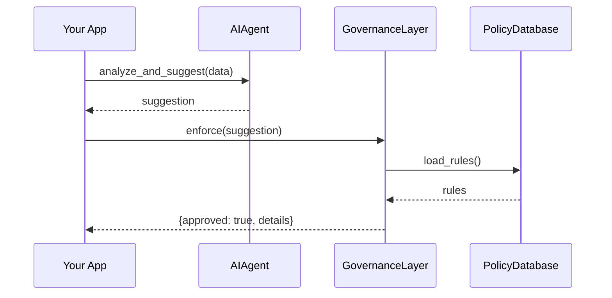

# Chapter 8: Governance Layer

Having built a shared set of UI components in [Chapter 7: Shared Frontend Component Library](07_shared_frontend_component_library_.md), it’s time to add a **Governance Layer**—our digital “ethics and compliance office” that reviews every AI-driven decision before it can take effect.

## 8.1 Why a Governance Layer? A Real-World Motivation

Imagine the Bureau of Land Management uses an AI agent to propose new grazing regulations. An AI might suggest easing rules in a way that conflicts with environmental laws or privacy standards. We need an automated filter that:

- Checks ethics (no unfair bias)  
- Verifies privacy (no leaking citizen data)  
- Enforces safety (no unsafe recommendations)  
- Ensures legal compliance (follows federal guidelines)

The Governance Layer sits between your AI agents (see [Chapter 1: AI Agents Module (HMS-A2A)](01_ai_agents_module__hms_a2a__.md)) and the action that follows. Think of it like a compliance officer who stamps "Approved" or "Denied" on each AI proposal.

## 8.2 Key Concepts

1. EthicsCheck  
   Ensures recommendations don’t introduce bias or harm.  
2. PrivacyCheck  
   Verifies the AI didn’t expose sensitive citizen data.  
3. SafetyCheck  
   Tests that suggested actions won’t cause unsafe states.  
4. ComplianceCheck  
   Confirms alignment with laws, regulations, and internal policies.

Each check is a small “gate.” A proposal must pass all gates to be enacted.

## 8.3 Using the Governance Layer

Here’s how you might use it in a census workflow:

```python
from hms_a2a import AIAgent
from hms_gov_layer import GovernanceLayer

# 1. AI agent suggests policy tweaks
agent = AIAgent(name="GrazingAdvisor", domain="land_management")
suggestion = agent.analyze_and_suggest(data)

# 2. Governance review
governor = GovernanceLayer()
result = governor.enforce(suggestion)

if result.approved:
    print("Suggestion approved:", result.details)
else:
    print("Denied due to:", result.reason)
```

Explanation:
- We ask an AI agent for a recommendation.
- We pass that recommendation to `GovernanceLayer.enforce(...)`.
- The layer returns an `approved` flag and either details or a denial reason.

## 8.4 What Happens Under the Hood?



1. Your app calls the AI agent.  
2. The agent returns a raw suggestion.  
3. Your app sends it to the Governance Layer.  
4. The layer fetches current rules from a policy store.  
5. The layer applies ethics, privacy, safety, and compliance checks.  
6. The layer returns approval or denial.

## 8.5 Under the Hood: Simplified Code

### 8.5.1 File: `governance_layer.py`

```python
class GovernanceLayer:
    def __init__(self):
        # Preload rule lists or connect to a rules database
        self.rules = {"ethics": [], "privacy": [], "safety": [], "compliance": []}

    def enforce(self, suggestion):
        if not self.privacy_check(suggestion):
            return Result(False, reason="Privacy violation")
        if not self.ethics_check(suggestion):
            return Result(False, reason="Ethics violation")
        if not self.safety_check(suggestion):
            return Result(False, reason="Safety violation")
        if not self.compliance_check(suggestion):
            return Result(False, reason="Compliance violation")
        return Result(True, details="All checks passed")

    # Below: placeholder checks
    def privacy_check(self, s):   return "PII" not in s.data
    def ethics_check(self, s):    return s.risk_score < 5
    def safety_check(self, s):    return s.impact != "high"
    def compliance_check(self, s):return s.region in ["BLM","NPS"]

class Result:
    def __init__(self, approved, reason=None, details=None):
        self.approved = approved
        self.reason   = reason
        self.details  = details
```

Explanation:
- `enforce` runs four checks in order.
- Each check returns True or False.
- On failure, we immediately return a denial with a reason.
- On success, we return approval details.

## 8.6 Conclusion

You’ve added a **Governance Layer** that reviews every AI suggestion for ethics, privacy, safety, and legal compliance—just like a real compliance office. In [Chapter 9: Management Layer](09_management_layer_.md), we’ll learn how to orchestrate and scale your services with a unified management console.

---

Generated by [HardisonCo [NARA-DOC]](https://github.com/The-Pocket/Tutorial-Codebase-Knowledge)