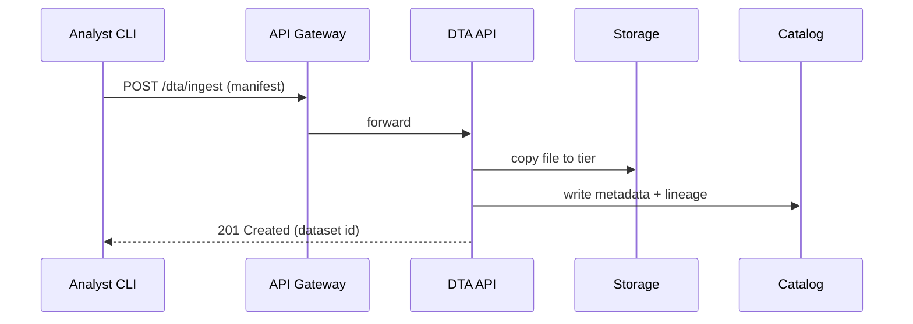

# Chapter 9: Central Data Lake & Registry (HMS-DTA)

*Coming from [Event & Workflow Orchestration (HMS-ACT / HMS-OMS)](08_event___workflow_orchestration__hms_act___hms_oms__.md) you saw tasks, AI labels, and human approvals fly back and forth.  
Where do all those task results, envelopes, and citizen records **finally live** so analysts can find them months later?  
Welcome to the national “library basement” of HMS—the Central Data Lake & Registry (HMS-DTA).*

---

## 1. Why Do We Need HMS-DTA? 📚

### Central Use-Case  
The **Bureau of Transportation Statistics (BTS)** wants to compare:

1. Daily **cargo tonnage** moving through the St. Lawrence Seaway (Department of Transportation).  
2. **Flu-like illness counts** reported by the Centers for Disease Control (CDC).  

Goal: discover if crew sickness slows shipping.

Hard parts without DTA:

| Problem | Pain |
|---------|------|
| “Where is the raw Seaway sensor CSV?” | 12 different S3 buckets, no index. |
| “Who last cleaned the health data?” | Lost in email threads. |
| “Can I join the two sets legally?” | Privacy rules unclear; risk of HIPAA breach. |

**HMS-DTA** fixes all three:

1. One secure **lake** for raw & processed files.  
2. A **registry** that tracks every version, owner, and transformation.  
3. **Role-based views** so a shipping analyst never sees personal health details, while epidemiologists never see individual vessel IDs.

---

## 2. Key Concepts in Plain English

| Term | Think of it as… | Why Beginners Care |
|------|-----------------|--------------------|
| Tiered Storage | Hot, Warm, Cold “shelves” | Keep fresh data fast, old data cheap |
| Dataset | One named “book” in the library | Everything is discoverable by title |
| Metadata Catalog | Library card catalog | Search by keywords, owner, license |
| Lineage | Family tree of a dataset | Know who copied/cleaned what & when |
| Role Policy | Access rules per hat you wear | Stay legal without manual policing |
| Data Token | Temporary “library card” | Lets a script read data for N hours |

---

## 3. Five-Minute Quick-Start

We will ingest a CSV of daily lock passages, register it, and query it—**all under 30 lines of code**.

### 3.1  Describe Your Dataset (manifest.yml – 12 lines)

```yaml
# manifest.yml
name: seaway_lock_passages_2024
source: s3://raw-bucket/lock_passages_2024.csv
owner: DOT:BTS
license: Public Domain
schema:
  - date: date
  - lock_id: string
  - vessel_type: string
  - tonnage: integer
tags: [shipping, seaway, 2024]
tier: hot
```

*Beginners*: This is just a fancy “index card” for the file.

### 3.2  Ingest & Register (CLI – 1 command)

```bash
hms-dta ingest manifest.yml
```

Console output:

```
✔  File copied to lake://hot/2024/05/lock_passages.csv
✔  Metadata saved (dataset id = 7b2c)
🔗 Lineage: raw -> seaway_lock_passages_2024:v1
```

### 3.3  Query Like a Database (Python – 14 lines)

```python
# query.py
import dta                      # fictitious SDK
token = dta.auth("analyst@bts") # gets a 2-hour data token
sql = """
SELECT date, SUM(tonnage) AS total_tons
FROM seaway_lock_passages_2024
GROUP BY date
ORDER BY date
"""
rows = dta.query(sql, token)
for r in rows[:3]:
    print(r)
```

Expected output:

```
(2024-05-01, 305000)
(2024-05-02, 298500)
(2024-05-03, 312200)
```

*No database spun up!*  DTA’s query engine reads parquet files right from the lake.

---

## 4. What Happens Under the Hood?



*Same gateway you met in [Chapter 6](06_backend_api_gateway_.md) – no new ports to open.*

---

## 5. Under the Hood: Mini Source Peek

### 5.1  Lineage Table (PostgreSQL – 6 lines)

```sql
CREATE TABLE lineage(
  child_id  UUID,
  parent_id UUID,
  action    TEXT,   -- 'ingest' | 'transform'
  ts        TIMESTAMP DEFAULT NOW()
);
```

Every new version inserts one simple row—auditors love it.

### 5.2  Role-Based Access Check (Go – 18 lines)

```go
// auth/check.go
func CanQuery(user, dataset string) bool {
  role := GetUserRole(user)            // e.g., "shipping-analyst"
  policy := FetchPolicy(role, dataset) // JSON rule set
  return policy["allow_read"].(bool)
}
```

Used automatically before every `dta.query()` call.

### 5.3  Tier Selection Logic (Python – 12 lines)

```python
def select_tier(size_mb, recency_days):
    if recency_days < 30:
        return "hot"
    if size_mb < 10_000:
        return "warm"
    return "cold"
```

Files migrate nightly via a cron job.

---

## 6. How DTA Plays with Other HMS Layers

| Other Layer | Relationship |
|-------------|--------------|
| [Micro-Services Backbone](05_micro_services_backbone__hms_sys___hms_svc__.md) | Storage nodes & query workers register as services |
| [Backend API Gateway](06_backend_api_gateway_.md) | Exposes `/dta/*` routes & enforces auth tokens |
| [Workflow Orchestration](08_event___workflow_orchestration__hms_act___hms_oms__.md) | Successful workflows auto-push results to the lake |
| [AI Agent Framework](10_ai_agent_framework__hms_agt___hms_agx__.md) | Agents pull training data via short-lived Data Tokens |
| Governance Model (Ch 1) | Role policies = Floor 3 rules; DTA enforces at Floor 2 |

---

## 7. Common Pitfalls & Quick Fixes

| Symptom | Cause | Fix |
|---------|-------|-----|
| `403 Forbidden` on query | Missing role policy | Ask dataset owner to add your role in `access.yml`. |
| Query super slow | File still on **cold** tier | Run `hms-dta promote 7b2c hot` (needs owner rights). |
| Duplicate datasets | Different teams ingested same file | Use `hms-dta search --hash` before ingesting. |

---

## 8. Hands-On Exercise (10 min)

1. `git clone https://github.com/hms-samples/dta-mini && cd dta-mini`  
2. `docker-compose up` – spins up DTA API, catalog DB, and storage mock.  
3. `hms-dta ingest samples/lock_manifest.yml`  
4. `python demo_query.py` – chart pops up with daily tonnage.  
5. Change `tier:` in manifest to `cold`, re-ingest, re-run query; see speed difference.

---

## 9. Recap & Next Steps

You learned how HMS-DTA:

• Stores **every** dataset in one lake with cost-smart tiers.  
• Registers rich **metadata & lineage** so nothing gets lost.  
• Enforces **role policies** so health data and shipping logs never mix illegally.  
• Exposes a SQL-like query API that feels like a database but scales like cloud storage.

In the next chapter we hand this neatly organized data to smart assistants that can reason over it.  
Continue to [AI Agent Framework (HMS-AGT / HMS-AGX)](10_ai_agent_framework__hms_agt___hms_agx__.md).

---

---

Generated by [HardisonCo [NARA-DOC]](https://github.com/The-Pocket/Tutorial-Codebase-Knowledge)