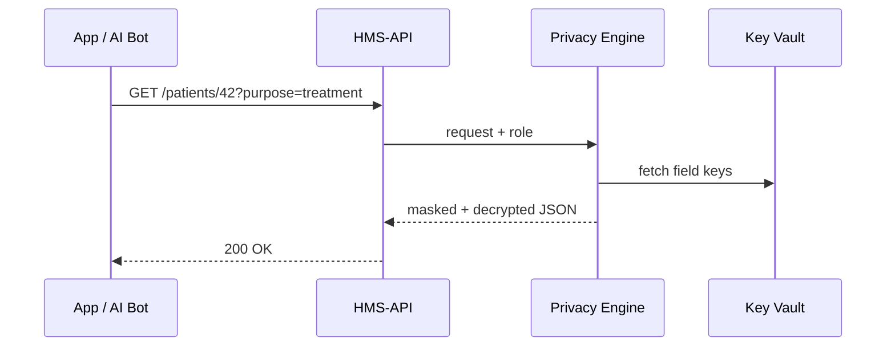

# Chapter 9: Data Privacy & Compliance Framework
[← Back to Chapter 8: Microservices & Service Mesh Architecture](08_microservices___service_mesh_architecture_.md)

---

## 1. Why Another Framework?

Imagine **Captain Jordan** at a military clinic.  
He opens HMS to review **Sergeant Ava Smith’s** lung-X-ray, while an **AI triage bot** wants the *same* record to predict asthma risk.  
Rules differ:

* Captain Jordan is covered by **HIPAA**.  
* The AI must follow **GDPR-style “purpose limitation.”**  
* Both must respect DoD **FISMA** controls.

If we fumble even one byte, we face lawsuits, revoked accreditations, and—most importantly—loss of public trust.

**The Data Privacy & Compliance Framework** is HMS’s “SCIF in the cloud”:
1. **Encrypts** data *per field* so stolen disks are gibberish.  
2. **Masks** or **redacts** fields not allowed for a given role.  
3. Logs *why* each access happened (“treatment”, “analytics”, “billing”).  

---

## 2. Key Concepts in Plain English

| Concept | Library Analogy | Why It Matters |
|---------|-----------------|----------------|
| Field-Level Encryption | Each paragraph in a diary is written in its own secret ink | A breach leaks the *fewest* words |
| Role-Based Masking | “Top-Secret” stamps on pages | Doctors see PII; receptionists see ✱✱✱ |
| Purpose Tag | Sign-out card (“studying”, “audit”) | Meets GDPR’s *purpose limitation* |
| Consent Ledger | Visitor logbook you can’t erase | Proves user granted (or revoked) consent |
| Privacy Vault | Locked filing cabinet | Stores encryption keys away from app code |

Keep these five in mind—everything else is just wiring.

---

## 3. 3-Minute “Hello, World”  
### Goal: Show Captain Jordan **medicalDiagnosis** but hide **homeAddress**.

```js
// file: getRecord.js (⬇ 15 lines)
import { fetchRecord } from '@hms/privacy-sdk';

async function show(patientId, requester) {
  const record = await fetchRecord(patientId, {
    role:    requester.role,     // "doctor"
    purpose: 'treatment'         // logged
  });

  console.log('Diagnosis:', record.medicalDiagnosis); // ✅
  console.log('Address  :', record.homeAddress);      // **MASKED**
}

show('patient-42', { role: 'doctor' });
```

What happened?

1. `fetchRecord` auto-decrypts each field.  
2. Masking rules hide `homeAddress` for the **doctor** role (only “admin-billing” may see).  
3. Purpose tag “treatment” is immutably written to the **Consent Ledger**.

---

## 4. How Does HMS Decide?  



Four participants—easy to remember!

---

## 5. Peeking “Under the Hood”

### 5.1 Masking Policy (YAML, 12 lines)

```yaml
# file: policies/masking.yaml
patientRecord:
  medicalDiagnosis:
    view:
      doctor:     "plain"
      researcher: "redact"
  homeAddress:
    view:
      admin-billing: "plain"
      "*":           "mask"   # ✱✱✱✱✱✱
```

Beginner notes  
* `"*"` is catch-all.  
* Policy lives in the same repo style you met in [Chapter 5: Policy / Process Module](05_policy___process_module_.md).

### 5.2 Field Encryption Column (PostgreSQL, 8 lines)

```sql
CREATE TABLE patient (
  id TEXT,
  medical_diagnosis BYTEA, -- AES-256 cipher text
  home_address      BYTEA,
  iv                BYTEA   -- per-row nonce
);
```

Only ciphertext lives in DB; keys live in **Privacy Vault** (an AWS KMS or HashiCorp Vault cluster).

### 5.3 Tiny Decrypt Helper (Node, 18 lines)

```js
// file: crypto.js
import crypto from 'crypto';
export function decrypt(buf, key, iv) {
  const decipher = crypto.createDecipheriv('aes-256-gcm', key, iv);
  return Buffer.concat([decipher.update(buf), decipher.final()])
               .toString('utf8');
}
```

Used internally by the Privacy Engine—no dev has to call it directly.

---

## 6. Enforcing “Purpose Limitation”

1. Front-end or service MUST pass a `purpose` string (`treatment`, `billing`, `analytics`, …).  
2. Privacy Engine checks **Consent Ledger**:

```sql
SELECT allowed
FROM   consent_ledger
WHERE  user_id='patient-42'
  AND  purpose='analytics';
```

If `allowed=false`, the request is **403 Forbidden** even if the role is high enough.

---

## 7. First-Time Integration Checklist

| Step | Command / Action | Time |
|------|------------------|------|
| 1. Import SDK | `npm i @hms/privacy-sdk` | 30 s |
| 2. Add purpose header | `X-HMS-Purpose: treatment` | 10 s |
| 3. Store masking YAML in repo | see 5.1 | 1 min |
| 4. Rotate field keys | `hms-privacy rotate-keys` | 20 s |
| 5. Verify access | `hms-privacy audit --since 24h` | 10 s |

Total ≈ **2 minutes** to become HIPAA/FISMA/GDPR-ready.

---

## 8. Where This Framework Touches Other HMS Layers

* All API calls flow through the **Gateway** from [Chapter 7](07_backend_api___service_layer__hms_api__hms_svc__.md); the Gateway delegates decryption/masking to *this* framework.  
* AI Agents from [Chapter 3](03_ai_representative_agent__hms_a2a__.md) must include a `purpose`—or they’re blocked.  
* Metrics about denied or masked fields feed into the upcoming [AI Governance Layer](10_ai_governance_layer__transparency__ethics__safety__privacy__.md).

---

## 9. Common Pitfalls & Tips

1. **Forgetting the Purpose Header**  
   • Result: 400 error.  
   • Fix: add `X-HMS-Purpose`.

2. **Oversharing in Masking Policy**  
   • Test with `hms-privacy lint policies/`.  
   • CI will fail if wildcard `"*": "plain"`.

3. **Long-Lived Keys**  
   • Rotate every 90 days: `hms-privacy rotate-keys --dry-run`.

4. **Bulk Analytics Jobs**  
   • Use role `researcher` + purpose `analytics`; engine auto-redacts direct identifiers.

---

## 10. Summary & Next Steps

You learned how HMS:

* Encrypts each sensitive field separately.  
* Masks or redacts data based on **role** *and* **purpose**.  
* Stores consent in an immutable ledger for audits.  
* Fits seamlessly with the Gateway, AI Agents, and Policy modules you met earlier.

Next we’ll pull these privacy controls into a broader discussion of **transparency, ethics, and safety** across all AI systems.  
Continue to ➡ [Chapter 10: AI Governance Layer (Transparency, Ethics, Safety, Privacy)](10_ai_governance_layer__transparency__ethics__safety__privacy__.md)

---

Generated by [HardisonCo [NARA-DOC]](https://github.com/The-Pocket/Tutorial-Codebase-Knowledge)