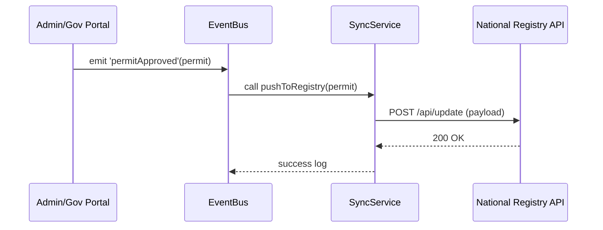

# Chapter 9: External System Synchronization

Continuing from [Chapter 8: AI Governance Values](08_ai_governance_values_.md), we now turn to keeping all our records in sync—especially with outside systems like national databases, scheduling platforms, or third-party services.

## Motivation & Central Use Case

Imagine your city issues **building permits**. Once the permit is officially approved in our **Admin/Gov Portal**, that same approval must appear instantly in the **National Building Registry**, the **Contractor Scheduling System**, and even a **third-party GIS map**. If any of those systems lag behind, contractors or inspectors might work with outdated rules—causing delays, confusion, or safety issues.

External System Synchronization solves this by:
- Detecting when a permit (or any record) changes state  
- Transforming the data to match each external API’s format  
- Delivering updates in real time (or on a schedule)  
- Retrying on failure and keeping logs for audits  

## Key Concepts

1. **Event Trigger**  
   Hooks into internal workflows (e.g., “permit approved”) to start a sync job.

2. **Transformation & Mapping**  
   Converts our internal data model into the shape each external API expects.

3. **Authentication & Security**  
   Manages API keys, OAuth tokens, or certificates to call external services safely.

4. **Delivery Mechanisms**  
   Uses HTTP requests, message queues, or webhooks depending on the target system.

5. **Scheduling & Retry**  
   Schedules periodic full-syncs and retries failures with backoff to guarantee consistency.

6. **Monitoring & Logging**  
   Records every attempt and outcome for transparency and troubleshooting.

---

## Using External System Synchronization

Below is a minimal example that listens for permit approvals and pushes updates to the National Registry.

### 1. Listen for Approval Events

```javascript
// hms-svc/src/services/approvalListener.js
import EventBus from '../utils/eventBus';
import SyncService from './syncService';

EventBus.on('permitApproved', async (permit) => {
  try {
    await SyncService.pushToRegistry(permit);
    console.log('Synced permit:', permit.id);
  } catch (e) {
    console.error('Sync failed for', permit.id, e.message);
  }
});
```
*Explanation:*  
We subscribe to a `'permitApproved'` event. When triggered, we call our `SyncService`.

### 2. Push to Registry

```javascript
// hms-svc/src/services/syncService.js
import fetch from 'node-fetch';
import Transform from './transformService';

class SyncService {
  static async pushToRegistry(permit) {
    const payload = Transform.toRegistryFormat(permit);
    const res = await fetch(process.env.REGISTRY_URL + '/api/update', {
      method: 'POST',
      headers: { 'Authorization': `Bearer ${process.env.REGISTRY_TOKEN}` },
      body: JSON.stringify(payload)
    });
    if (!res.ok) throw new Error(`Status ${res.status}`);
  }
}

export default SyncService;
```
*Explanation:*  
1. We transform the internal `permit` object into the registry’s schema.  
2. We POST it securely, throwing an error if something goes wrong.

### 3. Transform Data Shapes

```javascript
// hms-svc/src/services/transformService.js
class TransformService {
  static toRegistryFormat(permit) {
    return {
      registryId: permit.id,
      applicantName: `${permit.owner.firstName} ${permit.owner.lastName}`,
      validUntil: permit.expiryDate,
      geo: { lat: permit.location.lat, lon: permit.location.lng }
    };
  }
}

export default TransformService;
```
*Explanation:*  
Maps our `permit` fields to the registry’s expected JSON keys.

---

## What Happens Under the Hood?



1. The **Admin Portal** emits an event when a permit is approved.  
2. **EventBus** routes that event to **SyncService**.  
3. **SyncService** transforms & POSTs data to the **Registry API**.  
4. On success, it logs the result; on failure, it retries or alerts.

---

## Internal Implementation Details

### Scheduling Full Syncs

You may also want a nightly job to reconcile any missed updates:

```javascript
// hms-svc/src/services/syncScheduler.js
import cron from 'node-cron';
import Database from '../db';
import SyncService from './syncService';

cron.schedule('0 2 * * *', async () => {  // every day at 2 AM
  const allPermits = await Database.getAllPermits();
  for (const p of allPermits) {
    try { await SyncService.pushToRegistry(p); }
    catch (e) { console.error('Nightly sync failed for', p.id); }
  }
});
```
*Explanation:*  
Uses `cron` to run a daily sweep, ensuring no record is left behind.

### Retry with Backoff

```javascript
// hms-svc/src/utils/retryHelper.js
export async function retry(fn, attempts = 3, delayMs = 1000) {
  try { return await fn(); }
  catch (e) {
    if (attempts <= 1) throw e;
    await new Promise(r => setTimeout(r, delayMs));
    return retry(fn, attempts - 1, delayMs * 2);
  }
}
```
*Explanation:*  
A small helper to retry failed HTTP calls with exponential backoff.

---

## Conclusion

You’ve learned how **External System Synchronization**:

- Hooks into state changes (e.g., permit approvals)  
- Transforms and secures data for external APIs  
- Delivers updates in real time or on a schedule  
- Retries failures and logs every step  

With this in place, all your integrated systems—national registries, contractor schedulers, GIS maps—stay up to date automatically, avoiding confusion and delays.

Next up, explore how citizens and staff interact with these synced services in [Chapter 10: Frontend Interfaces (HMS-MFE/HMS-GOV)](10_frontend_interfaces__hms_mfe_hms_gov__.md).

---

Generated by [HardisonCo [NARA-DOC]](https://github.com/The-Pocket/Tutorial-Codebase-Knowledge)